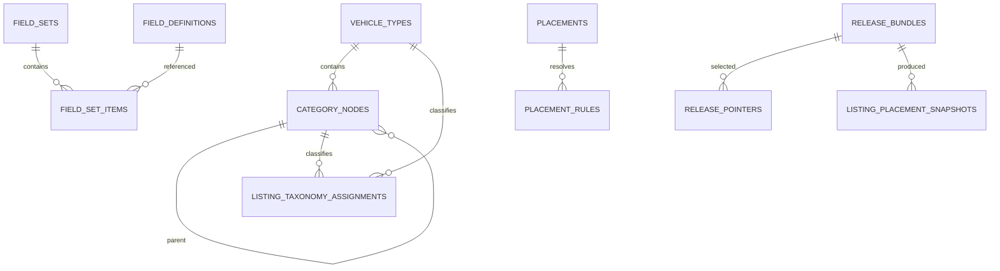

# 데이터 모델

```mermaid
erDiagram
  VEHICLE_TYPES ||--o{ CATEGORY_NODES : contains
  CATEGORY_NODES ||--o{ CATEGORY_NODES : parent
  FIELD_SETS ||--o{ FIELD_SET_ITEMS : contains
  FIELD_DEFINITIONS ||--o{ FIELD_SET_ITEMS : referenced
  PLACEMENTS ||--o{ PLACEMENT_RULES : resolves
  RELEASE_BUNDLES ||--o{ RELEASE_POINTERS : selected
  RELEASE_BUNDLES ||--o{ LISTING_PLACEMENT_SNAPSHOTS : produced
  VEHICLE_TYPES ||--o{ LISTING_TAXONOMY_ASSIGNMENTS : classifies
  CATEGORY_NODES ||--o{ LISTING_TAXONOMY_ASSIGNMENTS : classifies
```

매물 ID는 기존 시스템의 opaque ID다. 신규 DB는 매물 원장을 소유하지 않으며 `listing_taxonomy_assignments`와 `listing_attribute_values`만 보유한다. Placement snapshot은 캐시성 결과이므로 삭제 후 재생성할 수 있다.
