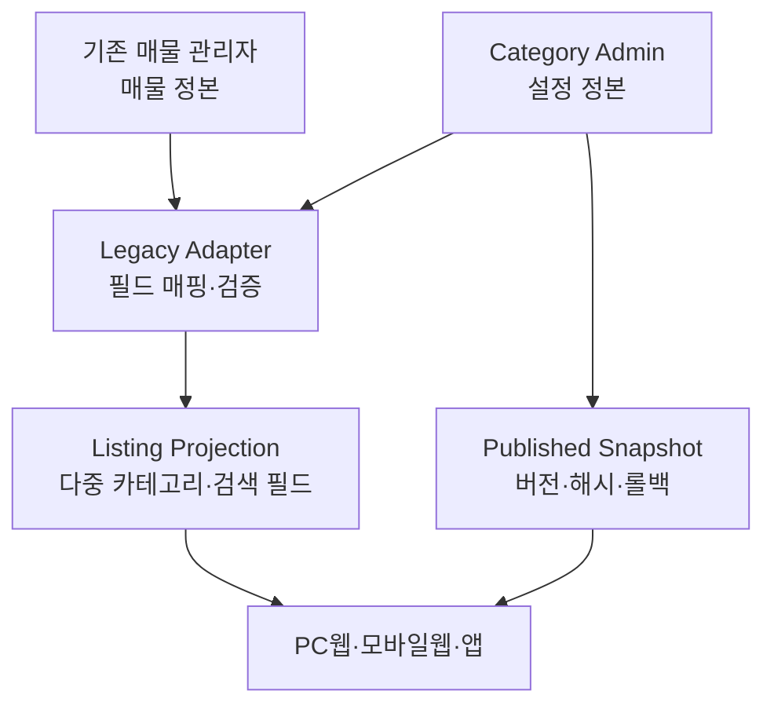

# Category Admin Architecture

## Runtime boundary

## Source ownership

- Existing listing admin owns transaction data.
- Category Admin owns configuration and publication state.
- Search owns read-optimized listing documents.
- No cross-service foreign keys are required. Stable external keys and idempotent events form the contract.

## Terms

- **Control Plane**(컨트롤 플레인): 서비스 동작 규칙을 설정하고 배포하는 관리 영역.
- **Data Plane**(데이터 플레인): 실제 매물 등록·조회·거래 요청을 처리하는 실행 영역.
- **Projection**(프로젝션): 원본을 검색·조회 목적에 맞게 펼쳐 만든 읽기 전용 모델.
- **Anti-Corruption Layer**(앤티 코럽션 레이어): 기존 데이터 의미가 신규 도메인에 그대로 침투하지 않도록 변환하는 경계.
- **Outbox**(아웃박스): DB 저장과 이벤트 발행의 불일치를 줄이기 위해 발행할 이벤트를 같은 트랜잭션에 기록하는 패턴.
