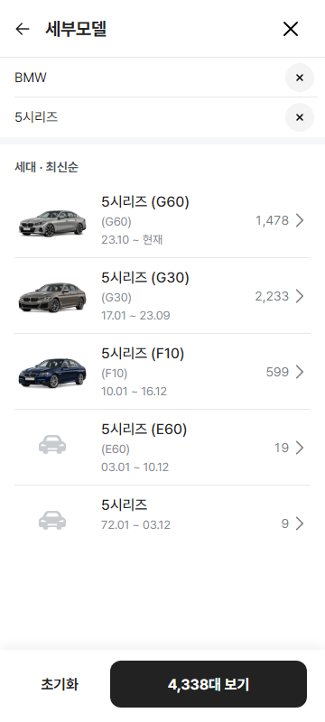

# BMW 세대 이미지 1차 배치 보고

- 기준일: 2026-10-07
- 범위: 엔카 BMW 세대 93개 중 매물 상위 10개
- 데이터 원본: `public/data/encar-car-depth-1005/catalog.json`
- 연결표: `public/data/encar-car-depth-1005/generation-images/bmw.json`
- 납품 규격: 960×600 투명 PNG
- 배치 규격: 차량 폭 89%, 바닥 여백 6%, 수평 중앙, 좌향 앞 3/4
- 색상 원칙: 해당 세대 `mobile.de` 실매물의 제조사 색상명·실제 톤 우선

## 반영 세대

| 우선 | 모델·세대 | 엔카 key | 색상 | mobile.de 확인 |
|---:|---|---|---|---|
| 1 | 5시리즈 G30 | `model_car_encar_generation_bd5d93f2233362c95c96` | Bernina Grey Amber Effect 계열 | [G30 매물](https://suchen.mobile.de/auto/bmw-5er-reihe-g30.html) |
| 2 | 5시리즈 G60 | `model_car_encar_generation_c81ba28ba52ced1f1935` | OXIDGRAU II METALLIC | [G60 실매물](https://suchen.mobile.de/auto-inserat/bmw-520d-xdrive-m-sportpaket-20-lc-ahk-adapt-led-d-geretsried-gelting/44796728852864.html) |
| 3 | X5 G05 | `model_car_encar_generation_9fd1825f7405c0a83db4` | Skyscraper Grey 계열 | [G05 매물](https://suchen.mobile.de/auto/bmw-x5-g05.html) |
| 4 | 3시리즈 G20 | `model_car_encar_generation_a0d600e96be0e6aa1390` | Portimao Blue Metallic | [G20 실매물](https://suchen.mobile.de/auto-inserat/bmw-330i-m-sportpaket-automatik-landshut/43244265069216.html) |
| 5 | X7 G07 | `model_car_encar_generation_32aa2e09b30e0c2a79fc` | Skyscraper Grau Metallic | [G07 실매물](https://suchen.mobile.de/auto-inserat/bmw-x7-xdrive40d-standheizung-driv-assist-prof-hifi-kirkel/459620778.html) |
| 6 | 5시리즈 F10 | `model_car_encar_generation_0a1b5a9d25195a99bf4a` | Imperial Blue 계열 | mobile.de 세대 매물 대조 |
| 7 | X6 G06 | `model_car_encar_generation_e3233ad8a05876917854` | Brooklyn Grey 계열 | [G06 매물](https://suchen.mobile.de/auto/bmw-x6-g06-f96.html) |
| 8 | X4 G02 | `model_car_encar_generation_593d66c63f64b73fa08a` | Red Metallic 계열 | [G02 적색 매물](https://suchen.mobile.de/auto/bmw-x4-rot.html) |
| 9 | 7시리즈 G11 | `model_car_encar_generation_387bea5f492997ed5cbd` | Grey Metallic 계열 | mobile.de 세대 매물 대조 |
| 10 | X3 G01 | `model_car_encar_generation_15a604d196c7343d9b84` | Blue Metallic 계열 | mobile.de 세대 매물 대조 |

## 검수

- `npm run verify:qf`: 통과
- 360px 5시리즈 세대 화면: G60·G30·F10 이미지 표시 정상
- 이미지 표시 크기: 84×52.5px
- 세대 행 높이: 84px
- 콘솔 오류: 0
- 페이지 오류: 0
- 엔카 원본 `catalog.json`: 수정 없음

## 보류

- X5 G05 LCI의 램프 디테일은 확대 대조 후 최종 승인한다.
- BMW 전체 코드네임 오류 및 엔카 통합 세대 전수조사는 사용자 요청대로 다음 별도 작업에서 진행한다.
