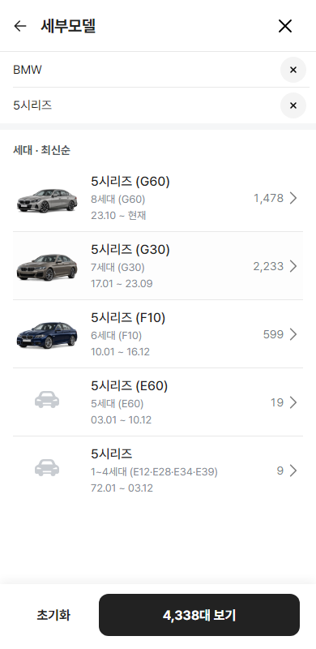

# BMW 세대 이미지 2차 배포 보고

- 기준일: 2026-10-07
- 범위: BMW 모델 40개 · 세대 93개
- 이미지 연결: 43개
- 이미지 미제작 자리표시자: 50개
- 세대 차수 표시: 93/93
- 데이터 원본: `public/data/encar-car-depth-1005/catalog.json`
- 이미지 연결표: `public/data/encar-car-depth-1005/generation-images/bmw.json`
- 표시 전용 세대 매핑: `public/data/encar-car-depth-1005/generation-display-identities/bmw.json`

## 반영 원칙

- 엔카의 모델명·세대명·코드는 수정하지 않았다.
- `1세대 (E21)` 같은 차수 표시는 별도 표시 매핑으로만 더했다.
- 페이스리프트는 새 세대로 올리지 않았다.
- 엔카가 여러 완전변경 세대를 한 행에 합친 경우 `1~4세대 (E12·E28·E34·E39)`처럼 범위로 표시했다.
- BMW 2시리즈의 쿠페·그란쿠페·액티브 투어러는 서로 다른 계보로 판정했다.
- 이미지 색상은 `mobile.de` 실매물 색을 기준으로 하고, 구도·슬롯은 AutoScout24 방식의 왼쪽 앞 3/4·투명 배경·접지 그림자를 유지했다.

## 세대 차수 근거

- [ADAC BMW 3시리즈](https://www.adac.de/rund-ums-fahrzeug/autokatalog/marken-modelle/bmw/3er-reihe/)
- [AutoScout24 BMW 7시리즈](https://www.autoscout24.de/auto/bmw/bmw-7er/)
- [AutoScout24 BMW E38](https://www.autoscout24.de/auto/bmw/bmw-baureihen/bmw-e38/)
- [mobile.de BMW E39](https://www.mobile.de/auto/bmw/5er/1995/limousine/modell/)

## 검수 결과

| 항목 | 결과 |
|---|---:|
| BMW 모델 | 40개 |
| BMW 세대 | 93개 |
| 차수 매핑 | 93/93 |
| 이미지 연결 | 43개 |
| 이미지 규격 | 43/43 · 960×600 PNG |
| 자리표시자 | 50개 |
| 모바일 폭 | 360 · 390 · 430px |
| 콘솔 오류 | 0 |
| 페이지 오류 | 0 |
| `npm run verify:qf` | 통과 |

## 보류

- 나머지 50개 세대 이미지는 저장 공간을 확보한 뒤 별도 배치로 생성한다.
- 권장 여유 공간은 최소 1GB다. 현재 작업에서는 사용자 파일이나 다른 제품 자산을 삭제하지 않았다.
