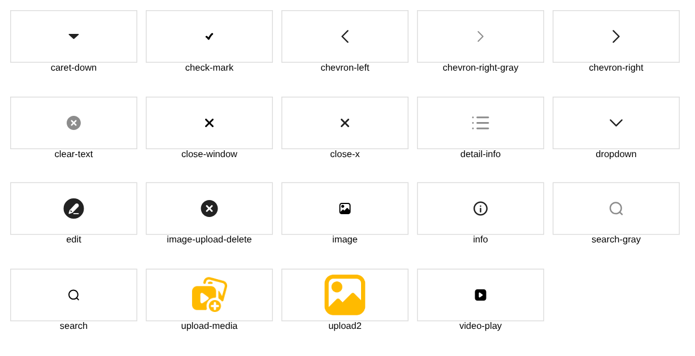

# 바이크 매물등록 준비(아이콘 · 작업 계획)

① 한 줄 요약: 노션 「매물 등록 문서」에 따라 초톳 바이크 등록 화면에 필요한 아이콘 19종을 노션 원본 그대로 저장소에 모으고, 클로드 코드 작업 계획을 정리했다.

② 과제 ID 미지정 · 브랜치 `claude/usedcar-list-detail-category-otcx1u` · 커밋 7b0e534 · PR 없음 · 상태: 푸시(병합·배포 없음, 화면 변경 없음)

③ 한 일
- 노션 초톳 아이콘 DB에서 「매물 등록용 아이콘」과 등록 화면에 쓰이는 화살표·닫기·검색 아이콘 19종을 원본 파일 그대로 `public/assets/register/chotot-v01/`에 복사했다(`manifest.json`에 노션 이름·원본 파일명·쓰는 자리).
- 드라이브 초톳 앱 캡처 2장(카테고리 선택 · 바이크 등록 폼)으로 화면 항목을 정리했다.
- 초톳 등록 화면은 로그인을 해야 열려서 직접 실측하지 못했다(로그인 우회 안 함).
- 작업 계획: `docs/register-bike-plan.md`.

④ 원본과 비교: 아이콘 모음

⑤ 검증: `npm run check:runtime` 통과. 화면 코드 변경 없음.

⑥ 원본과 다르게 남긴 것: AI 자동 카테고리 아이콘은 쓰지 않는다(보배드림은 그 단계 없이 바로 폼).

⑦ 못 한 것·다음에 할 것: 헤더 ← 화살표 · 선 연필 · 체크박스 원본 없음. 초톳 선택 시트·사진 추가·미리보기 캡처 추가 필요. 그다음 `?register=bike` 화면 제작.

⑧ 확인 링크: 없음(화면 변경 없음)
