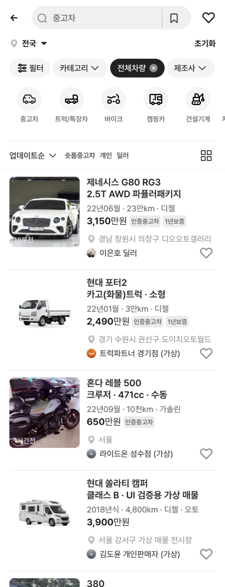

# 전체차량 목록에 모든 유형 매물 섞어 최신순 표시

## ① 한 줄 요약
과쯔 「전체차량」 목록에 승용·트럭·바이크·캠핑카·건설기계·자재운반장비·부품 매물을 모두 섞어 업데이트순(최신순)으로 보여주게 했습니다.

## ② 과제 · 브랜치 · 커밋 · PR · 상태
- 과제 ID: 없음(사용자 직접 지시)
- 브랜치: `claude/all-category-mixed` (base `main` f8bf5b0)
- 커밋 · PR · 배포 v값: 채팅 보고 참고
- 상태: 병합 · 배포(사용자 지시)

## ③ 한 일
- 이전에는 「전체차량」에 승용 샘플 64대만 나왔습니다.
- 이제 「전체차량」일 때 7개 유형 매물을 한 목록으로 합칩니다(`src/prototype/listing/index.tsx`의 `allVehicleMixedCars`).
- 업데이트순 정렬은 매물 번호(id) 기준이라, 그대로 합치면 부품(10000번대)·자재운반(9000번대)이 통째로 위에 쌓입니다. 그래서 유형마다 자기 최신순을 지키며 목록 전체에 고르게 퍼지게 섞고, 그 순서를 섞음 목록 전용 순위(`updateRank`)로 고정했습니다.
- 「중고차」 「트럭·특장」 「바이크」 등 개별 카테고리는 전과 같습니다. 가격순·연식순 같은 다른 정렬도 그대로 동작합니다.
- 수정 전 파일은 `_교체전/all-mixed/`에 백업했습니다(커밋 안 함).

## ④ 확인(384, 첫 화면 매물 순서)
제네시스 G80 → 현대 포터2(트럭) → 혼다 레블 500(바이크) → 현대 쏠라티 캠퍼(캠핑카) → 굴삭기 380(건설기계) → 현대머티리얼핸들링 25D-9(자재운반) → 한국타이어 벤투스(부품) → 기아 카니발 → 그랜저 GN7 → 이스즈 엘프 → …

## ⑤ 검증
- `npm run verify` 통과(테스트 29+4, 실패 0)
- 페이지 오류: 모바일 · PC 0건. 「중고차」 카테고리는 승용만 그대로.

## ⑥ 원본과 다르게 남긴 것
- 건설기계 매물 제목이 모델명만(예: 「380」) 나오는 것은 기존 건설기계 데이터 표기 그대로입니다.
- 매물 사진을 차종에 맞추는 작업은 권한 문제로 보류 중입니다(사진 출처 결정 대기).

## ⑦ 다음에 할 것
- 매물 사진 출처 결정 후 차종별 사진 교체

## ⑧ 확인 링크
- 모바일 `?qf=guazi`, PC `?qf=guazi&pc=1` (배포본은 `&v=<커밋>`)
