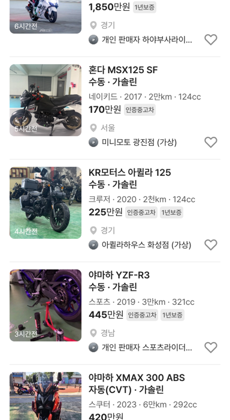

# 바이크 목록 카드 스펙 줄: 장르 · 연식 · 주행 · 배기량

## ① 한 줄 요약
바이크 카드 스펙 줄을 사용자 지시대로 「장르 · 2023 · 2만km · 2,300cc」 형식으로 바꿨습니다.

## ② 과제 · 브랜치 · 커밋 · PR · 상태
- 과제 ID: 없음(사용자 직접 지시)
- 브랜치: `claude/bike-card-meta` (base `main` 8c2303e)
- 커밋 · PR: 채팅 보고 참고
- 상태: 푸시 · PR(병합·배포 지시 없음)

## ③ 한 일
- 스펙 줄: 「22년10월 · 2만km · 가솔린」 → 「스포츠 · 2022 · 2만km · 1,340cc」(`src/prototype/data/bbm-card-samples.ts`)
- 2행: 장르·배기량이 스펙 줄과 겹쳐서 「스포츠 · 1,340cc · 수동」 → 「수동 · 가솔린」(`src/prototype/data/index.tsx`)
- 같이 고친 버그: 9,500km 이상 1만km 미만이 「10천km」로 나오던 것을 「1만km」로(모든 카테고리 공통)
- 수정 전 파일은 `_교체전/bike-card-meta/`에 백업했습니다(커밋 안 함).

## ④ 화면(384)
| 매물 | 2행 | 스펙 줄 |
|---|---|---|
| 스즈키 하야부사 | 수동 · 가솔린 | 스포츠 · 2022 · 2만km · 1,340cc |
| 혼다 MSX125 SF | 수동 · 가솔린 | 네이키드 · 2017 · 2만km · 124cc |
| KR모터스 아퀼라 125 | 수동 · 가솔린 | 크루저 · 2020 · 2천km · 124cc |
| 혼다 레블 500(전체차량) | 수동 · 가솔린 | 크루저 · 2023 · 1만km · 471cc (전: 10천km) |

## ⑤ 검증
- `npm run verify:qf` 통과
- 바이크 목록(모바일·PC)·전체차량 목록 페이지 오류 0건

## ⑥ 원본과 다르게 남긴 것
- 연식은 지시대로 「2023」(「년식」 없이)입니다. 승용 카드의 「24년08월」 표기와 다릅니다.

## ⑦ 다음에 할 것
- 트럭·트레일러·캠핑카·부품 카드도 시나리오 문서(`reports/claude/as24-category-meta-scenario.md`) 기준으로 바꿀지 확정

## ⑧ 확인 링크
- 모바일 `?qf=guazi&category=바이크`, PC `?qf=guazi&pc=1&category=바이크`
