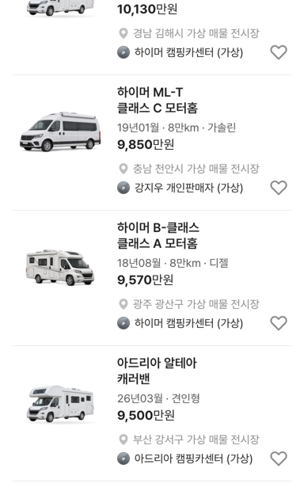

# 캠핑카 카드: 엔카 캠핑카 목록 규칙

## ① 한 줄 요약
캠핑카 매물 카드를 엔카 캠핑카 목록처럼 「제조사 모델 / 형태 / 등록연월 · 주행 · 연료」로 바꿨습니다.

## ② 과제 · 브랜치 · 커밋 · PR · 상태
- 과제 ID: 없음(사용자 직접 지시)
- 브랜치: `claude/camping-card-encar` (base `main` 770c2c4)
- 커밋 · PR · 배포 v값: 채팅 보고 참고
- 상태: 병합 · 배포(사용자 지시 「이젠 바로 배포해」)

## ③ 한 일
- 2행: 「클래스 A · UI 검증용 가상 매물」 → 형태만(「클래스 A 모터홈」 「캐러밴」 「팝업 캠퍼」 「캠퍼밴」)
- 스펙 줄: 「2020년식 · 84,550km · 전기 · 오토」 → 「20년06월 · 8만km · 전기」(트럭과 같은 엔카 순서·표기)
- 캐러밴은 엔진이 없어 주행·연료 대신 「등록연월 · 견인형」
- 올해 연식은 등록월이 이번 달을 넘지 않게 했습니다(미래 등록월 방지).
- 자재운반장비·부품/용품은 바꾸지 않았습니다(2행 검증 문구 유지).
- 수정 전 파일은 `_교체전/camping-card-encar/`에 백업했습니다(커밋 안 함).

## ④ 화면(384)
| 1행 | 2행 | 스펙 줄 |
|---|---|---|
| 하이머 엑시스 | 클래스 A 모터홈 | 20년06월 · 8만km · 전기 |
| 하이머 ML-T | 클래스 C 모터홈 | 19년01월 · 8만km · 가솔린 |
| 아드리아 알테아 | 캐러밴 | 26년03월 · 견인형 |
| 현대 쏠라티 캠퍼(전체차량) | 클래스 B 모터홈 | 18년05월 · 5천km · 디젤 |

## ⑤ 검증
- `npm run verify` 통과(테스트 29+4, 실패 0)
- 캠핑카(모바일·PC)·전체차량 페이지 오류 0건

## ⑥ 원본과 다르게 남긴 것
- 🟡 엔카 캠핑카 목록은 robots.txt(api.encar.com 금지)로 직접 보지 못해 엔카 등급명 관례로 만들었습니다.
- 🟡 「UI 검증용 가상 매물」 표시는 캠핑카 카드에서 빠졌습니다. 판매자 이름의 「(가상)」은 그대로입니다.

## ⑦ 다음에 할 것
- 취침 인원·전장 데이터가 생기면 2행이나 스펙 줄에 추가

## ⑧ 확인 링크
- 모바일 `?qf=guazi&category=캠핑카`, PC `?qf=guazi&pc=1&category=캠핑카`
