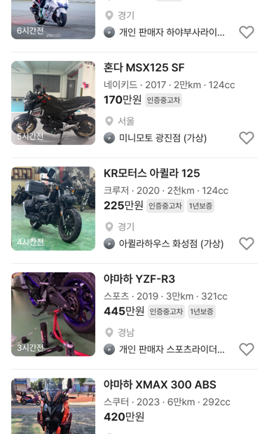
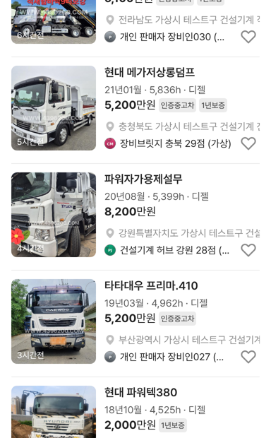
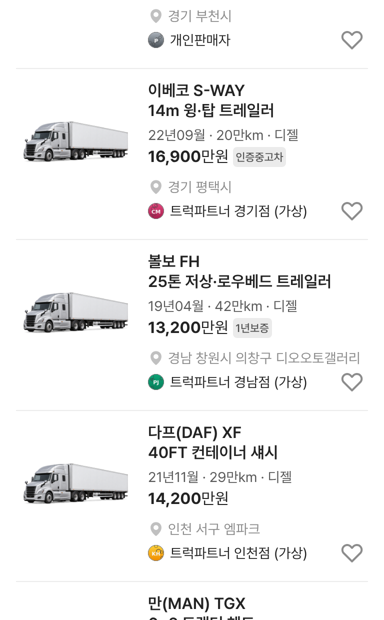

# 바이크·건설기계 제목 「제조사 모델」만 · 트럭 엔카 화물·특장 규칙

## ① 한 줄 요약
바이크·건설기계 매물 카드 제목을 「제조사 모델」 한 줄로 줄이고, 트럭 카드는 엔카 화물·특장 등급명처럼 「톤수 + 세부형식」으로 바꿨습니다.

## ② 과제 · 브랜치 · 커밋 · PR · 상태
- 과제 ID: 없음(사용자 직접 지시)
- 브랜치: `claude/category-card-titles` (base `main` 64ee6e9)
- 커밋 · PR · 배포 v값: 채팅 보고 참고
- 상태: 병합 · 배포(사용자 지시 「이젠 바로 배포해」)

## ③ 한 일
- 바이크: 2행(「수동 · 가솔린」)을 빼고 제목 「제조사 모델」만. 스펙 줄은 지난번 그대로(장르 · 연식 · 주행 · 배기량).
- 건설기계: 2행(「덤프차 · 전체 · 5M10저상덤프」)을 빼고 제목만. 스펙 줄의 「0km」를 사용시간(h)으로 고쳤습니다(건설기계는 시간으로 셈).
- 트럭: 2행을 엔카 등급명처럼 「톤수 + 세부형식」(「1톤 카고」 「8.5톤 윙바디」 「6×2 트랙터 헤드」)으로. 스펙 줄은 「연식 · 주행 · 연료」로, PC에서 붙던 샘플 마력은 뺐습니다.
- 수정 전 파일은 `_교체전/category-card-titles/`에 백업했습니다(커밋 안 함).

## ④ 화면(384)
| 카테고리 | 1행 | 2행 | 스펙 줄 |
|---|---|---|---|
| 바이크 | 스즈키 하야부사 | 없음 | 스포츠 · 2022 · 2만km · 1,340cc |
| 건설기계 | 현대 메가저상롱덤프 | 없음 | 21년01월 · 5,836h · 디젤 |
| 트럭 | 한국GM 라보 | 0.5톤 카고 | 14년02월 · 9만km · LPG |
| 트럭 | 볼보 FH | 25톤 저상·로우베드 트레일러 | 19년04월 · 42만km · 디젤 |

| 바이크 | 건설기계 | 트럭 |
|---|---|---|
|  |  |  |

## ⑤ 검증
- `npm run verify` 통과(테스트 29+4, 실패 0)
- 바이크·건설기계·트럭(모바일·PC)·전체차량 페이지 오류 0건

## ⑥ 원본과 다르게 남긴 것
- 🟡 엔카 화물·특장 목록은 robots.txt(api.encar.com 전체 금지)로 직접 보지 못해, 엔카 등급명 관례(제조사 모델 + 톤수 + 형식)로 만들었습니다.
- 🟡 건설기계 중 제조사가 「미확인」인 매물(5M10저상덤프 등)은 제조사가 없어 원래 매물명만 나옵니다.
- 🟡 트레일러는 엔진이 없는데 주행거리·연료가 나옵니다(데이터 그대로). 시나리오 문서대로 고칠지 확정이 필요합니다.

## ⑦ 다음에 할 것
- 트레일러 스펙 줄(적재량·길이·축) 정리, 건설기계 미확인 제조사 데이터 보강

## ⑧ 확인 링크
- 모바일 `?qf=guazi&category=바이크` · `건설기계` · `트럭 · 특장`, PC `&pc=1` (배포본은 `&v=<커밋>`)
