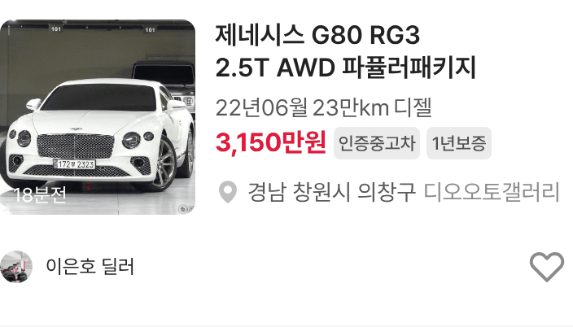
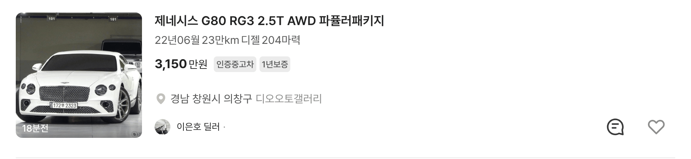

# claude/happy-wozniak-mwlnne 보고 — 목록 썸네일 사진 아이콘·숫자 제거

## ① 한 줄 요약
과쯔(개발 시안형) 중고차 목록 카드 썸네일 오른쪽 아래의 사진 아이콘과 사진 수를 뺐습니다. 등록 시간 표시(예: 18분전)는 그대로 둡니다.

## ② 과제 · 브랜치 · 커밋 · PR · 상태
- 과제 ID: 없음(사용자 직접 지시)
- 브랜치: `claude/happy-wozniak-mwlnne` (base `main` a1c6107)
- 커밋: 이 보고서를 담은 커밋
- PR: 없음
- 상태: 푸시 완료 · 병합·배포 안 함
- 함께 main에 들어간 과제: 없음

## ③ 한 일
- 모바일 목록 카드(`src/prototype/listing/bbm-list.tsx`)에서 썸네일 아래 띠의 `bbm-card-count`(사진 아이콘 + 숫자)를 지웠습니다.
- PC 목록 카드(`src/prototype/listing/pc-bbmuseum.tsx`의 `BbCarCard`)에서도 같은 부분을 지웠습니다.
- 초톳·동처띠 모드 카드는 동결 대상이라 바꾸지 않았습니다.

## ④ 원본과 비교
| 항목 | 작업 전 | 작업 후 |
|---|---|---|
| 썸네일 사진 수 표시(384) | 카드 20장 모두 표시 | 0 |
| 썸네일 사진 수 표시(1280) | 카드 20장 모두 표시 | 0 |
| 등록 시간 표시 | 왼쪽 아래 | 그대로 |

 

## ⑤ 검증
- `npm run verify:qf` 통과
- 콘솔(페이지) 오류: 모바일 0 · PC 0
- 퀵필터 규격(`measure:qf`)은 해당 없음(퀵필터 레일을 바꾸지 않음)

## ⑥ 원본과 다르게 남긴 것과 이유
- dev 원본 카드에는 사진 수가 있지만, 사용자 지시로 뺐습니다.

## ⑦ 못 한 것 · 다음에 할 것
- 상세 화면의 사진 번호(예: 3/24)는 썸네일이 아니라 그대로 두었습니다. 함께 빼야 하면 알려 주세요.

## ⑧ 확인 링크
- 로컬: 모바일 `?qf=guazi`, PC `?qf=guazi&pc=1` (빌드 `claude/happy-wozniak-mwlnne` @ 이 보고서 커밋)
