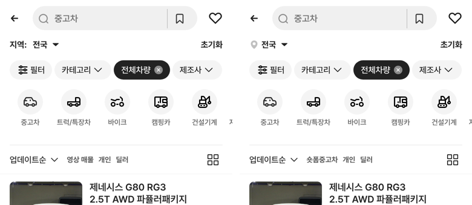

# 모바일 헤더 지역 아이콘 · 숏폼중고차 문구

## ① 한 줄 요약
과쯔 모바일 헤더의 「지역: 전국」을 초톳 위치 아이콘 + 「전국」으로 바꾸고, 목록 제어행의 「영상 매물」을 「숏폼중고차」로 바꿨습니다.

## ② 과제 · 브랜치 · 커밋 · PR · 상태
- 과제 ID: 없음(사용자 직접 지시)
- 브랜치: `claude/header-region-icon` (base `main` 7aa9faf)
- 커밋 · PR · 배포 v값: 채팅 보고 참고
- 함께 main에 들어간 과제: 없음

## ③ 한 일
- 노션 `svgexport-20`(초톳 「중고차 리스트 사용 아이콘」) SVG 원본을 고치지 않고 `public/assets/bbm/header-location-chotot-v01.svg`로 넣었습니다.
- 모바일 헤더 지역 버튼에서 「지역:」 글자를 지우고 그 자리에 아이콘(16×16, 원본 색 #C0C0C0)을 넣었습니다. 아이콘–「전국」 간격은 초톳 원본과 같은 4px입니다.
- 목록 제어행 「영상 매물」 → 「숏폼중고차」(화면 문구와 화면읽기 이름 모두).
- 과쯔 모드에만 적용했습니다. 초톳·동처띠 모드의 「지역:」은 그대로입니다.
- 수정 전 파일은 `_교체전/header-region/`에 백업했습니다.

## ④ 원본과 비교(384)
| 항목 | 전 | 후 |
|---|---|---|
| 헤더 문구 | 지역: 전국 ▾ | [아이콘] 전국 ▾ |
| 아이콘 | 없음 | 16×16, x 16 |
| 「전국」 시작 x | 54.2 | 36 (아이콘 끝 32 + 4) |
| 제어행 첫 탭 | 영상 매물 | 숏폼중고차 |

## ⑤ 검증
- `npm run verify:qf` 통과, `npm run verify`는 배포 전 실행
- 페이지 오류: 모바일 0건
- 퀵필터 레일 규격은 바꾸지 않았습니다(헤더 높이 그대로).

## ⑥ 원본과 다르게 남긴 것
- PC 목록의 「숏폼매물」 스위치 문구는 이번 지시(모바일 「영상 매물」) 범위 밖이라 그대로 두었습니다. 같이 바꿀지 알려 주세요.

## ⑦ 다음에 할 것
- 없음

## ⑧ 확인 링크
- 모바일 `?qf=guazi`, PC `?qf=guazi&pc=1` (배포본은 `&v=<커밋>`)
