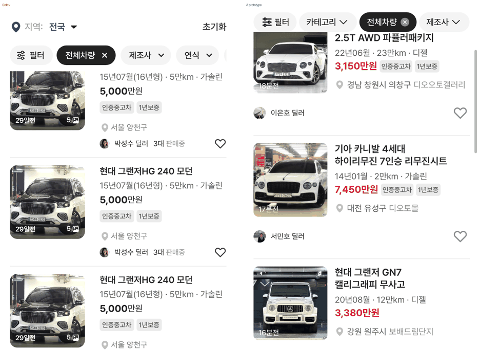
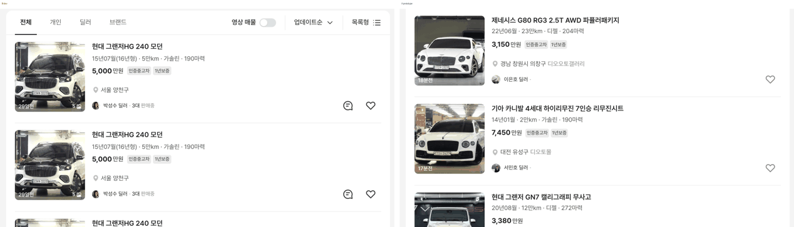
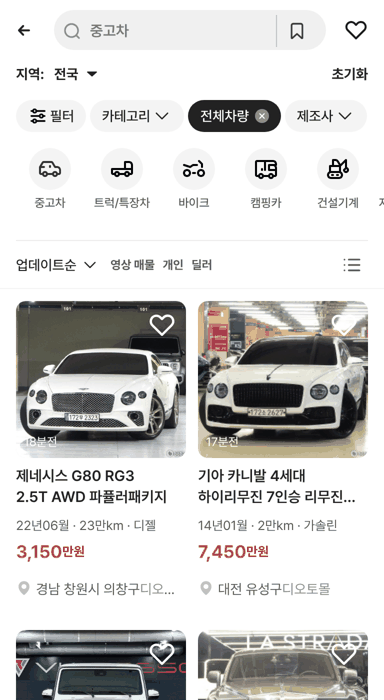

# JOB-8 추가 보고 — 목록 카드 스펙 가운데 점 + 매물 구분선

## ① 한 줄 요약
과쯔 목록 카드의 스펙 줄을 dev처럼 `22년06월 · 23만km · 디젤`로 이어 쓰고, 카드 구분선을 dev와 같은 1px #EBEBEB로 맞췄습니다(모바일·PC).

## ② 과제 · 브랜치 · 커밋 · PR · 상태
- 과제 ID: JOB-8(추가분)
- 브랜치: `claude/job8-list-card` (base `main` 5d3a41f)
- 커밋: 이 보고서를 담은 커밋
- PR: 이 브랜치의 PR(병합 안 함)
- 상태: 푸시 완료 · 병합·배포 안 함(지시)
- JOB-8 본문(판매자 줄 이동): 지시문을 아직 받지 못했습니다. 노션에도 JOB-8 행이 없습니다. 본문이 오면 같은 PR에 넣겠습니다.

## ③ 한 일
- **가운데 점:** 이미 `bbmCardSpec()`이 항목을 `" · "`로 이어 만든 글을 화면에서 다시 쪼개 span으로 나누고(간격 2px) 있었습니다. dev(`15년07월(16년형) · 5만km · 가솔린`)처럼 그 글을 그대로 한 줄로 보여 주게 바꿨습니다(`bbm-list.tsx`). 점은 글자이므로 색이 스펙 글자색과 같습니다.
- 스펙 줄을 flex에서 block으로 바꿔 한 줄이 넘치면 말줄임(…)이 걸리게 했습니다(`bbm-tokens.css`).
- **모바일 구분선:** 카드 `border-bottom`을 #F4F4F4(`--list-divider`)에서 #EBEBEB로 바꿨습니다. `--list-divider` 변수 값은 그대로 두었습니다(`.bbm-m-options` 등이 씀).
- **PC 구분선:** 이미 dev와 같은 `::after` 1px #EBEBEB, 좌우 20px 안쪽이었습니다. 다만 마지막 카드는 선을 숨기는 규칙이 있었는데, dev는 마지막 카드 아래에도 선이 있어서 그 규칙을 지웠습니다.
- 수정 전 파일은 작업 폴더 `_교체전/`에 백업했습니다.
- 사진 아이콘·사진 수·채팅 아이콘 제거 상태는 그대로입니다.

## ④ 원본과 비교
### 스펙 줄(첫 카드, 글자 단위 x 좌표, 공백 포함)
| 폭 | | 1번째 항목 | 점 | 2번째 | 점 | 3번째 | 점 | 4번째 |
|---|---|---|---|---|---|---|---|---|
| 384 | dev | 15년07월(16년형) 162–268.5 | 268.5–272 | 5만km 272–318.4 | 318.4–322 | 가솔린 322–361.8 | | |
| 384 | 시안 전 | 22년06월 148–205.6 | 없음(간격 2) | 23만km 207.6–255.4 | 없음 | 디젤 257.4–281.6 | | |
| 384 | 시안 후 | 22년06월 148–209.1 | 209.1–212.6 | 23만km 212.6–267.5 | 267.5–271.1 | 디젤 271.1–298.8 | | |
| 1280 | dev | 15년07월(16년형) 560–666.5 | 666.5–670 | 5만km 670–716.4 | 716.4–720 | 가솔린 720–763.3 | 763.3–766.8 | 190마력 766.8–817.6 |
| 1280 | 시안 후 | 22년06월 560–621.1 | 621.1–624.6 | 23만km 624.6–679.5 | 679.5–683.1 | 디젤 683.1–714.3 | 714.3–717.9 | 204마력 717.8–770.9 |

- 점 한 개 칸(점 + 양쪽 공백 일부)의 폭은 dev와 시안 모두 3.5px입니다. 같은 글꼴·크기(14px)라 간격이 같습니다.
- 항목 글자 자체가 달라(샘플 매물) 항목 길이는 다릅니다.
- 384에서 줄 시작 x가 148(시안) vs 162(dev)인 것은 사진–글 간격 차이(16 vs 24)로, JOB-3(PR #188) 범위입니다.

### 구분선
| 폭 | | 방식 | 색 | 두께 | 시작 x | 끝 x | 마지막 카드 |
|---|---|---|---|---|---|---|---|
| 384 | dev | 카드 border-bottom | #EBEBEB | 1px | 16 | 368 | 있음 |
| 384 | 시안 전 | 카드 border-bottom | #F4F4F4 | 1px | 16 | 368 | 있음 |
| 384 | 시안 후 | 카드 border-bottom | #EBEBEB | 1px | 16 | 368 | 있음 |
| 1280 | dev | 카드 ::after(좌우 20) | #EBEBEB | 1px | 384 | 1220 | 있음 |
| 1280 | 시안 전 | 카드 ::after(좌우 20) | #EBEBEB | 1px | 384 | 1220 | 숨김 |
| 1280 | 시안 후 | 카드 ::after(좌우 20) | #EBEBEB | 1px | 384 | 1220 | 있음 |

### 다른 목록 보기
- 모바일: 목록 · 피드 · 갤러리 · 쇼츠 영상 · 텍스트 보기 모두 점이 나옵니다. 한줄 광고 보기는 스펙 줄이 없습니다.
- PC: 목록형에서 점이 나옵니다. 시안의 PC 보기 메뉴는 다른 보기를 골라도 화면이 목록형으로 남습니다(기존 동작).
- 트럭·건설기계·자재운반장비 등 다른 카테고리 목록에서도 점이 나옵니다(예: `2020년식 · 8,455h · LPG · 오토`).
- 말줄임: 모바일 갤러리 보기의 `18년10월 · 7만km · 가솔린 하이브리드`가 보이는 폭 170 / 글 폭 198로 넘쳐 「…」로 잘립니다.

## ⑤ 검증
- `npm run verify:qf` 통과
- 페이지 오류: 모바일 · PC 모든 보기 0건
- 퀵필터 규격(`measure:qf`)은 해당 없음(퀵필터 레일을 바꾸지 않음)

## ⑥ 원본과 다르게 남긴 것과 이유
- 모바일 스펙 글자색: dev #616161, 시안 #595959입니다. 이번 지시 범위(점·구분선) 밖이라 바꾸지 않았습니다. 맞출지 확정해 주세요. 점 색은 이 글자색을 그대로 따릅니다.
- 모바일 카드 높이(dev 177 / 시안 201)와 사진–글 간격은 JOB-8 본문(판매자 줄 이동)·JOB-3 범위입니다.

## ⑦ 못 한 것 · 다음에 할 것
- JOB-8 본문(판매자 줄 이동) 지시문을 받으면 같은 PR에 넣겠습니다.

## ⑧ 확인 링크
- 로컬: 모바일 `?qf=guazi`, PC `?qf=guazi&pc=1` (빌드 `claude/job8-list-card` @ 이 보고서 커밋)
