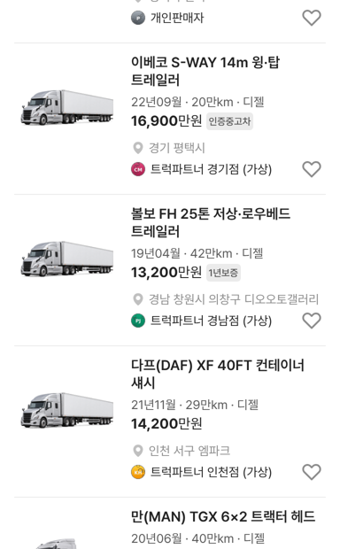

# 중고차 외 카테고리 매물 제목: 차명을 붙여 한 제목으로

## ① 한 줄 요약
중고차(승용)를 뺀 트럭·바이크·건설기계·캠핑카·자재운반장비·부품/용품 카드는 「제조사 모델」과 세부 내용을 붙여 한 제목으로 보여줍니다.

## ② 과제 · 브랜치 · 커밋 · PR · 상태
- 과제 ID: 없음(사용자 직접 지시)
- 브랜치: `claude/joined-title-nonpassenger` (base `main` 776575d)
- 커밋 · PR · 배포 v값: 채팅 보고 참고
- 상태: 병합 · 배포

## ③ 한 일
- 카드 제목(`src/prototype/listing/bbm-list.tsx`): 중고차 외 매물은 「현대 포터2」 / 「1톤 카고」 두 줄 대신 「현대 포터2 1톤 카고」 한 제목.
- 길면 두 줄까지 줄바꿈하고 넘치면 말줄임(`bbm-tokens.css`의 `.bbm-card-model.is-joined`). 줄바꿈은 낱말 단위.
- 중고차(승용)는 그대로 두 줄(제조사 모델 / 세부모델).
- 수정 전 파일은 `_교체전/joined-title/`에 백업했습니다(커밋 안 함).

## ④ 화면(384)
| 카테고리 | 제목 |
|---|---|
| 트럭 | 한국GM 라보 0.5톤 카고 · 이베코 S-WAY 14m 윙·탑 트레일러(2줄) |
| 캠핑카 | 하이머 엑시스 클래스 A 모터홈 |
| 자재운반장비 | 린데 H25D 디젤 지게차 |
| 부품/용품 | 현대모비스 순정 루프랙 외장 용품 |
| 바이크 | 스즈키 하야부사 |
| 중고차 | 제네시스 G80 RG3 / 2.5T AWD 파퓰러패키지(그대로) |

## ⑤ 검증
- `npm run verify` 통과(테스트 29+4, 실패 0)
- 7개 화면(모바일 각 카테고리·PC 트럭·전체차량) 페이지 오류 0건

## ⑥ 원본과 다르게 남긴 것
- 제목이 한 줄인 매물은 두 줄 매물보다 카드가 20px 낮습니다(내용에 따라 높이가 정해지는 기존 규칙).

## ⑦ 다음에 할 것
- 부품/용품 스펙 줄·가격 단위 정리

## ⑧ 확인 링크
- 모바일 `?qf=guazi&category=트럭 · 특장`, PC `&pc=1`
