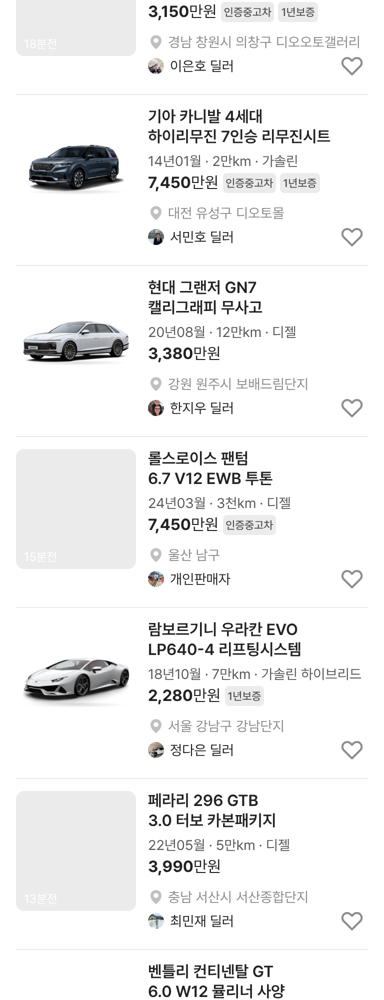

# 매물 사진을 차종과 같은 모델 이미지로 교체

## ① 한 줄 요약
차종과 상관없던 매물 사진(8장 돌려쓰기)을 같은 제조사·모델 이미지로 바꿨습니다. 맞는 이미지가 없는 6개 차종은 다른 차 사진 대신 빈 사진 칸으로 두었습니다.

## ② 과제 · 브랜치 · 커밋 · PR · 상태
- 과제 ID: 없음(사용자 지시 「니가 판단해서 배포해」)
- 브랜치: `claude/listing-photo-model-image` (base `main` 065c63c)
- 커밋 · PR · 배포 v값: 채팅 보고 참고
- 상태: 병합 · 배포

## ③ 한 일
- 판단:
  - ① 보배드림 실매물 사진은 이 작업 환경의 권한 검사(사진 출처)에 막혀 쓰지 않았습니다.
  - 엔카 캡처 이미지(`maker-model/generations`)는 에셋 지침의 외부 앱 캡처 금지 규칙 때문에 쓰지 않았습니다.
  - 저장소에 출처 기록이 있는 모델 이미지 `public/assets/models/kr/`를 썼습니다.
- 기본 매물 19대와 화물 2대(포터2·봉고3)의 사진을 차종에 맞는 모델 이미지로 바꿨습니다. 복사 매물 41대와 카니발 RV 2대는 자기 차종 사진을 그대로 따라갑니다.
- 모델 이미지는 배경 없는 그림이라 칸 안에 맞춰(`contain`) 회색 칸 위에 그립니다.
- 수정 전 파일은 `_교체전/listing-model-image/`에 백업했습니다(커밋 안 함).

## ④ 차종별 사진
| 차종 | 사진 |
|---|---|
| 현대 그랜저 GN7 | `models/kr/49/87.png` (디 올 뉴 그랜저) |
| 기아 카니발 4세대 | `models/kr/3/1838.png` |
| 현대 아이오닉 5 | `models/kr/49/1880.png` |
| 기아 쏘렌토 MQ4 | `models/kr/3/1501.png` (쏘렌토 4세대) |
| BMW 5시리즈 530i | `models/kr/1/1985.png` (G60) |
| 벤츠 E클래스 E 300 | `models/kr/21/1316.png` (W213) |
| 벤츠 A클래스 A 220 | `models/kr/21/1570.png` (W177) |
| 벤츠 C클래스 C 300 · C 200 | `models/kr/21/1197.png` (W206) |
| 벤츠 C클래스 C 220d | `models/kr/21/1267.png` (W205) |
| 포르쉐 718 박스터 | `models/kr/43/1290.png` |
| 벤틀리 컨티넨탈 GT | `models/kr/22/1433.png` (18~24년) |
| 람보르기니 우라칸 EVO | `models/kr/11/1182.png` |
| 현대 포터2 / 기아 봉고3 | `models/kr/49/548.png` / `models/kr/3/1738.png` |
| 제네시스 G80 · 아우디 A6 · 랜드로버 레인지로버 스포츠 · 렉서스 ES300h · 페라리 296 GTB · 롤스로이스 팬텀 | 빈 사진 칸(쓸 수 있는 이미지 없음) |

## ⑤ 검증
- `npm run verify` 통과(테스트 29+4, 실패 0)
- 중고차 목록 19개 차종 사진 대응 확인, 페이지 오류 0건

## ⑥ 원본과 다르게 남긴 것
- 🟡 실매물 사진이 아니라 모델 이미지(측면 그림)입니다. 실매물 사진은 사진 출처가 확정되면 교체합니다.
- 🟡 빈 칸 6개 차종: 「전체차량」 첫 카드가 제네시스 G80이라 첫 카드가 빈 칸으로 보입니다.

## ⑦ 다음에 할 것
- 실매물 사진 출처(권한 허용 또는 사진 폴더) 확정 후 교체
- 빈 칸 6개 차종 이미지 확보

## ⑧ 확인 링크
- 모바일 `?qf=guazi&category=중고차`, PC `?qf=guazi&pc=1&category=중고차` (배포본은 `&v=<커밋>`)
