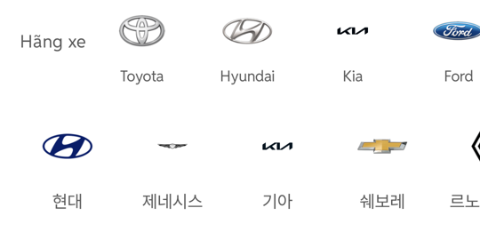

# 제조사 레일 로고 교체 — 오토홈 원본 · 초톳 슬롯 규칙

## ① 한 줄 요약
Drive 「원본_오토홈_0925」에서 우리 제조사 10개 로고를 받아 투명 여백을 잘라내고, 초톳 40×40 상자 규칙으로 승용 제조사 레일(모바일·PC)을 교체했습니다.

## ② 과제 · 브랜치 · 커밋 · PR · 상태
- 과제 ID: 없음(사용자 직접 지시)
- 브랜치: `claude/maker-logo-chotot-slot` (base `main` e7df8a8)
- 커밋 · PR: 채팅 보고 참고
- 상태: 푸시 · PR(병합·배포 지시 없음)

## ③ 한 일
- Drive 폴더에서 현대·제네시스·기아·쉐보레·BMW·벤츠·아우디·포르쉐·르노 원본(600×600 투명 PNG)을 받았습니다.
- 알파 16 이하는 지우고 로고 윤곽에 맞춰 자른 뒤 긴 변 240px 이하로 줄여 `public/assets/brand/rail-v01/`에 넣었습니다(manifest.json에 출처·Drive ID·비율 기록).
- 로고 크기는 초톳 실측 규칙: 40×40 상자 가운데, 비율 r ≤ 1.25 긴 변 82.5% · 1.6 미만 폭 91% · 4 미만 폭 100% · 4 이상 폭 61%.
- 이전에는 256×256 정사각(여백 많음) 파일을 28×28로 그려 로고가 초톳의 절반 크기였습니다.
- 바이크·트럭 등 다른 유형 레일과 제조사 목록 창은 그대로입니다.
- 수정 전 파일은 `_교체전/maker-logo/`에 백업했습니다(커밋 안 함).

## ④ 원본과 비교(384, 1080 해상도 잉크 실측)
| 로고 | 초톳 | 전 | 후 |
|---|---|---|---|
| 현대 / Hyundai(r 1.9) | 40.2×21.3 | 21.3×11.0 | **40.5×20.3** |
| 기아 / Kia(r 4.1) | 24.5×6.0 | 21.0×5.0 | **24.5×6.4** |
| 제네시스(r 4.9) | – | 21.3×4.6 | 24.2×4.3 |
| 쉐보레(r 3.6) | – | 21.0×6.0 | 40.2×12.1 |
| 세로 중심 | 모두 같은 선 | 같은 선 | 같은 선(174) |

## ⑤ 검증
- `npm run verify:qf` 통과
- 페이지 오류: 모바일 · PC 0건, PC 레일 새 로고 10개 표시
- `npm run check:logos`: 스크립트가 찾는 브라우저 버전이 이 작업 환경에 없어 실행하지 못했습니다(위 실측으로 대신 확인).

## ⑥ 원본과 다르게 남긴 것
- 🟡 르노코리아: 폴더의 「르노삼성」 파일은 구형 로고라 현행 르노 다이아몬드(「프랑스_르노」)를 썼습니다. 원본이 100px로 작아 화면에서 약간 확대됩니다.
- 🟡 KGM: 폴더의 「KGM(쌍용)」 파일은 구형 쌍용 날개 로고라 쓰지 않고, 트럭에서 쓰는 공식 KGM 워드마크를 썼습니다.
- 🟡 아우디: 4링 엠블럼을 썼습니다(폴더의 「AUDI」 글자형은 중국 신브랜드).
- 🟡 제네시스·KGM처럼 아주 납작한 글자형은 초톳 기아 규칙(폭 61%)을 따라 작게 보입니다. 키울지 확정이 필요합니다.
- 🟡 세로 위치는 그대로 두었습니다. 이번 초톳 캡처(칩 줄 → 로고 중심 32.2)와 이전 초톳 4장 실측(상자 위 6 · 이름까지 14, 현재 우리 값)이 서로 달라 확정이 필요합니다.

## ⑦ 다음에 할 것
- 제조사 목록 창(바텀시트·모달)·좌측 필터 로고도 같은 원본으로 바꿀지 확정

## ⑧ 확인 링크
- 로컬 모바일 `?qf=guazi&category=중고차`, PC `?qf=guazi&pc=1&category=중고차` (빌드 `claude/maker-logo-chotot-slot`)
