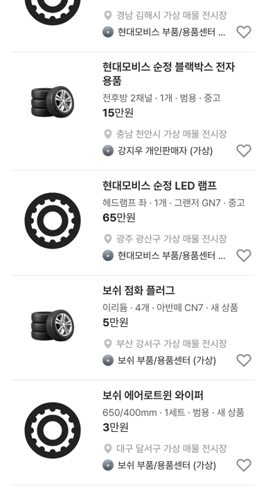

# 부품/용품 카드: 규격 · 수량 · 적용 차종 · 상태, 부품 가격대

## ① 한 줄 요약
부품/용품 카드의 「2020년식 · 미사용·중고 혼합 · 해당 없음 · 해당 없음」과 수천만원 가격을 「규격 · 수량 · 적용 차종 · 상태」와 실제 부품 가격대로 고쳤습니다.

## ② 과제 · 브랜치 · 커밋 · PR · 상태
- 과제 ID: 없음(사용자 직접 지시)
- 브랜치: `claude/parts-card-fix` (base `main` 38bd29e)
- 커밋 · PR · 배포 v값: 채팅 보고 참고
- 상태: 병합 · 배포

## ③ 한 일
- 30개 품목마다 규격·수량·적용 차종·상태·가격을 정한 표를 추가했습니다(`partsCardDetailsV01`, `src/prototype/data/category-virtual-scenario-v01.ts`). 모두 UI 검증용 가상 값입니다.
- 스펙 줄: 차량용 항목(연식·연료·변속기) 대신 「245/45R18 · 4개 · 그랜저 GN7 · 중고 80%」.
- 가격: 「6,248만원」(루프랙) → 「18만원」. 품목별 3만원(와이퍼)~420만원(BBS 단조 휠).
- 제목: 분류 낱말이 모델명에 이미 있으면 붙이지 않음(「보쉬 AGM 배터리 배터리」 → 「보쉬 AGM 배터리」).
- 수정 전 파일은 `_교체전/parts-card-fix/`에 백업했습니다(커밋 안 함).

## ④ 화면(384)
| 제목 | 스펙 줄 | 가격 |
|---|---|---|
| 현대모비스 순정 루프랙 외장 용품 | 크로스바 · 1세트 · 팰리세이드 LX2 · 미사용 | 18만원 |
| 현대모비스 순정 LED 램프 | 헤드램프 좌 · 1개 · 그랜저 GN7 · 중고 | 65만원 |
| 보쉬 AGM 배터리 | 70Ah · 1개 · 범용 · 새 상품 | 24만원 |
| 브렘보 Xtra 디스크 | 345mm · 2개 · BMW 5시리즈 · 새 상품 | 36만원 |

## ⑤ 검증
- `npm run verify` 통과(테스트 29+4, 실패 0)
- 부품/용품 모바일·PC 페이지 오류 0건, 「해당 없음」 0건

## ⑥ 원본과 다르게 남긴 것
- 🟡 가격 필터의 가격 구간은 승용차 기준이라 부품 가격대(수십만원)에서는 대부분 같은 구간에 들어갑니다.
- 🟡 1만원 미만 가격은 없게 정했습니다(카드 가격이 「만원」 단위 표기).

## ⑦ 다음에 할 것
- 부품용 가격 구간·필터(분류·상태·적용 차종) 정리

## ⑧ 확인 링크
- 모바일 `?qf=guazi&category=부품 · 용품`, PC `&pc=1`
