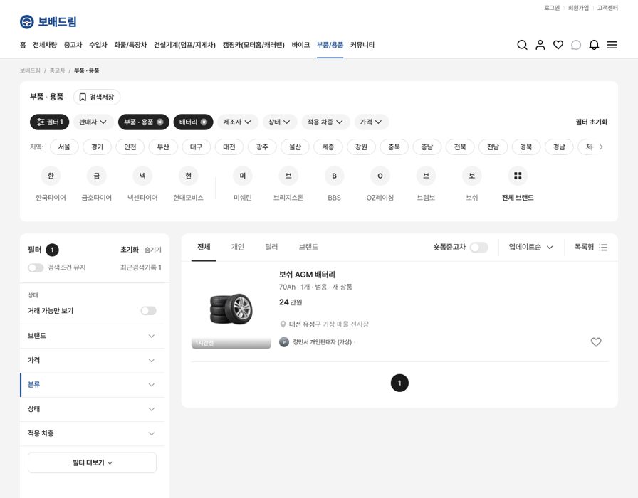
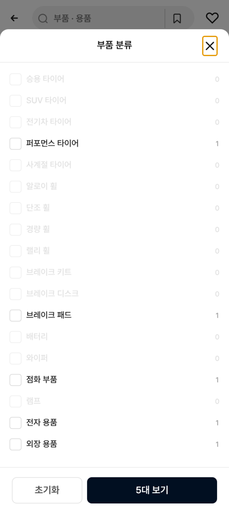
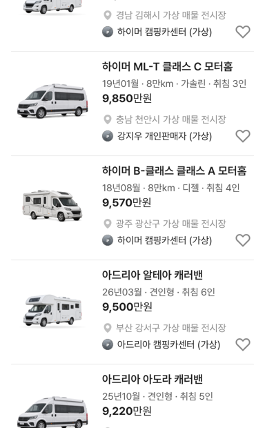

# 부품/용품 가격 구간·필터 + 캠핑카 취침 인원

## ① 한 줄 요약
부품/용품 카테고리에 전용 가격 구간과 필터(분류·상태·적용 차종)를 만들고, 캠핑카 카드에 취침 인원(「취침 5인」)을 붙였습니다.

## ② 과제 · 브랜치 · 커밋 · PR · 상태
- 과제 ID: 없음(사용자 직접 지시)
- 브랜치: `claude/parts-filter-camping-berths` (base `main` b1e241b)
- 커밋 · PR · 배포 v값: 채팅 보고 참고
- 상태: 병합 · 배포

## ③ 한 일
**부품/용품 필터**
- 상단 칩: 연식·주행거리·연료 대신 「분류 · 상태 · 적용 차종 · 가격」(모바일·PC).
- 좌측 필터(PC)·전체 필터(모바일): 브랜드 → 가격 → 분류 → 상태 → 적용 차종, 나머지는 「필터 더보기」(지역).
- 분류 18종(승용 타이어 ~ 외장 용품), 상태 3종(새 상품·미사용·중고, 「중고 80%」는 중고로), 적용 차종 18종(「범용 5x112」 등은 범용으로). 선택지 옆에 매물 수가 나옵니다.
- 가격 구간: 승용 구간(1천만원~) 대신 「~5만원 · 5~20만원 · 20~50만원 · 50~100만원 · 100~300만원 · 300만원~」. 리스·렌트 탭은 숨김.
- 고친 곳: `bbm-filter-state.ts`(필터 키·매물 값·가격 구간 해석), `bbm-filter-options.ts`(선택지·순서·가격 구간), `bbm-price.tsx`(구간·탭 표시 선택), `listing/index.tsx`(칩·순서·가격 창), `pc-bbmuseum.tsx`(좌측 가격 창), `data/index.tsx`(매물 필터 값).

**캠핑카 취침 인원**
- 30개 모델마다 취침 인원(2~6인)을 정하고(`campingBerthsV01`, UI 검증용 가상 값) 스펙 줄 끝에 붙였습니다: 「20년06월 · 8만km · 전기 · 취침 5인」, 캐러밴 「26년03월 · 견인형 · 취침 6인」.

- 수정 전 파일은 `_교체전/parts-filter-camping/`에 백업했습니다(커밋 안 함).

## ④ 동작 점검(로컬 빌드)
| 점검 | 결과 |
|---|---|
| 부품 상단 칩(모바일) | 카테고리 · 부품 · 용품 · 제조사 · 분류 · 상태 · 적용 차종 · 가격 |
| 가격 창 구간 | 전체 · ~5만원 · 5~20만원 · 20~50만원 · 50~100만원 · 100~300만원 · 300만원~, 탭 없음 |
| 「5~20만원」 선택 | 입력칸 5~20 자동 채움, 「5대 보기」 → 18·15·5·12·14만원 5대, 칩 「5만원부터 20만원까지」 |
| 분류 창 | 승용 타이어 5 · SUV 타이어 4 · … 매물 수 표시 |
| PC 분류 「배터리」 선택 | 보쉬 AGM 배터리 1대, 적용 칩 「배터리」 |
| 캠핑카 카드 | 취침 3~6인 표시 |
| 중고차 가격 창 | 기존 구간·탭 그대로 |

| PC 부품 필터 | 모바일 분류 창 | 캠핑카 |
|---|---|---|
|  |  |  |

## ⑤ 검증
- `npm run verify` 통과(테스트 29+4, 실패 0)
- 부품(모바일·PC)·캠핑카·중고차 페이지 오류 0건

## ⑥ 원본과 다르게 남긴 것
- PC 좌측 필터는 당근 기본 노출 순서 규칙에 따라 가격이 분류보다 위에 옵니다.
- 부품 값(가격·상태·적용 차종)과 캠핑카 취침 인원은 UI 검증용 가상 값입니다.

## ⑦ 다음에 할 것
- 트레일러 스펙 줄(적재량·길이·축) 정리

## ⑧ 확인 링크
- 모바일 `?qf=guazi&category=부품 · 용품`, `?qf=guazi&category=캠핑카`, PC `&pc=1`
