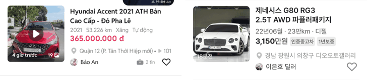

# claude/price-black 보고 — 목록 카드 가격을 현대 인증중고차 방식으로

## ① 한 줄 요약
모바일 목록 카드 가격을 빨강에서 검정으로 바꾸고, 「만원」은 같은 색·같은 크기에서 굵기만 낮췄습니다(현대 인증중고차 방식).

## ② 과제 · 브랜치 · 커밋 · PR · 상태
- 과제 ID: 없음(사용자 직접 지시)
- 브랜치: `claude/price-black` (base `main` 51b104d)
- 상태: 푸시 · PR(병합·배포는 지시 대기)

## ③ 한 일
- 현대 인증중고차 앱 캡처 실측(1080×2340 → 384): 「4,990」은 검정 #000, 굵게(획 약 3px). 「만원」도 검정이고 같은 크기, 보통 굵기(획 약 1px)입니다.
- `--list-price`를 #E5193B(빨강)에서 #222(우리 검정)로 바꿨습니다. 이 변수는 목록 카드 가격에만 쓰입니다.
- 모바일 「만원」 굵기를 700에서 400으로 낮췄습니다.
- 갤러리 보기의 별도 빨강(#F2385A)도 같은 검정으로 맞췄습니다.
- PC 카드는 원래 검정 700 + 만원 400이라 그대로입니다. 초톳·동처띠(`pc.css`)는 동결이라 건드리지 않았습니다.
- `docs/quick-filter-spec.md`의 가격 규칙(빨강 #E5193B)을 검정 방식으로 고쳤습니다.

## ④ 원본과 비교
| 보기 | 숫자 | 만원 |
|---|---|---|
| 현대 인증중고차 | 검정 굵게 | 검정 보통, 같은 크기 |
| 모바일 목록(전) | 16 700 #E5193B | 16 700 #E5193B |
| 모바일 목록(후) | 16 700 #222 | 16 400 #222 |
| 피드(후) | 17 700 #222 | 14 400 #222 |
| 갤러리(후) | 18 700 #222 | 13 400 #222 |
| 텍스트(후) | 16 700 #222 | 16 400 #222 |
| PC(변화 없음) | 16 700 #222 | 14 400 #222 |

## ⑤ 검증
- `npm run verify:qf` 통과, 4개 모바일 보기·PC 페이지 오류 0건

## ⑥ 원본과 다르게 남긴 것과 이유
- 검정은 현대의 #000 대신 우리 글자 검정 #222를 썼습니다(제목·PC 가격과 같은 색). #000으로 바꿀지 알려 주세요.
- 피드·갤러리 보기는 기존 크기 차이(만원이 숫자보다 작음)를 유지했습니다.

## ⑦ 못 한 것 · 다음에 할 것
- 상세 화면 가격은 이번 범위가 아니라 그대로입니다.

---

## 추가: 지역·판매자 글자 색·크기를 초톳과 같게(프리텐다드 기준 균형)
- **초톳 실측**(1080×2340 → 384):
  - 지역 줄 전체 #8C8C8C, 판매자 이름 #222222
  - 두 줄의 대문자 높이가 8.89로 같습니다. 즉 같은 크기입니다.
  - 지역 줄 잉크 높이는 12.44입니다.
- **글꼴:** 카드는 이미 Pretendard Variable(QF-120)입니다. 프리텐다드 한글은 글자 크기의 0.87이라, 14px이면 한글 높이가 약 12.2로 초톳 줄과 같은 크기로 보입니다.
- **바꾼 것:**
  - 판매자 이름: 12px → **14px**/20, 색 #222 그대로
  - 지역 줄: 앞부분(지역) #595959 → **#8C8C8C**. 뒷부분(단지명)은 이미 #8C8C8C여서 줄 전체가 같은 색이 됐습니다.
  - `--list-meta` 변수(스펙 줄도 씀)는 그대로 두었습니다.
- **크로스체크**(초톳과 같은 1080px 캡처, 같은 측정 방법):

| | 지역 잉크 높이 | 지역 색 | 판매자 잉크 높이 | 판매자 색 |
|---|---|---|---|---|
| 초톳 | 12.44 | #8C8C8C | 9.6(「Bảo An」, 긴 글자 없음) / 11.73(「Phong」) | #222222 |
| 시안 | 12.09 | #8C8C8C | 12.44 | #222222 |

- 간격(지역 → 판매자 24, 판매자 → 구분선 28)과 카드 높이(171)는 그대로입니다. 갤러리·텍스트·피드 첫 카드도 변화가 없습니다.
- `npm run verify:qf` 통과.
