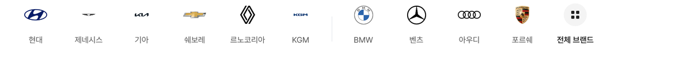

# 제조사 레일 르노코리아·KGM 로고 신형 교체

## ① 한 줄 요약
헤이딜러 로고 폴더의 현행 로고로 르노코리아(평면 다이아몬드)와 KGM(남색 KGM 글자)을 바꿨습니다.

## ② 과제 · 브랜치 · 커밋 · PR · 상태
- 과제 ID: 없음(사용자 직접 지시)
- 브랜치: `claude/rail-logo-heydealer` (base `main` 6767720)
- 커밋 · PR · 배포 v값: 채팅 보고 참고
- 상태: 병합 · 배포(사용자 지시 「일단 배포」)

## ③ 한 일
- Drive 헤이딜러 로고 폴더에서 「국산_르노코리아삼성」 「국산_KG모빌리티쌍용」(600×600 투명 PNG)을 받았습니다. 구형은 그 폴더의 `_구형_제외`에 따로 있습니다.
- 앞 작업과 같이 투명 여백을 자르고 긴 변 240px 이하로 줄여 `public/assets/brand/rail-v01/renault.png`, `kgm.png`를 바꿨습니다(manifest.json에 출처 기록).
- 르노코리아: 모양은 같고 원본이 100px → 410px로 선명해졌습니다.
- KGM: 작은 심볼이 붙은 글자 로고 → 남색 「KGM」 글자만 있는 로고. 비율 6.3이라 초톳 규칙(폭 61%)대로 작게 보입니다.
- 수정 전 파일은 `_교체전/rail-logo-heydealer/`에 백업했습니다(커밋 안 함).

## ④ 화면

## ⑤ 검증
- `npm run verify` 통과(테스트 29+4, 실패 0)
- PC 레일 새 로고 10개, 페이지 오류 0건

## ⑥ 원본과 다르게 남긴 것
- 🟡 KGM·제네시스는 아주 납작해서 작게 보입니다(초톳 기아 규칙). 키울지 확정이 필요합니다.

## ⑦ 다음에 할 것
- KGM·제네시스 크기 확정 후 반영

## ⑧ 확인 링크
- 모바일 `?qf=guazi&category=중고차`, PC `?qf=guazi&pc=1&category=중고차` (배포본은 `&v=<커밋>`)
