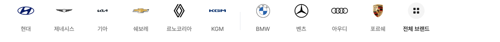

# 제조사 레일 제네시스·KGM 로고 키움

## ① 한 줄 요약
아주 납작해서 작게 보이던 제네시스·KGM 로고를 40×40 상자 폭 100%(40px)로 키웠습니다.

## ② 과제 · 브랜치 · 커밋 · PR · 상태
- 과제 ID: 없음(사용자 직접 지시 「키워」)
- 브랜치: `claude/rail-logo-wide-size` (base `main` c9287b6)
- 커밋 · PR: 채팅 보고 참고
- 상태: 푸시 · PR(병합·배포 지시 없음)

## ③ 한 일
- 두 로고에만 폭 100%를 지정했습니다. 나머지는 초톳 규칙 그대로이고, 기아는 초톳 실측(폭 61%)과 같게 유지했습니다.
- 수정 전 파일은 `_교체전/rail-logo-wide/`에 백업했습니다(커밋 안 함).

## ④ 비교(보이는 크기, 384 기준)
| 로고 | 전 | 후 |
|---|---|---|
| 제네시스(r 4.9) | 약 24.4×5.0 | 40×8.1 |
| KGM(r 6.3) | 약 24.4×3.9 | 40×6.4 |

## ⑤ 검증
- `npm run verify:qf` 통과, PC 레일 로고 10개 · 페이지 오류 0건

## ⑥ 원본과 다르게 남긴 것
- 제네시스·KGM은 초톳 r ≥ 4 규칙(61%)과 다르게 100%입니다(사용자 지시).

## ⑦ 다음에 할 것
- 없음

## ⑧ 확인 링크
- 모바일 `?qf=guazi&category=중고차`, PC `?qf=guazi&pc=1&category=중고차`
