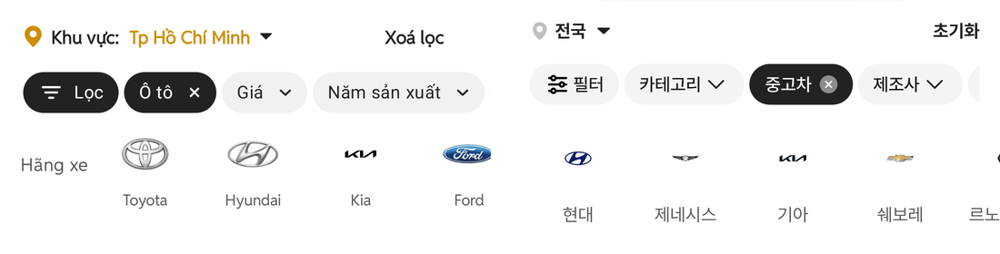

# 헤더 「전국 ▾」 간격 · PC 숏폼중고차 · 초톳 로고 슬롯 규칙

## ① 한 줄 요약
PC 목록 스위치 문구를 「숏폼중고차」로 바꾸고, 모바일 헤더 「전국」–화살표 간격을 초톳에 맞췄습니다. 초톳 제조사 로고 칸 규칙을 실측해 다음 작업용 규칙으로 정리했습니다.

## ② 과제 · 브랜치 · 커밋 · PR · 상태
- 과제 ID: 없음(사용자 직접 지시)
- 브랜치: `claude/region-gap-shortform` (base `main` a728116)
- 커밋 · PR: 채팅 보고 참고
- 상태: 병합 · 배포(사용자 지시)

## ③ 한 일
- 🔴 과쯔 PC 목록 위 스위치 「숏폼매물」 → 「숏폼중고차」(화면 문구와 스위치 이름 모두). 동결된 초톳·동처띠 구 PC 화면은 그대로 두었습니다.
- 🔴 모바일 헤더 「전국」 글자 끝 → ▾ 화살표 사이 간격을 초톳 캡처와 같은 방법(1080 해상도, 잉크 기준)으로 재서 맞췄습니다. 칸 사이 간격을 4px에서 3px로 줄였습니다.
- 🔵 초톳 「Hãng xe」 로고 레일을 실측해 로고 크기·위치 규칙을 `docs/quick-filter-spec.md`에 「다음 작업에서 적용」으로 적었습니다. 이번에는 로고 코드를 바꾸지 않았습니다.
- 수정 전 파일은 `_교체전/region-gap/`에 백업했습니다(커밋 안 함).

## ④ 원본과 비교
### 「전국」 → ▾ 보이는 간격(384 환산, 1080 캡처 잉크 기준)
| | 초톳 | 전(간격 4px) | 후(간격 3px) |
|---|---|---|---|
| 글자 끝 → 화살표 시작 | 8.54 | 9.25 | **8.89** |
| 위치 아이콘 끝 → 「전국」 시작 | 8.53 | 7.11 | **8.53** |
| 화살표 폭 | 9.24 | 10.31 | 10.31 |

- 추가 지시로 아이콘–「전국」 간격도 맞췄습니다(「전국」 앞 1.5px 추가 → 8.53, 초톳과 같음).
- 그 뒤 화살표는 픽셀 단위로 붙어 7.82 또는 8.89만 나와서 초톳 8.54에 더 가까운 8.89(칸 간격 3px)로 두었습니다(차이 0.35px).

### 제조사 로고 칸(384 환산, 투명 여백 뺀 보이는 크기)
| 항목 | 초톳 | 우리(현재) |
|---|---|---|
| 칸 반복 간격 | 84.3 | 84 |
| 로고 크기 | Toyota 36.6×25.2 · Hyundai 40.2×21.3 · Kia 24.5×6.0 | 현대 21.3×11.0 · 제네시스 21.3×4.6 · 기아 21.0×5.0 · 쉐보레 21.0×6.0 |
| 로고 정렬 | 세로 가운데(모두 같은 중심) | 세로 가운데 |
| 칩 줄 아래 끝 → 로고 중심 | 32.2 | 42.0 |
| 로고 중심 → 이름 글자 윗선 | 31.5 | 37.9 |
| 칩 줄 아래 끝 → 이름 글자 윗선 | 63.7 | 79.9 |

**초톳 규칙(정리)**
- 40×40 상자 안에서 로고 비율 r(폭÷높이)에 따라 크기를 정합니다.
  - r ≤ 1.25: 긴 변 82.5%(33px)
  - 1.25 < r < 1.6: 폭 91%(36.4px). Toyota r 1.45 → 36.6으로 맞음
  - r ≥ 1.6: 폭 100%(40px). Hyundai r 1.88 → 40.2로 맞음
  - r ≥ 4의 아주 납작한 글자형: 폭 약 61%(24.5px). Kia r 4.06
- 상자는 세로 가운데 정렬이고, 이름은 로고 중심에서 31.5px 아래에서 시작합니다.

**다음 작업에서 할 것**
- 우리 로고 파일은 256×256 정사각 안에 여백이 많고 28×28로 그려서, 보이는 크기가 초톳의 절반 정도입니다.
- 여백을 잘라낸 원본으로 바꾸고 위 규칙과 세로 간격(32.2 / 31.5)에 맞춥니다.

## ⑤ 검증
- `npm run verify:qf`, `npm run verify`(테스트 29+4, 실패 0) 통과
- 페이지 오류: PC(1280) 0건, 모바일 0건
- 퀵필터 레일 규격은 바꾸지 않았습니다.

## ⑥ 원본과 다르게 남긴 것
- 초톳 화살표 폭은 9.24, 우리는 10.31입니다. 이번 지시 범위(간격) 밖이라 아이콘은 그대로 두었습니다.
- 위치 아이콘 그림 크기: 초톳 13.5×16.7, 우리 10.7×13.5(16px 원본 그대로). 간격만 맞추라는 지시라 크기는 그대로입니다.

## ⑦ 다음에 할 것
- 제조사 로고를 위 초톳 규칙으로 수정(다음 작업)

## ⑧ 확인 링크
- 로컬 모바일 `?qf=guazi`, PC `?qf=guazi&pc=1` (빌드 `claude/region-gap-shortform`)
