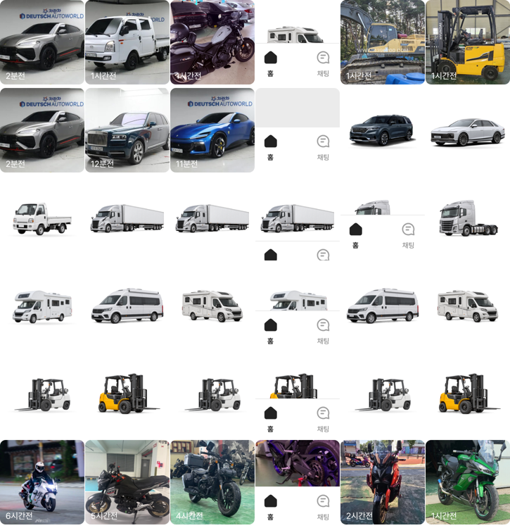
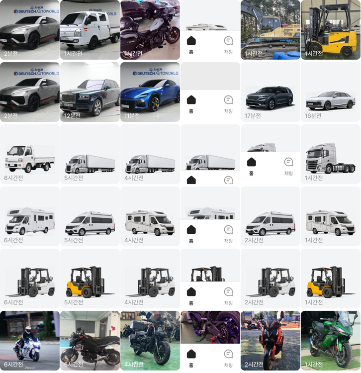

# 썸네일 차량 비율 밸런스

## ① 한 줄 요약
목록 썸네일에서 작게 떠 보이던 차량 그림(모델·트럭·캠핑카·지게차)을 여백을 잘라 크게 하고, 연회색 바탕의 같은 바닥선에 놓아 실사 사진과 크기 균형을 맞췄습니다.

## ② 브랜치 · 상태
- 브랜치: `claude/thumb-balance` (base `main` e356be5), 병합 · 배포

## ③ 한 일
- 원인: 그림마다 투명 여백이 달라(보이는 폭 74~98%) 같은 칸 안에서도 크기가 들쭉날쭉했고, 흰 바탕에 6px 여백으로 놓여 실사 사진 옆에서 작고 떠 보였습니다.
- 목록에 쓰이는 차량 그림 36장의 투명 여백(투명도 16 이하)을 잘라 긴 변 360px로 줄인 사본을 `public/assets/listing-thumbs/`에 만들었습니다(256색 압축, 합계 564KB). 원본은 그대로입니다.
- 카드(`bbm-list.tsx`)는 그림 썸네일일 때 이 사본을 씁니다(`listing-thumbs.generated.ts`).
- 표시: 연회색 `#F3F4F6` 바탕, 안쪽 여백 위 16 · 좌우 10 · 아래 20, `contain` + 아래 가운데 정렬 → 모든 차가 같은 바닥선, 비슷한 폭.
- 그림 썸네일의 시간 표시는 회색 `#8C8C8C`(흰 글자가 연회색에서 안 보여서).
- 실사 사진(cover)은 그대로입니다.

## ④ 비교(384, 카테고리별 앞 6장)
| 전 | 후 |
|---|---|
|  |  |

## ⑤ 검증
- `npm run verify` 통과(테스트 29+4, 실패 0), 페이지 오류 0건

## ⑥ 원본과 다르게 남긴 것
- 일부 원본 그림(경형 트럭 등)은 그림 안에 흰 사각 바탕이 있어 연회색 위에서 약간 보입니다.
