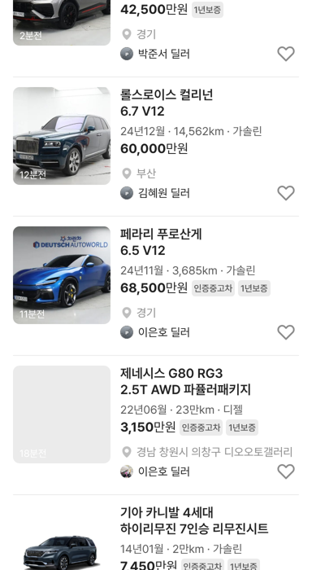
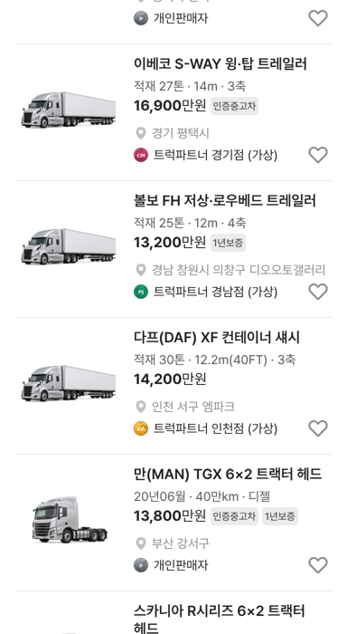

# 트레일러 스펙 줄 · 승용 매물 3대 추가

## ① 한 줄 요약
트레일러 카드를 「적재량 · 길이 · 축」으로 바꾸고, 지시받은 승용 매물 3대(페라리 푸로산게 · 롤스로이스 컬리넌 · 람보르기니 우루스 PHEV)를 사용자 제공 사진으로 추가했습니다.

## ② 과제 · 브랜치 · 커밋 · PR · 상태
- 과제 ID: 없음(사용자 직접 지시)
- 브랜치: `claude/trailer-spec-luxury3` (base `main` 16bfaad)
- 커밋 · PR · 배포 v값: 채팅 보고 참고
- 상태: 병합 · 배포

## ③ 한 일
- 트레일러 3대: 「20만km · 디젤」 → 「적재 27톤 · 14m · 3축」 등(UI 검증용 가상 값, `trailerSpecsV01`). 제목은 세부형식만(「이베코 S-WAY 윙·탑 트레일러」).
- 승용 매물 3대 추가(`bbmLuxuryAddCars`, id 3001~3003 → 업데이트순 맨 위):
  - 페라리 푸로산게 6.5 V12 · 24년11월 · 3,685km · 가솔린 · 경기 · 68,500만원
  - 롤스로이스 컬리넌 6.7 V12 · 24년12월 · 14,562km · 가솔린 · 부산 · 60,000만원
  - 람보르기니 우루스 PHEV 4.0 V8 SE · 25년11월 · 5,679km · 가솔린+전기 · 경기 · 42,500만원
- 카드 스펙 줄이 지시값 그대로 나오도록 `cardSpec` 필드를 추가했습니다(다른 매물은 기존처럼 자동 생성).
- 사진: 사용자가 대화에 첨부한 3장을 800×450 JPG로 줄여 `public/assets/listing-photos/v01/`에 넣고 CREDITS.md에 출처를 적었습니다. 색상 필터도 사진에 맞춤(파랑·초록·회색).
- 수정 전 파일은 `_교체전/trailer-luxury3/`에 백업했습니다(커밋 안 함).

## ④ 화면(384)
| 중고차 맨 위 | 트레일러 |
|---|---|
|  |  |

## ⑤ 검증
- `npm run verify` 통과(테스트 29+4, 실패 0)
- 중고차(모바일·PC)·트럭·전체차량 페이지 오류 0건, 사진 3장 로드 확인

## ⑥ 원본과 다르게 남긴 것
- 🟡 배지(인증중고차·1년보증 등)와 판매자 이름은 지시값이 없어 기존 샘플 규칙대로 붙었습니다.
- 🟡 사용자 제공 사진에 번호판과 「차란차 DEUTSCH AUTOWORLD」 표시가 그대로 있습니다.

## ⑦ 다음에 할 것
- 없음

## ⑧ 확인 링크
- 모바일 `?qf=guazi&category=중고차`, `?qf=guazi&category=트럭 · 특장`, PC `&pc=1`
