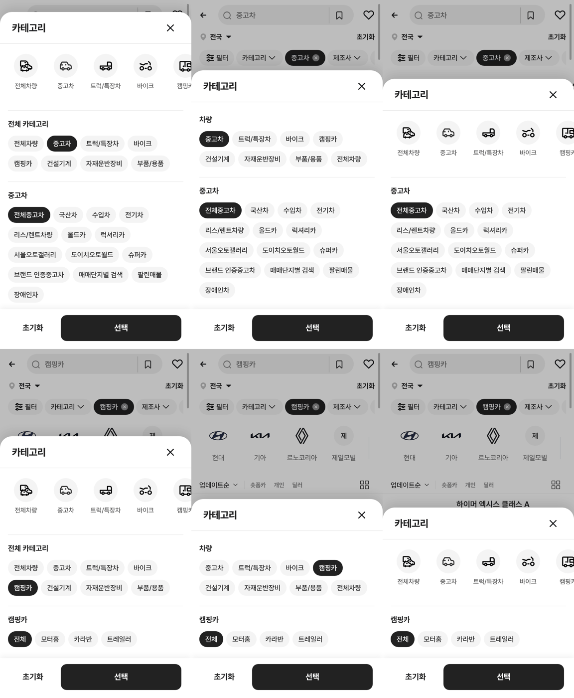

# 카테고리 시트 시안 2종 (a·b)

① 초톳 크로스체크에서 드러난 「아이콘 줄 + 전체 카테고리 알약」 중복을 정리하는 시안 2종을 만들었다. 기본 화면은 그대로다.

② 과제 ID 미지정 · 브랜치 `feat/qf-category-sheet-proposal-1010` · 상태 푸시 후 병합·배포(v 값은 채팅 보고) · 함께 들어간 과제 없음

③ 한 일
- 시안 a(`&catsheet=a`): 초톳처럼 아이콘 줄을 없애고 「차량」 알약 한 줄(전체차량이 맨 끝)만 둔다. 선택 표시는 하나, 하위가 있는 그룹만 아래에 하위 알약을 보여 준다.
- 시안 b(`&catsheet=b`): 아이콘 줄은 두고, 같은 목록을 한 번 더 보여 주던 「전체 카테고리」 섹션을 뺀다. 펼친 그룹의 알약만 보인다.
- `&catsheet` 없이 열면 지금 화면과 같다.

④ 원본과 비교: 아래 캡처(왼쪽부터 현재 · a · b, 위 중고차 / 아래 캠핑카)

⑤ 검증: `npm run verify:qf` 통과 · a에서 바이크 누르고 선택 → `category=바이크` 이동 확인 · 콘솔 오류는 기존 404 1건뿐

⑥ 원본과 다르게 남긴 것: a는 초톳과 달리 보배드림 그룹(중고차 등)을 알약으로 쓰고, 중고차 하위(국산차 등)는 두 번째 줄에 둔다.

⑦ 다음에 할 것: 사용자가 a/b 중 고르면 기본으로 승격하고 사용하지 않는 쪽 코드를 지운다.

⑧ 확인 링크: 모바일 `?qf=guazi&category=중고차&catsheet=a` · `…&catsheet=b` (카테고리 칩을 누르면 시트가 열린다)
