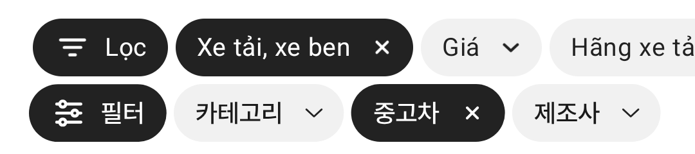

# 모바일 필터 칩 초톳 치수 맞춤

① 필터 칩 색, 꺽쇠, X, 칩 사이 간격을 초톳 캡처 실측값에 맞췄다.

② 과제 ID 미지정 · 브랜치 `feat/qf-chip-chotot-1010` · 상태 푸시(병합·배포는 채팅 보고) · 함께 들어간 과제 없음

③ 한 일
- `필터` 칩을 검정(#222) 바탕 + 흰 아이콘으로 바꿨다. 아이콘 ↔ 글자 간격을 초톳(11.4)에 가깝게(약 12) 넓혔다.
- 일반 칩 바탕을 #F1F1F1로, 꺽쇠를 9.6×5.0(초톳 9.2×5.3), X를 7.1×7.1~7.5(초톳 7.5×7.5)로 맞추고 글자와의 간격·오른쪽 여백을 초톳 수치로 옮겼다.
- 다른 작업이 칩 사이를 8로 넓혀 둔 것을 초톳 실측(4.3)대로 4로 되돌렸다.

④ 원본과 비교(CSS px)
| 항목 | 작업 전 | 작업 후 | 초톳 |
|---|---|---|---|
| 꺽쇠 크기 | 11.7×6.4 | 9.6×5.0 | 9.2×5.3 |
| 글자→꺽쇠 | 6.4 | 약 13.5~14.6 | 13.5 |
| X 크기 | 5.3×5.7 | 7.1×7.1 | 7.5×7.5 |
| 글자→X | 7.9 | 14.9 | 14.6 |
| 필터 아이콘→글자 | 5.3 | 12.3→11.3 | 11.4 |
| 일반 칩 바탕 | #F4F4F4 | #F1F1F1 | #F1F1F1 |
| 필터 칩 바탕 | #F4F4F4 | #222 | #222 |

⑤ 검증: `npm run verify:qf` 통과(런타임 점검·타입·빌드). 칩 사이 4 확인(DOM 실측).

⑥ 다르게 남긴 것: 필터 아이콘 모양은 스펙대로 세 조절선(초톳은 깔때기형이라 세로가 4.9 더 큼). 사용자 결정으로 필터 칩을 검정으로 바꿨는데, 기존 스펙은 회색이었다.

⑦ 다음에 할 것: 필터 아이콘 모양까지 초톳과 같게 할지 결정. PC 칩은 이번에 손대지 않았다.

⑧ 확인 링크: 모바일 `?qf=guazi&category=중고차` (배포본은 `&v=<커밋>`)
