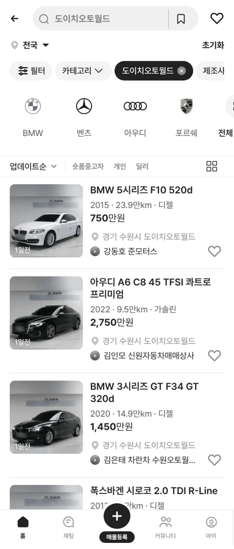
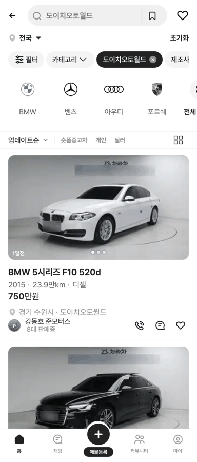

# 도이치오토월드 1차본 4,673대 반영

① 시트 「도이치오토월드」 4,673대를 반영했다. 도이치오토월드 4,298대는 카테고리로, 사직오토랜드 등 375대는 중고차 목록으로 들어간다.

② 과제 ID 미지정 · 브랜치 `feat/qf-deutsch-autoworld-all-1010` · 상태 병합·배포(v 값은 채팅 보고)

③ 한 일
- 4,673대 전부 상사명·딜러명(실제), 가격(차란차 공개가), 판매중 대수(시트 전체 기준 실제 값), 등록일을 입력.
- 사진 원본 주소에서 4,630대의 대표 사진을 받아 번호판·전화번호 글자를 흐림 처리하고, 목록 썸네일(200×200)과 피드 대표(폭 360)로 압축 저장(약 40MB). 사진 5장 슬라이드는 Drive에 올라간 43대만.
- 사직오토랜드(373대)·감만동·수원 오토컬렉션 I는 중고차 목록에 넣었다(지시 매물 3001~3004 바로 뒤).

④ 비교
| 항목 | 작업 전 | 작업 후 |
|---|---|---|
| 도이치오토월드 카테고리 | 39대 | 4,298대 |
| 중고차에 들어간 사직 등 | 4대 | 375대 |
| 사진 | 5장 × 43대 | 5장 × 43대 + 나머지 대표 1장 |

 

⑤ 검증: `npm run verify:qf` 통과 · 모바일 목록·피드 · 중고차에 사직 표시 · 콘솔 오류는 기존 404 1건뿐 · 배포 크기 dist/client 약 938MB(표시 크기, Pages 한도 1GB)

⑥ 다르게 남긴 것: 사진 5장은 43대만(저장소 용량). 바디타입은 모델명으로 추정. 스튜디오 벽의 업체 로고(`차란차`)는 원본 그대로. 판매완료는 시트에 없어 미표시.

⑦ 못 한 것: 나머지 4,630대의 5장 사진은 Drive 업로드·시트 링크 입력이 끝난 뒤 별도 이미지 저장소로 연결. Pages 용량 여유가 약 60MB뿐이라 추가 사진은 저장소에 더 넣을 수 없다.

⑧ 확인 링크: 모바일 `?qf=guazi&category=도이치오토월드` · PC `?qf=guazi&pc=1&category=도이치오토월드`(배포본은 `&v=<커밋>`)
