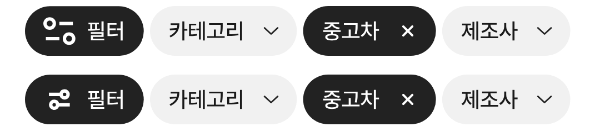

# 필터 아이콘 교체 (노션 필터_16/16 (1))

① 사용자가 지정한 노션 아이콘 「필터_16/16 (1)」을 수정 없이 필터 칩 기본 아이콘으로 넣었다.

② 과제 ID 미지정 · 브랜치 `feat/qf-filter-icon-leasing-1010` · 상태 병합·배포는 채팅 보고

③ 한 일: 노션 파일을 그대로 `chip-filter-leasing-24.svg`로 저장하고 기본 아이콘으로 연결했다. 파일 기준 크기(24)에 맞게 24px 상자로 표시한다.

④ 비교(위 새 아이콘, 아래 직전 아이콘): 

⑤ 검증: `npm run verify:qf` 통과, 모바일 칩 화면 확인(선 두께 수치는 이번에 따로 재지 않음).

⑥ 다르게 남긴 것: 원본 패스는 그대로 두었다.

⑦ 다음에 할 것: 폰에서 확인 후 크기 조정 여부 결정.

⑧ 확인 링크: 모바일 `?qf=guazi` (배포본은 `&v=<커밋>`)
