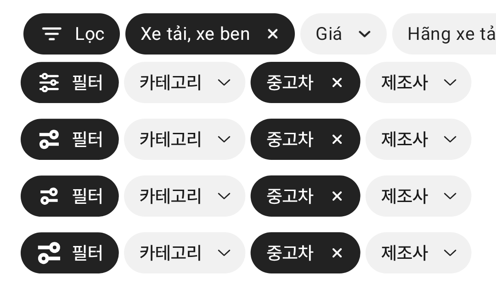

# 필터 아이콘 시안 (노션 24px 필터 아이콘)

① 노션 「필터 (24px)」 아이콘을 필터 칩에 넣은 시안 3종(원본·작게·크게)을 만들었다. 기본 화면은 그대로다.

② 과제 ID 미지정 · 브랜치 `feat/qf-filter-icon-proposal-1010` · 상태 병합·배포는 채팅 보고 · 함께 들어간 과제 없음

③ 한 일
- 노션 아이콘(두 줄 조절선, 굵은 선·동그라미 손잡이)을 수정 없이 `chip-filter-chotot-24.svg`로 저장했다.
- `&filtericon=chotot24`(원본), `chotot24s`(작게), `chotot24l`(크게)로 모바일·PC 필터 버튼에서 바꿔 볼 수 있다.

④ 비교(맨 위 초톳 · 현재 · 시안 1 원본 · 시안 2 작게 · 시안 3 크게)

⑤ 검증: `npm run verify:qf` 통과 · 4가지 모두 모바일 칩에서 표시 확인.

⑥ 다르게 남긴 것: 이 아이콘은 초톳 캡처의 필터 아이콘(선 3줄 깔때기형)과 모양이 다르다. 노션 원본 그대로 쓰는 시안이다.

⑦ 다음에 할 것: 마음에 드는 크기를 고르면 기본으로 바꾸고 이전 아이콘을 정리한다.

⑧ 확인 링크: 모바일 `?qf=guazi&filtericon=chotot24` · `chotot24s` · `chotot24l` (PC는 `&pc=1` 추가, 배포본은 `&v=<커밋>`)
