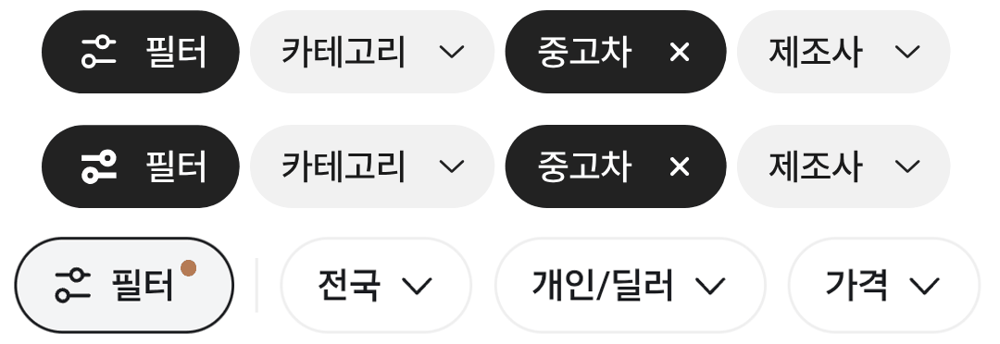

# 필터 아이콘 얇게

① 필터 아이콘을 당근·초톳과 같은 선 두께(1.4)로 다시 그려 기본으로 바꿨다.

② 과제 ID 미지정 · 브랜치 `feat/qf-filter-icon-slim-1010` · 상태 병합·배포는 채팅 보고

③ 한 일: 같은 두 줄 조절선 모양을 선 두께 1.4, 속 빈 고리 손잡이(지름 5.7), 크기 13.2로 다시 그렸다. 굵은 이전 시안은 `&filtericon=bold`로 남겼다.

④ 비교(위 우리 얇게 · 가운데 굵은 시안 2 · 아래 당근): 
| 항목 | 굵은 시안 2 | 얇게 | 당근 |
|---|---|---|---|
| 선 두께 | 2.2 | 1.4 | 1.4 |
| 크기 | 13.3 | 13.2 | 13.2 |

⑤ 검증: `npm run verify:qf` 통과, 칩 안 선 두께 1.42 실측.

⑥ 다르게 남긴 것: 초톳 아이콘(선 3줄)과 모양은 다르다(사용자 선택).

⑦ 다음에 할 것: 없음.

⑧ 확인 링크: 모바일 `?qf=guazi` · PC `?qf=guazi&pc=1` (배포본은 `&v=<커밋>`)
