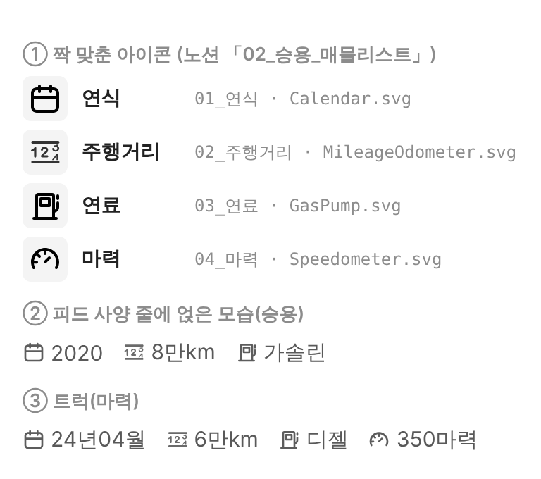

# 피드 사양 줄 아이콘 짝 맞추기 (노션 승용 매물리스트 아이콘)

① 노션 「N_독일_오토스카우트 24」의 `02_승용_매물리스트` 아이콘 4개를 우리 피드 사양 줄 항목과 짝지었다. 화면에는 아직 적용하지 않았고 짝 맞춤 확인용 자산·미리보기만 올렸다.

② 과제 ID 미지정 · 브랜치 `feat/qf-m-feed-meta-icons-1010` · PR 없음 · 상태 푸시(짝 맞춤 확인 대기, 병합·배포 없음)

③ 한 일
- 노션 보기에서 `02_승용_매물리스트` 항목을 골라 SVG 4개(연식·주행거리·연료·마력)를 받았다. 원본 그대로 `public/assets/bbm/meta-icons/`에 저장했다(수정·재그리기 없음).
- 우리 사양 줄 항목과 짝을 맞추고, 피드 사양 줄에 얹은 모습을 미리 그려 봤다.

④ 짝 맞춤표
| 우리 항목 | 노션 항목 | 저장 파일 |
|---|---|---|
| 연식(`24년04월` · `2020`) | 01_연식 Erstzulassung · Calendar.svg | `year-calendar.svg` |
| 주행거리(`8만km`) | 02_주행거리 Kilometerstand · MileageOdometer.svg | `mileage-odometer.svg` |
| 연료(`가솔린`) | 03_연료 Kraftstoff · GasPump.svg | `fuel-gaspump.svg` |
| 마력(`350마력`, 트럭) | 04_마력 Leistung · Speedometer.svg | `power-speedometer.svg` |

같은 노션 DB에 있지만 `02_승용_매물리스트` 묶음에는 없는 항목(짝 맞춤 후보)
- 변속기: `Transmission.svg`(「차량 리스트」·「차량 필터」 묶음). 우리 사양 줄에는 변속기 항목이 없다.
- 축 수: `Axle-1499b3fb.svg`(「차량 필터」 묶음, `11_축 수`). 트레일러·트럭 `3축`에 쓸 수 있다.
- 지역: `Location-be4a6dc3.svg`(`07_지역`). 지금은 우리 `card-location.svg`를 쓰고 있다.
- 인기 매물: `Fire.svg`(배지 후보).

⑤ 검증: 앱 코드 변경 없음(자산·보고서만).

⑥ 원본과 다르게 남긴 것: 아이콘은 노션 원본 그대로이며 색만 사양 줄 글자색(`currentColor`)을 따른다.

⑦ 다음에 할 것(확인 필요): ① 승용 사양 줄에 `연식·주행·연료` 아이콘 3개를 모두 넣을지, ② 지금 사양 줄에 없는 변속기를 넣을지, ③ 아이콘 크기(미리보기는 16px, 글자 15px 기준)와 글자색(#595959), ④ 트럭·트레일러의 축 수 아이콘 추가 여부.

⑧ 확인: 미리보기 이미지 `reports/feat-qf-m-feed-meta-icons-1010/icon-pairing.png`
