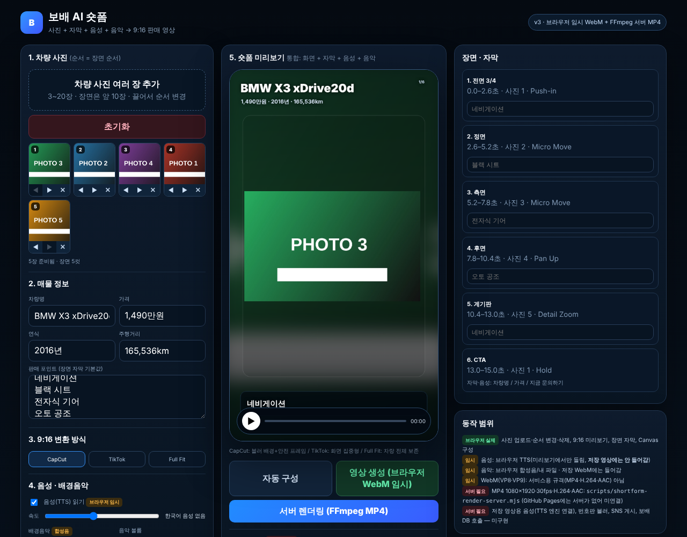
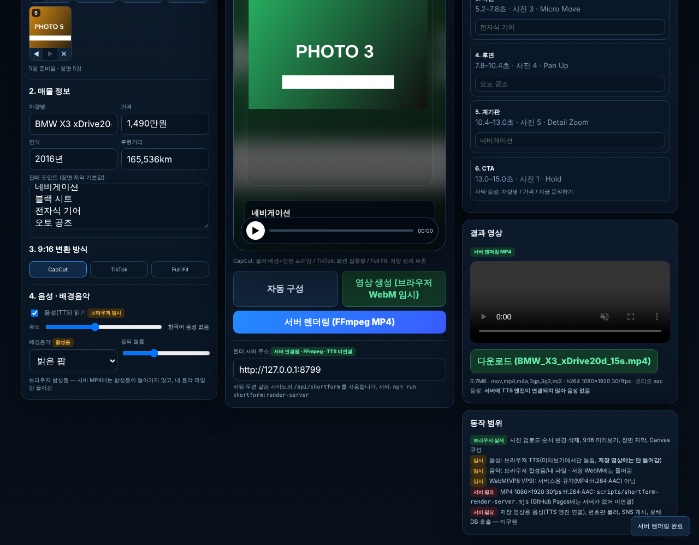

# 숏폼 영상 제작기: 사진+자막+음성+음악 → 영상 → 재생 → 다운로드, FFmpeg 서버 MP4 분리

① 사진·자막·음악이 들어간 영상을 만들고 재생·다운로드하는 흐름을 실제로 동작하게 고쳤다. 서비스용 MP4(1080×1920·30fps·H.264·AAC)는 FFmpeg 서버 스크립트로 분리했다.

② 과제 ID 미지정 · 브랜치 `feat/shortform-ffmpeg-pipeline-1011` · 상태 병합·배포는 채팅 보고 · 대상 `public/shortform/index.html` (`public/shortform-upload*`는 수정 안 함)

③ 한 일
- 사진 순서 변경(◀▶·끌어놓기)·삭제, 장면별 자막 편집, 통합 미리보기(화면+자막+음성+음악), 음악 선택(합성음 2종·내 파일·없음), 영상 생성(브라우저 WebM) → 결과 재생 → 다운로드를 만들었다.
- FFmpeg 서버 렌더러(`scripts/shortform-render-server.mjs`)와 화면의 「서버 렌더링」 버튼을 연결했다. 한글 자막은 브라우저가 그려 보낸다.
- 구현 상태를 화면(「동작 범위」, 태그 3종)과 `docs/SHORTFORM_AI_HANDOFF.md`에 실제/임시/서버필요로 나눠 적었다.

④ 비교 / 실제 동작 확인 (`npm run check:shortform`, 21항목 중 19 통과, 2는 환경 한계)
| 항목 | 결과 |
|---|---|
| 사진 등록 5장 · 순서 변경(버튼·끌기) · 자막 편집 | 통과 |
| 통합 미리보기 장면 전환 | 통과 (3.6초에 2번째 장면) |
| 음악 재생 | 통과 (AudioContext running, 파형 레벨 0.25) |
| 음성 호출 | 통과 (`speechSynthesis` 2회, 첫 문장 「2016년, BMW X3 xDrive20d, 165,536km, 1,490만원. 네비게이션」) |
| **음성 실제 발화(소리)** | **확인 못 함** — 헤드리스에 한국어 음성 엔진 없음 (실기기 확인 필요) |
| 영상 생성 → 결과 재생 → 다운로드(WebM) | 통과 (VP9+Opus, 1080×1920) |
| 서버 MP4: 1080×1920 · 30fps · H.264 High · AAC 48kHz · 15.00초 · 끝까지 디코딩 오류 없음 · 다운로드 | 통과 |
| **서버 MP4 브라우저 재생** | **확인 못 함** — 테스트용 Chromium에 H.264 디코더 없음 (ffmpeg 디코딩으로 대체) |

 

⑤ 검증: `npm run check:runtime` 통과(28 파일) · `npm run build` 통과(`dist/client/shortform/index.html` 포함) · `npm run test:sites` 4/4 통과 · `npm run check:shortform` 19/21(위 2건 환경 한계). TTS 연결 자리는 가짜 TTS 명령으로 `tts: applied`·AAC 믹스까지 확인(실제 TTS 엔진 아님).

⑥ 원본과 다르게 남긴 것: 브라우저 WebM에는 **음성이 들어가지 않는다**(브라우저가 TTS 소리를 녹음하게 두지 않음). 서버 MP4에는 **내 음악 파일만** 들어가고(합성음 불가) 음성은 TTS 엔진이 연결될 때만 들어간다.

⑦ 못 한 것 · 다음에 할 것(서버 필요): 서버 배포·인증·작업 큐 / 서버 TTS 엔진 연결 / 서버용 BGM 라이브러리 / 번호판 블러 / SNS 게시 / 보배 DB 연동. GitHub Pages에는 서버가 없어 공개 사이트의 「서버 렌더링」은 「미연결」로 표시된다.

⑧ 확인 링크: `/shortform/` (배포본은 `?v=<커밋>`), 로컬 서버: `npm run shortform:render-server` 후 `?render=http://localhost:8787`
