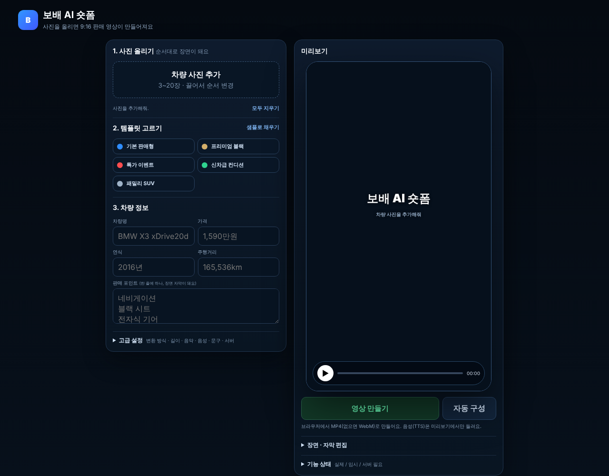

# 숏폼 제작기 화면 단순화 (v6)

① 기능은 그대로 두고, 첫 화면을 「사진 → 템플릿 → 차량 정보 → 영상 만들기」 네 가지만 보이게 줄였다.

② 과제 ID 미지정 · 브랜치 `feat/shortform-simplify-1011` · 상태 병합·배포는 채팅 보고 · 대상 `public/shortform/index.html`

③ 한 일
- 3열 → 2열(왼쪽 입력, 오른쪽 미리보기). 단계 번호 1·2·3.
- 큰 버튼은 「영상 만들기」 하나. 브라우저 MP4를 만들고, MP4 인코더가 없으면 자동으로 WebM으로 만든다.
- 변환 방식·길이·음악·음성·마지막 문구·서버 주소·서버 렌더링·WebM 버튼은 「고급 설정」, 장면 자막은 「장면 · 자막 편집」, 구현 상태는 「기능 상태」로 접었다(기능은 삭제 없음).
- 템플릿 카드는 이름만 표시(설명 숨김), 「샘플로 채우기」는 작은 글자 버튼, 「모두 지우기」도 작게.

④ 비교: 첫 화면에 보이는 버튼 15개 → 5개(템플릿 카드 5개 별도). 보이는 입력칸 수도 줄어듦.

⑤ 검증: `npm run check:runtime` · `npm run build` · `npm run test:sites` 통과(채팅 보고), `check:shortform` 34/36 (환경 한계 2건 동일).

⑥ 다르게 남긴 것: 없음(기능 삭제 없음, 위치만 이동).

⑦ 다음에 할 것: 폰 화면 확인 후 더 줄일 곳(예: 템플릿 카드 높이) 조정.

⑧ 확인 링크: `/shortform/` (배포본은 `?v=<커밋>`)
