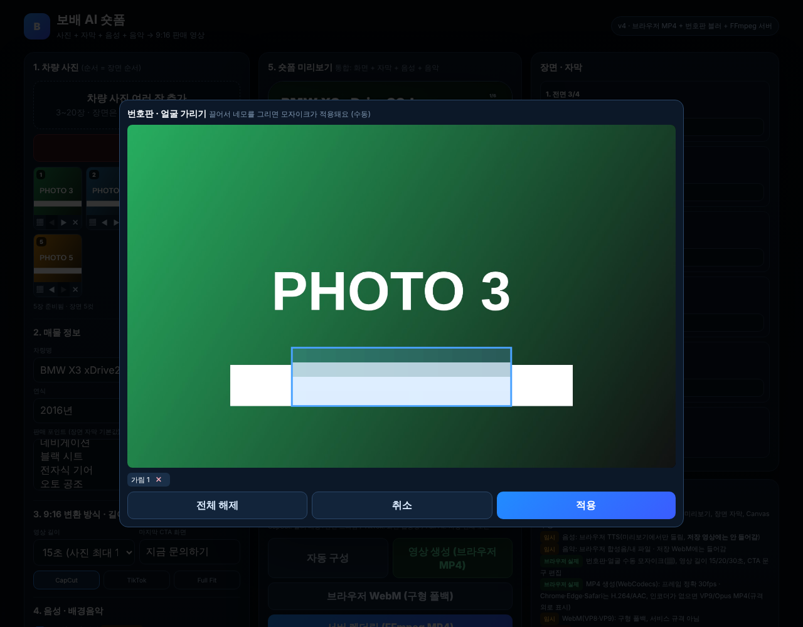
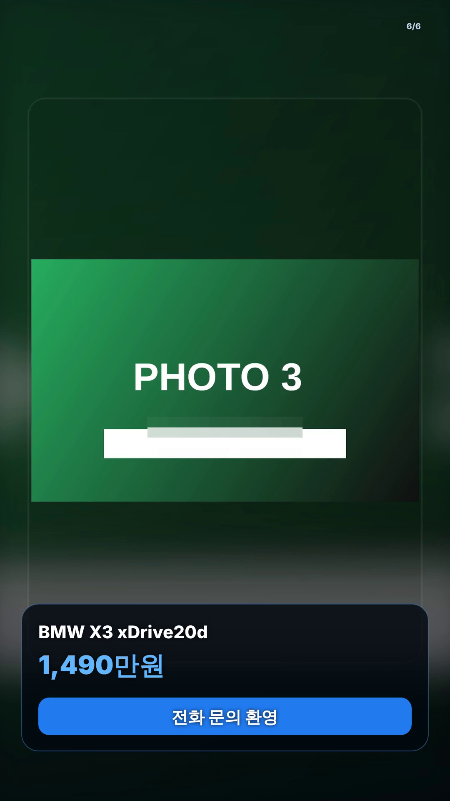

# 숏폼 제작기 고도화 v4: 브라우저 MP4 · 번호판 모자이크 · 영상 길이

① 서버 없이도 MP4를 만들 수 있게 하고(브라우저 WebCodecs), 번호판·얼굴 수동 모자이크와 15/20/30초 길이를 넣었다.

② 과제 ID 미지정 · 브랜치 `feat/shortform-v4-mp4-blur-length-1011` · 상태 병합·배포는 채팅 보고 · 대상 `public/shortform/index.html` (`shortform-upload*` 미수정)

③ 한 일
- 브라우저 MP4: WebCodecs로 30fps 프레임을 정확히 인코딩하고 mp4-muxer로 묶는다. 음악은 오프라인으로 먼저 믹스한다(실시간 녹화 아님). Chrome·Edge·Safari는 H.264+AAC, 인코더가 없으면 VP9+Opus MP4(「규격 외」 표시)로 만든다.
- 번호판·얼굴 수동 모자이크: 사진마다 ▦ 버튼 → 끌어서 네모. 미리보기·WebM·MP4·서버 렌더링 영상에 모두 들어간다.
- 영상 길이 15/20/30초(사진 최대 10/13/20컷), CTA 문구 편집.

④ 실제 동작 확인 (`npm run check:shortform`, 31항목 중 29 통과 · 2건은 환경 한계)
| 항목 | 결과 |
|---|---|
| 모자이크 네모 그리기 → 적용 → 변경 픽셀 54,421개 확인 | 통과 |
| 브라우저 MP4: 생성·다운로드·1080×1920·30fps·15.02초·음악 소리·디코딩 오류 없음·브라우저 재생 | 통과 — 단, 이 환경은 **VP9+Opus MP4**로 만들어졌고 화면에 「규격 외」로 표시됨 |
| 서버 MP4 15초·20초(H.264 High · AAC 48kHz · 1080×1920 · 30fps) | 통과 |
| 영상 길이 20초 선택 → 장면 재구성 · 서버 MP4 20.00초 · CTA 문구 반영 | 통과 |
| 음성 소리 / 서버 MP4 브라우저 재생 | 확인 못 함(헤드리스 환경 한계) |

 

⑤ 검증: `npm run check:runtime` · `npm run build` · `npm run test:sites` 통과(결과는 채팅 보고), `check:shortform` 29/31.

⑥ 다르게 남긴 것·한계
- **브라우저 MP4의 H.264/AAC 경로는 이 환경에 인코더가 없어 직접 확인하지 못했다.** 코드는 H.264+AAC를 먼저 시도하도록 되어 있고, 실기기 Chrome·Edge·Safari에서 확인이 필요하다. 확인 전에는 서비스 규격 충족이라고 단정하지 않는다(서버 렌더링 MP4만 H.264/AAC를 확인함).
- 브라우저 MP4·WebM에는 **음성(TTS)이 들어가지 않는다**(브라우저가 TTS 소리를 녹음하게 두지 않음). 서버 MP4의 음성은 TTS 엔진 연결 전까지 미구현.
- 번호판 모자이크는 **수동**이다(자동 인식 미구현).

⑦ 다음에 할 것: 실기기에서 H.264/AAC 확인, 서버 TTS 엔진 연결, 번호판 자동 인식, 서버 배포.

⑧ 확인 링크: `/shortform/` (배포본은 `?v=<커밋>`)
