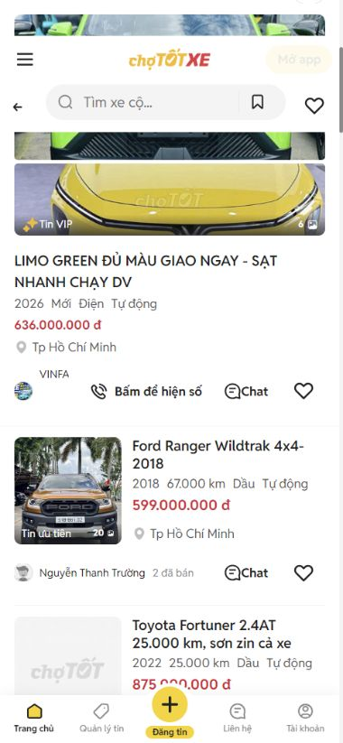
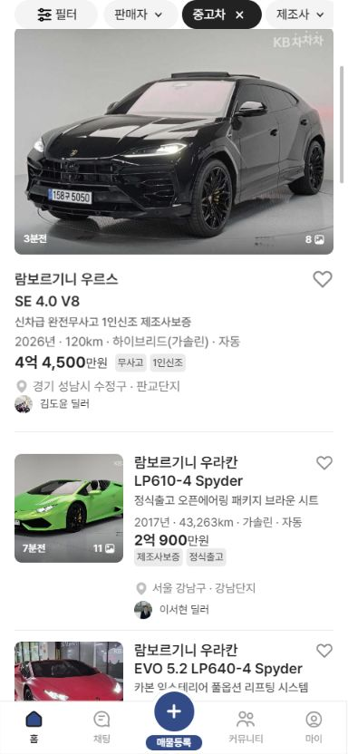
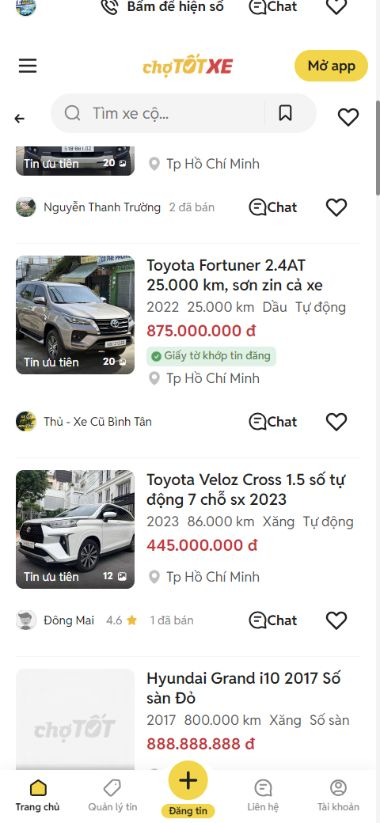
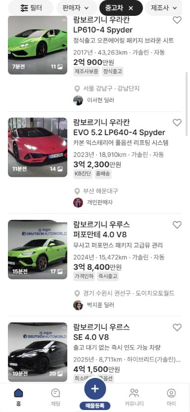

# 초톳 피드형 ↔ 보배드림 수정본 크로스체크

기준 화면은 384×832 CSS px이다.

## 1. 첫 강조 카드

### 초톳 원본

### 보배드림 수정본

- 첫 결과만 대형 피드 카드로 표시: 일치
- 제목: 양쪽 모두 16px / 24px / 600
- 보배드림 추가 제목: 13px / 18px / 500
- 미디어 비율: 초톳 약 348×248px, 보배드림 352×251px

## 2. 후속 가로형 카드

### 초톳 원본

### 보배드림 수정본

- 썸네일: 양쪽 모두 120×120px
- 이미지와 텍스트 간격: 양쪽 모두 12px
- 제목: 양쪽 모두 16px / 20px / 600
- 카드 높이: 초톳 약 201px, 보배드림 약 207px
- 높이 차이는 보배드림의 추가 제목 행을 포함한 결과다.

## 판정

계층, 썸네일 크기, 제목 크기와 줄 높이, 이미지·텍스트 간격은 일치한다. 보배드림에서는 제조사·모델 및 세부모델 구조를 유지하고, 그 아래 제목 한 줄만 추가했다. 초톳의 다중 이미지 갤러리와 연락 버튼은 현재 테스트 데이터 및 기존 보배드림 동작을 보존하기 위해 복제하지 않았다.
