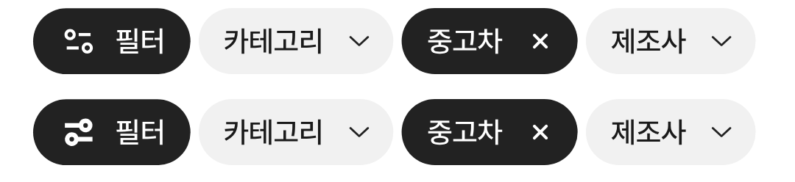

# 필터 아이콘 크기 시안 2에 맞춤

① 새 필터 아이콘이 시안 2보다 크게 그려지던 것을 같은 폭(13.5)으로 줄였다.

② 과제 ID 미지정 · 브랜치 `fix/qf-filter-icon-size-1010` · 상태 병합·배포는 채팅 보고

③ 한 일: 아이콘 상자를 24px에서 16.3px로 줄였다(칩 폭은 그대로). 모바일·PC 모두 적용.

④ 비교(위 지금, 아래 시안 2): 
| 항목 | 이전 | 지금 | 시안 2 |
|---|---|---|---|
| 잉크 폭 | 19.9 | 13.5 | 13.5 |

⑤ 검증: `npm run verify:qf` 통과.

⑥ 다르게 남긴 것: 원본 비율(14×12) 때문에 높이는 시안 2보다 낮다. 패스는 수정하지 않았다.

⑦ 다음에 할 것: 필터 칩 모양(검정·고정)에 대한 사용자 의견 확인.

⑧ 확인 링크: 모바일 `?qf=guazi` · PC `?qf=guazi&pc=1` (배포본은 `&v=<커밋>`)
