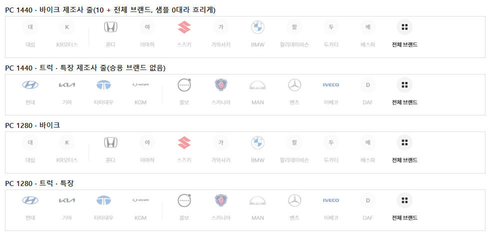
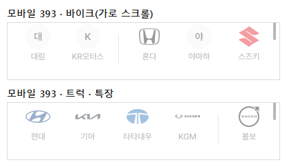
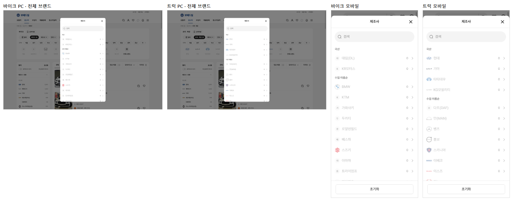

# PR #100 QF-114 바이크·트럭 제조사 줄 10개 + 전체 브랜드

## 1. 한 줄 요약
과쯔 바이크 · 트럭·특장 제조사 줄을 유형별 10개와 "전체 브랜드"로 바꿨습니다. 칸·로고 크기 3단계·이름 폭·구분선은 승용 줄과 같고, 트럭 줄에 나오던 승용 브랜드는 없앴습니다. 바이크 줄은 원래 비어 있었는데 이제 보입니다. 점검이 모두 통과해 병합·배포했습니다.

## 2. 기본 정보
| 항목 | 내용 |
|---|---|
| 과제 ID | QF-114(QF-113 병합·배포 뒤) |
| 브랜치 | `feat/qf-114-bike-truck-makers`(QF-113이 병합된 main `cb8a413`에서 시작) |
| 커밋 | `2567ebc` · 보고서 커밋(이 파일) |
| PR | https://github.com/bobaekimboae/bobaedream/pull/100 |
| 상태 | 병합·배포(배포 v 값은 채팅 보고·노션에 적음) |
| 이번 병합으로 main에 함께 들어간 과제 | QF-114 |

## 3. 한 일
- **목록**(기준 월 2026-09): `src/prototype/data/brand-top10-bike.json` · `brand-top10-truck.json`.
  - 바이크: 대림(DL) · KR모터스 │ 혼다 · 야마하 · 스즈키 · 가와사키 · BMW · 할리데이비슨 · 두카티 · 베스파
  - 트럭 · 특장: 현대 · 기아 · 타타대우 · KG모빌리티 │ 볼보 · 스카니아 · 만(MAN) · 벤츠 · 이베코 · 다프(DAF)
- **순서**: "샘플 매물 대수로 국산·수입 안에서 정렬"하라는 지시였지만, 과쯔 샘플 64대가 모두 승용이고 유형 구분 값도 없어 바이크·트럭 매물은 0대입니다. 그래서 제안 순서를 그대로 두고, 10칸 모두 흐리게(opacity 0.4) 표시했습니다(빼지 않음).
- **칸 규격**: 승용 줄과 같습니다(PC 84×102 · 모바일 64×74, 로고 상자 40·36, 로고 3단계 82.5 · 91 · 100%, 이름 폭 76·56, 이름표 없음, 구분선 1×44 #E4E7EC, 11번째 "전체 브랜드"). 줄 이름은 짧게 씁니다(KGM · MAN · DAF · 대림).
- **전체 브랜드 · "제조사 ▾" 칩**: 그 유형 목록만 엽니다(국산 → 수입 이름순 → 기타). 승용 목록과 섞이지 않고, 0대도 흐리게 보이면서 고를 수 있습니다(`BbmMakerList` `allowEmpty`).
- **로고**: 기존 폴더에 없던 트럭 로고 중 타타대우 · 만(MAN)을 당근 제조사 이미지에서 받아 같은 보정(여백 자르기 · 192×112 안)으로 추가했습니다(`scripts/brand-logos-kr.mjs` 표 2행, 로고 파일 73 → 75).
  - 못 구한 8개는 이름 첫 글자 원형(#F4F4F4, 600)으로 임시 표시합니다: 대림(DL) · KR모터스 · 야마하 · 가와사키 · 할리데이비슨 · 두카티 · 베스파 · 다프(DAF). 헤이딜러는 공개 로고 경로를 찾지 못했고, 당근은 승용·상용 차량만 있어 바이크 전용 브랜드와 DAF가 없습니다. 공식 자료실은 이번에 받지 못했습니다.
- **점검**: `scripts/type-maker-check.mjs`를 추가했고, check:logos의 로고 파일 수 기준을 75로 바꿨습니다. quick-filter-spec과 change-log CH-0119~0121도 갱신했습니다.

## 4. 원본과 비교 — 로고 크기 3단계(상자 안 로고 폭×높이)
| 유형 | 브랜드 | 비율 | 단계 | PC(상자 40) | 모바일(상자 36) |
|---|---|---:|---|---|---|
| 트럭 | 현대 | 2.000 | 1.6 이상(폭 100%) | 40×20 | 36×18 |
| 트럭 | 기아 | 4.235 | 1.6 이상 | 40×9.4 | 36×8.4 |
| 트럭 | 타타대우 | 1.533 | 1.25~1.6(폭 91%) | 36.4×23.7 | 32.8×21.3 |
| 트럭 | KGM | 5.182 | 1.6 이상 | 40×7.7 | 36×6.9 |
| 트럭 | 볼보 | 1.000 | 1.25 이하(긴 변 82.5%) | 33×33 | 29.7×29.7 |
| 트럭 | 스카니아 | 1.048 | 1.25 이하 | 33×31.6 | 29.7×28.4 |
| 트럭 | MAN | 1.797 | 1.6 이상 | 40×22.3 | 36×20.1 |
| 트럭 | 벤츠 | 1.021 | 1.25 이하 | 33×32.4 | 29.7×29.2 |
| 트럭 | 이베코 | 4.571 | 1.6 이상 | 40×8.8 | 36×7.9 |
| 바이크 | 혼다 | 1.231 | 1.25 이하 | 33×26.8 | 29.7×24.1 |
| 바이크 | 스즈키 | 1.000 | 1.25 이하 | 33×33 | 29.7×29.7 |
| 바이크 | BMW | 1.000 | 1.25 이하 | 33×33 | 29.7×29.7 |

## 5. 검증
| 점검 | 결과 |
|---|---|
| `type-maker-check`(새) | 바이크·트럭 × PC 1440·1280 · 모바일 393 모두 통과. 순서, 승용 브랜드 없음, 칸 84×102·64×74, 이름 폭 76·56, PC 11칸 한 줄(넘침 0), 모바일 가로 스크롤, 로고 3단계, 첫 글자 원형 · 흐리게, 전체 브랜드 열기(유형 목록만) → 고르기(야마하 · 스카니아) → 닫힘 · 칩, 콘솔 오류 0 |
| 승용 흐름 | `check:logos` 23/23(승용 10 + 전체 브랜드 그대로) · `check:stability`(지역·정렬 포함) · `check:models` 23/23·23/23·19/19 · 지역 흐름 전부 |
| `check:sidebar` · `check:model-images` · `check:top` · `check:hybrid` | 33/33 · 15/15 · 21/21 · 20/20 |
| `verify:qf` | 통과 |
| `regress:modes` | 전 모드 0% |
| `diff:bbm` · `diff:bbm:flow` | 3% 이하 |
| 콘솔 오류 | 0 |

## 6. 지시와 다르게 남긴 것과 이유
- **정렬**: 샘플에 바이크·트럭 매물이 없어 대수 정렬을 할 수 없었습니다. 제안 순서를 그대로 두고, 전부 0대로 흐리게 표시했습니다.
- **"전체 목록" 구성**: 10개 밖 브랜드는 제안입니다(바이크 KTM · 로얄엔필드 · 트라이엄프 · 피아지오, 트럭 이스즈 · 히노). 보배드림 정식 목록 확인이 필요합니다.
- **바이크 로고**: 혼다 · 스즈키 · BMW는 기존 폴더의 자동차 브랜드 로고를 씁니다(혼다 바이크는 원래 날개 로고). 바이크 전용 로고는 나중에 바꿀 수 있습니다.
- **트럭에서 현대·기아·벤츠를 고르면**: 샘플에 유형 구분 값이 없어, 목록에는 그 제조사의 승용 매물이 보입니다(기존 동작 그대로).

## 7. 못 한 것 · 다음에 할 것
- 로고를 못 구한 8개(대림 · KR모터스 · 야마하 · 가와사키 · 할리데이비슨 · 두카티 · 베스파 · 다프)는 공식 자료실(긴 변 144px 이상 투명 PNG)에서 받아 넣어야 합니다.
- 바이크·트럭 샘플 매물이 생기면 대수로 순서를 다시 정합니다.

## 8. 확인 링크
- PC: https://bobaekimboae.github.io/bobaedream/?qf=guazi&v=<커밋>&pc=1 → 유형 "바이크" · "트럭 · 특장"
- 모바일: https://bobaekimboae.github.io/bobaedream/?qf=guazi&v=<커밋>
