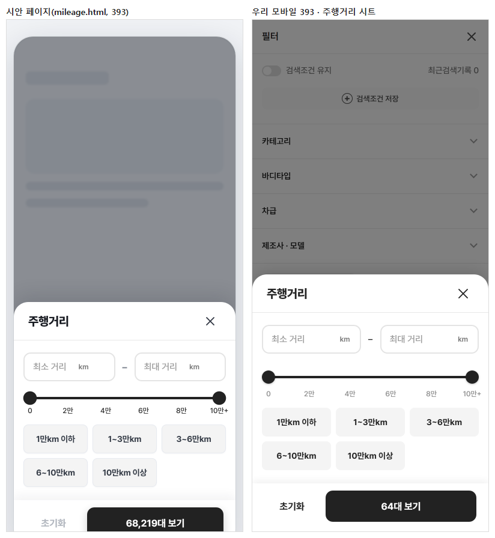
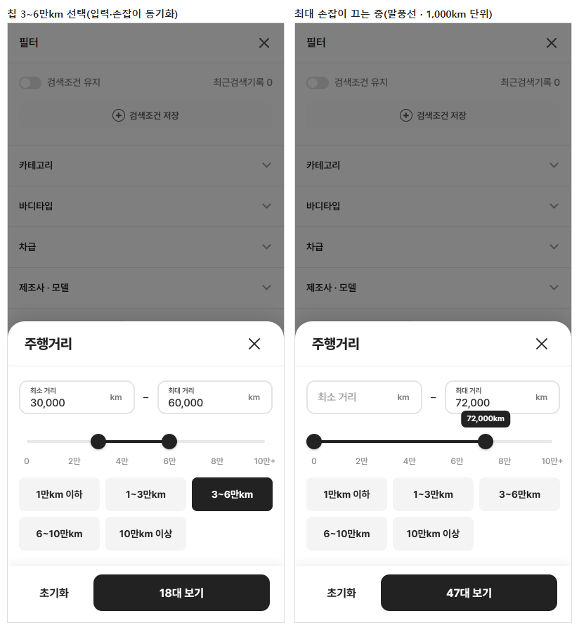
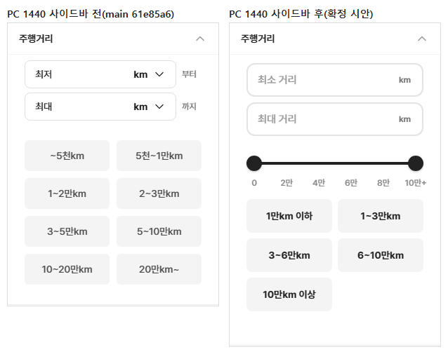

# PR #101 QF-117 주행거리 필터 확정 시안 — 모바일 바텀시트 + PC 좌측 사이드바

## 1. 한 줄 요약
과쯔 주행거리 필터를 확정 시안으로 교체했습니다. 모바일은 전용 바텀시트, PC는 좌측 300px 사이드바 안입니다. 구성은 최소·최대 입력, 실제로 끄는 듀얼 슬라이더(0~10만+, 1,000km 단위), 트랙 좌표에 맞춘 눈금, 구간 칩 5개입니다. 다른 필터·모드는 그대로이고, 점검이 모두 통과해 병합·배포했습니다.

## 2. 기본 정보
| 항목 | 내용 |
|---|---|
| 과제 ID | QF-117(QF-116 범위 시트 통일은 취소, 이 지시로 대체) |
| 브랜치 | `feat/qf-117-mileage-filter`(main `61e85a6`에서 시작) |
| 커밋 | `b44f39e` · 보고서 커밋(이 파일) |
| PR | https://github.com/bobaekimboae/bobaedream/pull/101 |
| 상태 | 병합·배포(배포 v 값은 채팅 보고·노션에 적음) |
| 이번 병합으로 main에 함께 들어간 과제 | QF-117 |

## 3. 한 일
### 바꾸기 전 확인한 구조
- **값 모델**: `filters.bbm.ranges.mileage = { min, max, preset? }`이고, 쉼표가 들어간 문자열이며 비어 있으면 ""입니다. 주소(URL) 값은 없습니다(bbm 값은 화면 상태에만 있음). 값 이름·형식은 그대로 두었습니다.
- **대수 계산**: `matchesBbmFilters` → `bbmRangeBounds`(경계 포함)로 거릅니다. 모바일 시트 버튼은 지금까지 적용 값 기준(`visibleCars`)이었고, PC 사이드바는 즉시 반영이었습니다.
- **모바일 여는 경로**: "필터" → 전체 필터 → "주행거리"(`BbmSheet` + `BbmActionBar`, 임시 값 `sheetValue`), 그리고 적용 칩을 눌러 여는 칩 창입니다.
- **PC**: `BbFilterSidebar` → `BbmExpandPanel "주행거리"`입니다. 같은 부품을 초톳·동처띠 PC도 씁니다.

### 변경 파일
| 파일 | 내용 |
|---|---|
| `src/prototype/filters/bbm-mileage.tsx`(새) | 전용 부품(mileage-final): 값 변환(`mileageBounds` · `mileageRange` · 칩 판정 · 요약 표기), 입력 필드, 듀얼 슬라이더(포인터 · 방향키 · 말풍선), 눈금, 칩, 패널(sheet/sidebar), 모바일 바텀시트(임시 값 · 대수 실시간 · Esc/배경/닫기는 버림) |
| `src/prototype/filters/bbm-mileage.css`(새) | 시안 수치(헤더 64 · 입력 · 슬라이더 · 눈금 · 칩 · 액션 바 80 · prefers-reduced-motion) |
| `src/prototype/filters/bbm-filter-panels.tsx` | `BbmExpandPanel`에 `mileageFinal` — 켜면 주행거리를 새 패널(사이드바 모양)로. 끄면 기존 그대로 |
| `src/prototype/listing/pc-bbmuseum.tsx` | `BbFilterSidebar`가 `mileageFinal`을 패널에 넘김 |
| `src/prototype/listing/index.tsx` | 과쯔만: 모바일 전체 필터의 주행거리 · 모바일 칩 창 → 전용 바텀시트, PC 사이드바·칩 모달 → 새 패널, 칩 줄·필터 목록 요약 표기 |
| `scripts/mileage-check.mjs`(새) | 수치·동작 점검 |
| `docs/quick-filter-spec.md`, `reports/change-log.csv` | 규칙 · CH-0122~0124 |

## 4. 원본과 비교
### 모바일 결과(시트 수치)
| 폭 | 헤더 · 제목/닫기 차이 | 입력 폭(구분자 12) | 트랙 폭(인셋 11) | 첫·끝 눈금 − 손잡이 중심 | 칩 | 버튼 |
|---|---|---|---|---|---|---|
| 375 | 64 · 0 | 155.5 / 155.5 | 321 | 0 / 0 | 109×48 | 92×52 · 233×52 |
| 390 | 64 · 0 | 163 / 163 | 336 | 0 / 0 | 114×48 | 92×52 · 248×52 |
| 393 | 64 · 0 | **164.5 / 164.5** | **339** | 0 / 0 | **115×48** | 92×52 · **251×52** |
| 430 | 64 · 0 | 183 / 183 | 376 | 0 / 0 | 127.3×48 | 92×52 · 288×52 |

모든 폭에서 공통입니다: 눈금 간격 일정, 잘림·가로 넘침 0, 닫기 누르는 영역 44×44(보이는 36, 오른쪽 24), 슬라이더 줄 38 · 트랙 4, 액션 바 80.

### PC 결과(사이드바)
| 폭 | 사이드바 | 입력(세로) | 칩 | 잘림 | 즉시 반영 |
|---|---|---|---|---|---|
| 1024(펼침판) | 320 | 272 · 272 | 2열 · 48 | 0 | 64 → 17대 · 칩 [1~3만km ×] |
| 1280 | 300 | 252 · 252 | 2열 · 48 | 0 | 64 → 17대 |
| 1440 | 300 | 252 · 252 | 2열 · 48 | 0 | 64 → 17대 |

모바일 전용 헤더·닫기·액션 바는 PC에 나오지 않습니다.

## 5. 검증
### 동작 테스트(`scripts/mileage-check.mjs`, 모바일 393)
| 테스트 | 결과 |
|---|---|
| 최대 손잡이 드래그 → 60,000(1,000 단위) · 입력 60,000 | 통과 |
| 최소 손잡이 드래그 → 35,000 · 입력 35,000 | 통과 |
| 칩 3~6만km → 입력 30,000~60,000 · 손잡이 30,000/60,000 · 칩 선택 | 통과 |
| 같은 칩 다시 → 해제(0 ~ 제한 없음) | 통과 |
| 10만km 이상 = 최대 없음("제한 없음") ≠ 6~10만km(최대 "100,000km") | 통과 |
| 방향키: 최소 → 3,000 · 최대 ← 99,000 · End → 제한 없음 | 통과 |
| 최소 50,000 > 최대 20,000 → 적용 버튼 비활성, 1~3만 입력 → 칩 1~3만km 선택 | 통과 |
| 닫기 → 임시 값 확정 안 됨(다시 열면 비어 있음) | 통과 |
| 적용 → 목록 표기 "3~6만km" · 버튼 "18대 보기"(임시 값 대수) | 통과 |
| 초기화 → 주행거리만(연료 디젤 유지) | 통과 |

### 기존 점검
| 점검 | 결과 |
|---|---|
| `verify:qf` | 통과 |
| `check:stability` · `check:sidebar` · `check:top` · `check:hybrid` | 전부 · 33/33 · 21/21 · 20/20 |
| `check:logos` · `check:model-images` · `check:models`(1440) · 지역 흐름 · 바이크·트럭 | 23/23 · 15/15 · 23/23 · 전부 · 전부 |
| `regress:modes` | 전 모드 0% |
| `diff:bbm` · `diff:bbm:flow` | 0% · 274/274 |
| 콘솔 오류 | 0 |

## 6. 지시와 다르게 남긴 것과 이유
- **제목 굵기 750**: CSS에는 750을 넣었지만, 저장소에 Pretendard 글꼴 파일이 없어 시스템 글꼴(맑은 고딕 등)로 그려지고, 가장 가까운 굵기 700으로 보입니다. 가변 글꼴을 넣으면 750으로 보입니다.
- **정확히 100,000km**: 슬라이더 오른쪽 끝은 "제한 없음"이라, 끝까지 끌면 최대 없음(max "")이 됩니다. 최대를 정확히 100,000km로 하려면 칩(6~10만km)이나 입력으로 넣습니다. 이때 손잡이는 끝에 있고 말풍선·값은 "100,000km"로 "제한 없음"과 구분됩니다.
- **입력칸 모양**: 시안 페이지처럼 자리 글자가 값 입력 뒤 위로 작게 올라갑니다. 시안 페이지의 값 지우기(×) 버튼은 지시문에 없어 넣지 않았습니다.
- **"최소 > 최대" 안내 문구**: 적용 버튼 비활성과 함께 입력 아래에 빨간 한 줄 안내("최소 주행거리가 최대 주행거리보다 높습니다.")를 보입니다(시안 페이지 문구).
- **적용 대수**: 모바일 시트 버튼은 임시 값 기준으로 바꿨습니다(지시 "대수 실시간"). 계산은 120ms 늦춰 하고, 손잡이 반응은 즉시입니다.
- **범위**: 과쯔에만 적용했습니다. 초톳·동처띠가 쓰는 같은 사이드바는 기존 주행거리 그대로입니다(`mileageFinal` 끔).

## 7. 못 한 것 · 다음에 할 것
- 없음(가격·배기량·마력 등 다른 범위 필터는 이번 범위 밖).

## 8. 확인 링크
- 모바일: https://bobaekimboae.github.io/bobaedream/?qf=guazi&v=<커밋> → "필터" → "주행거리"
- PC: https://bobaekimboae.github.io/bobaedream/?qf=guazi&v=<커밋>&pc=1 → 좌측 필터 "주행거리"
