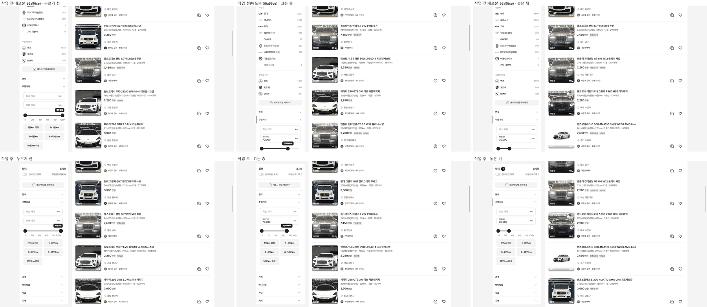
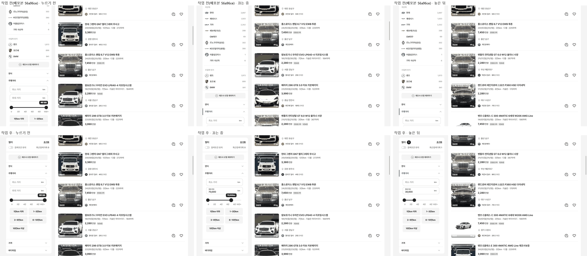
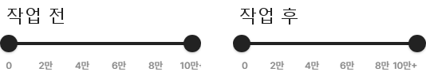
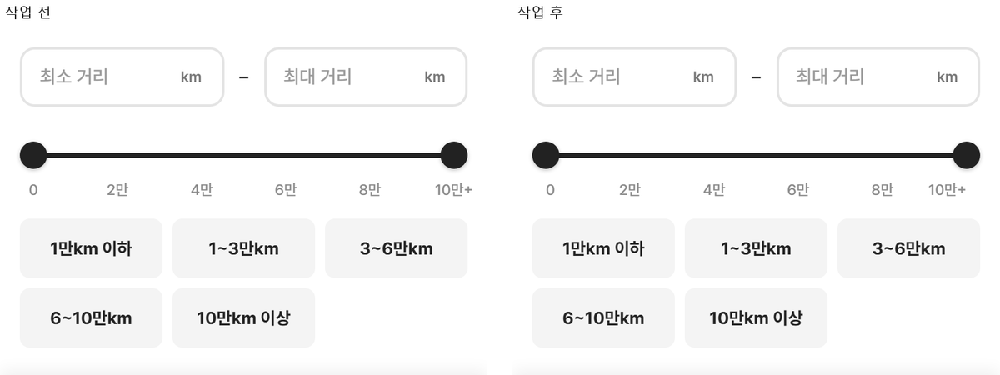

# PR #102 QF-119 PC 좌측 필터 흔들림 수정 — 주행거리 조작 때 사이드바·화면이 튀는 문제

## 1. 한 줄 요약
과쯔 PC 좌측 필터를 "위에 붙는 자기 스크롤 영역"으로 바꾸고, 주행거리는 손을 뗄 때 한 번만 목록에 반영하게 했습니다. 브라우저의 스크롤 앵커링(보던 카드를 따라 화면을 옮기는 기능)도 껐습니다. 이제 손잡이를 누르고, 끌고, 놓아도, 칩을 눌러도, 값을 입력해도 사이드바 위치·높이와 페이지 스크롤 위치가 바뀌지 않습니다(변화 0).

## 2. 기본 정보
| 항목 | 내용 |
|---|---|
| 과제 ID | QF-119 |
| 브랜치 | `feat/qf-119-pc-sidebar-stable`(main `56a96ce`에서 시작) |
| 커밋 | `5835651` · 보고서 커밋(이 파일) |
| PR | https://github.com/bobaekimboae/bobaedream/pull/102 |
| 상태 | 병합·배포(배포 v 값은 채팅 보고·노션에 적음) |
| 이번 병합으로 main에 함께 들어간 과제 | QF-119 |

## 3. 한 일
- **사이드바 구조(1280 이상)**: `position: sticky; top: 16`에 높이를 "화면 − 32"로 고정했습니다. 머리("필터 · 초기화 · 검색조건 유지")는 맨 위에 고정되고, 그 아래 항목 목록만 따로 스크롤됩니다(`overflow-y: auto`, `overscroll-behavior: contain` = 사이드바 끝에 닿아도 페이지로 스크롤이 넘어가지 않음). 스크롤바는 얇게, 마우스를 올릴 때만 보입니다. 예전 "아래 붙는 사이드바"(음수 top을 계산하던 `bbm-sticky-sidebar.ts`)는 지웠습니다.
- **목록 반영 시점(PC 사이드바 주행거리)**: 끄는 동안에는 부품 안에서만 값이 바뀌고 목록은 그대로입니다. 놓을 때(pointerup)·방향키를 뗄 때 한 번 반영합니다. 입력칸은 0.4초 멈춤·Enter·다른 곳으로 포커스 이동 때, 칩은 누를 때 반영합니다.
- **보던 위치 유지**: 원인은 스크롤 앵커링이었습니다. 목록 카드가 바뀌면 브라우저가 보던 카드를 따라 scrollTop을 끌어올렸습니다(1440에서 832 → 630 → 428). 과쯔 PC 화면만 `overflow-anchor: none`으로 껐습니다. 이제 scrollTop은 그대로이고, 목록이 짧아져 스크롤 끝을 넘을 때만 브라우저가 끝에 맞춥니다.
- **높이 불변(주행거리 부품, PC·모바일 공통)**: "최소 > 최대" 오류 문구는 입력 아래 여백 위에 겹쳐 그립니다(예전에는 줄이 24 늘어남). 손잡이를 누를 때 강조는 `transform: scale`만 씁니다. 손잡이 포커스는 `focus({ preventScroll: true })`로 줘서 스크롤이 움직이지 않습니다. 칩 선택 테두리는 이미 `box-shadow inset`이었습니다.
- **끝 눈금**: "0"은 첫 손잡이 중심에서 시작(왼쪽 정렬), "10만+"는 끝 손잡이 중심에서 끝(오른쪽 정렬), 가운데 눈금은 가운데 정렬입니다. PC 사이드바·모바일 시트·PC 모달 모두 같은 부품이라 눈금이 슬라이더 안에 들어옵니다.
- **함께 고친 것**: 적용 개수 배지(26)가 생기면 머리 줄이 22.4 → 26으로 늘며 아래 항목이 3.6 밀렸습니다. 그래서 머리 줄 26을 미리 확보했습니다. 또 제조사·모델 목록(자기 스크롤 580)이 1280×720에서 휠을 다 잡아 사이드바 아래 항목까지 못 가던 것을, 목록 끝에서 사이드바 스크롤로 이어지게 했습니다.

### 변경 파일
| 파일 | 내용 |
|---|---|
| `src/prototype/listing/qf-sidebar-stable.css`(새) | 사이드바 sticky · 높이 · 머리 고정 · 목록 자기 스크롤 · 얇은 스크롤바, 스크롤 앵커링 끔, 머리 줄 26, 제조사 목록 스크롤 이어짐 |
| `src/prototype/listing/pc-hybrid.css` | 사이드바 규칙을 `top: 16px; align-self: start`로(음수 top 변수 제거) |
| `src/prototype/listing/bbm-sticky-sidebar.ts`(삭제) · `index.tsx` | 아래 붙는 사이드바 훅 제거 |
| `src/prototype/listing/bbm-filter-drawer.tsx` | 새 CSS 불러오기 |
| `src/prototype/filters/bbm-mileage.tsx` · `.css` | 사이드바 지연 반영(놓기·keyup·0.4초·Enter·blur·칩), preventScroll, 오류 문구 겹침, 손잡이 transform, 끝 눈금 정렬 |
| `scripts/sidebar-stable-check.mjs`(새) | 단계별 수치 표 점검(PC 1024·1280·1440 + 모바일 393) |
| `scripts/sidebar-scroll-check.mjs` | check:sidebar를 새 규칙으로(높이 = 화면 − 32, 위 16, 자기 스크롤, 페이지와 분리) |
| `scripts/mileage-check.mjs` | 눈금 기준을 새 정렬로(첫 눈금 왼쪽 끝 = 첫 손잡이 중심, 끝 눈금 오른쪽 끝 = 끝 손잡이 중심) |
| `reports/baseline/…`(PC 사이드바 상태) | 의도한 변경이라 원본 대조 기준 다시 저장 |
| `docs/quick-filter-spec.md` · `reports/change-log.csv` | 규칙 · CH-0125~0131 |

## 4. 작업 전과 비교
### PC 1440×900 단계별 수치(작업 전 = 배포본 v=56a96ce, 페이지를 832 내린 상태에서 시작)
| 단계 | 사이드바 top 전 → 후 | 주행거리 제목 y 전 → 후 | 페이지 scrollTop 전 → 후 | 사이드바 높이 전 → 후 | 목록 대수 전 → 후 |
|---|---|---|---|---|---|
| 시작 | −363 → 16 | 476.4 → 230.4 | 832 → 832 | 2,474.4 → 868 | 64 → 64 |
| 손잡이 누름 | −363 → 16 | 476.4 → 230.4 | 832 → 832 | 2,474.4 → 868 | 64 → 64 |
| 끄는 중 70% | **−161** → 16 | **682** → 230.4 | **630** → 832 | 2,478 → 868 | **47** → 64 |
| 끄는 중 30% | −161 → 16 | 682 → 230.4 | 630 → 832 | 2,478 → 868 | **27** → 64 |
| 놓기 | −161 → 16 | 682 → 230.4 | 630 → 832 | 2,478 → 868 | 27 → 27 |
| 칩 1만km 이하 | −263 → 16 | 580 → 230.4 | 732 → 832 | 2,478 → 868 | 12 → 12 |
| 칩 3~6만km | −298 → 16 | 545 → 230.4 | 767 → 832 | 2,478 → 868 | 18 → 18 |
| 칩 10만km 이상 | **−780** → 16 | **63** → 230.4 | **1,249** → 832 | 2,478 → 868 | 14 → 14 |
| 칩 풀기(결과 늘어남) | −780 → 16 | 59.4 → 230.4 | 1,249 → 832 | 2,474.4 → 868 | 64 → 64 |
| 입력 35,000(0.4초 전) | −375 → 16 | 468 → 230.4 | 844 → 832 | 2,478 → 868 | **37** → 64 |
| 입력 0.4초 멈춤 · Enter | −375 → 16 | 468 → 230.4 | 844 → 832 | 2,478 → 868 | 37 → 37 |
| **최대 변화** | **417 → 0** | **417 → 0** | **619 → 0** | **3.6 → 0** | — |

사이드바 scrollTop(사이드바 안 스크롤 위치)은 후에 모든 단계에서 625로 그대로입니다. 1280×800도 같은 결과입니다(작업 전 top 변화 411·높이 3.6 → 후 0·0, scrollTop 832 유지). 1024(왼쪽 펼침판)도 펼침판 scrollTop 683이 그대로이고 끄는 동안 목록이 그대로입니다.

### 동작 점검표
| 항목 | 작업 전 | 작업 후 |
|---|---|---|
| 끄는 동안 목록 다시 그림 | 64 → 47 → 27(움직일 때마다) | 64 유지 → 놓을 때 27(한 번) |
| 입력 반영 | 한 글자마다 | 0.4초 멈춤·Enter·포커스 이동 |
| 결과가 크게 줄 때(10만km 이상, 14대) | 페이지 1,249로 튐 | 832 유지(끝 2,996 안) |
| 결과가 늘 때(칩 풀기) | 사이드바 제목 y 59 | 230.4 유지 |
| 사이드바 안 스크롤로 "차량번호 / 판매자"까지 | 페이지와 함께 움직임(자기 스크롤 없음) | 사이드바만 스크롤, 페이지 832 그대로 |
| 목록 휠 → 사이드바 scrollTop | — | 1,606 그대로(분리) |
| 끝 눈금 "10만+" 슬라이더 밖 | −4.4px | 안쪽 11px(= 끝 손잡이 중심) |
| 모바일 393 시트 높이 변화(오류 문구 포함) | 24 | 0 |

### 원본 대조(diff)
| 점검 | 결과 |
|---|---|
| `diff:bbm` | PC 사이드바 두 상태(pc-1-first · pc-2-bodytype) 기준 다시 저장 후 0%. pc-3 모달 0.1%(작업 전과 같음) |
| `diff:bbm:flow` | PC 흐름의 사이드바 머리·제목 영역 기준 다시 저장 후 0% |
| `regress:modes` | 초톳·동처띠·과쯔 모바일 모두 0% |

### 캡처(끌기 전 · 중 · 후, 같은 위치)

## 5. 검증
| 점검 | 결과 |
|---|---|
| `npm run verify:qf` | 통과(runtime · tsc · vite build) |
| `node scripts/sidebar-stable-check.mjs` | 모두 통과(PC 1024 · 1280 · 1440 + 모바일 393) |
| `npm run check:sidebar` | 34/34 |
| `npm run check:stability` | 모두 통과(plain · card) |
| `npm run check:top` · `check:hybrid` | 21/21 · 20/20 |
| `npm run check:logos` · `region-flow-check` · `sidebar-order-measure` | 23/23 · 모두 통과 · 순서 27개 그대로 |
| `node scripts/mileage-check.mjs` | 모두 통과(눈금 기준 새 정렬) |
| `regress:modes` | 다른 모드 0% |
| 콘솔 오류 | PC 1024·1280·1440 0 · 모바일 393 0 |
| measure:qf 규격 | 레일·카드·이미지·트림 칩 변경 없음(퀵필터 레일 코드 수정 없음, check:stability 통과). 개발 시안형 필터 선택지·시트 마감·광고기간 "전체"도 변경 없음 |

## 6. 원본과 다르게 남긴 것과 이유
- **사이드바 항목 폭 300 → 290**: 항목 목록이 자기 스크롤이 되면서 스크롤바 칸 10px이 생깁니다(Windows Chrome은 스크롤바가 내용 위에 겹치지 않음). 칸 너비가 바뀌어 흔들리지 않도록 `scrollbar-gutter: stable`로 늘 확보했습니다.
- **머리 줄 26 확보**: 배지가 없을 때 머리 아래가 3.6 넓습니다. 조건을 걸 때 항목이 밀리지 않게 하려는 것입니다.
- **페이지 스크롤 앵커링 끔**: 과쯔 PC 화면만입니다. 다른 모드와 모바일은 그대로입니다.

## 7. 못 한 것 · 다음에 할 것
- 모바일 필터 시트와 전체 필터 페이지는 이번 범위가 아니라 바꾸지 않았습니다. 주행거리 부품의 높이 불변·눈금 정렬만 함께 적용됩니다.
- 사이드바 안 다른 펼침형 항목(가격·연식 등)은 이미 즉시 반영형입니다. 같은 "놓을 때 반영"이 필요하면 별도 과제로 하면 됩니다.

## 8. 확인 링크
- 모바일: https://bobaekimboae.github.io/bobaedream/?qf=guazi&v=<배포 v>
- PC: https://bobaekimboae.github.io/bobaedream/?qf=guazi&v=<배포 v>&pc=1
- 로컬: `?qf=guazi` · `?qf=guazi&pc=1`
