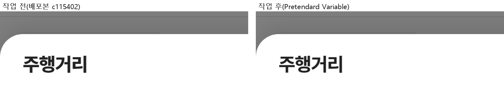
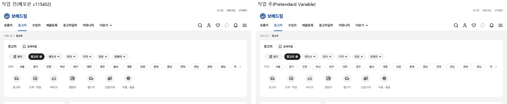
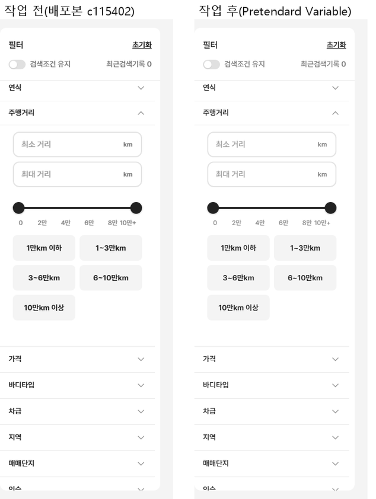
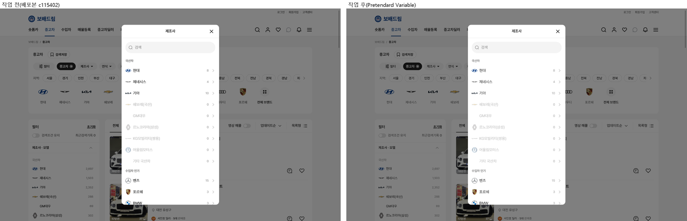
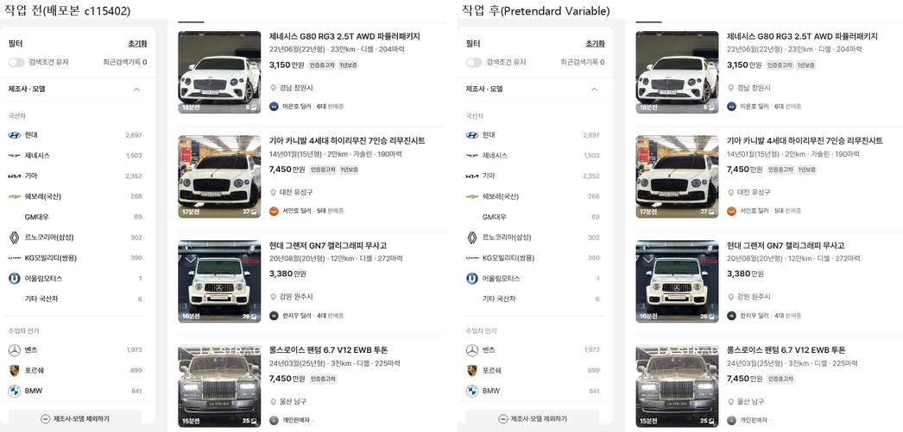
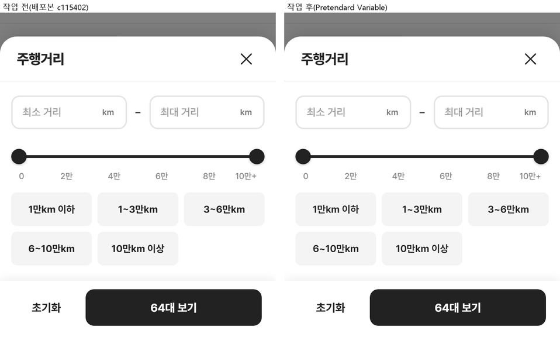
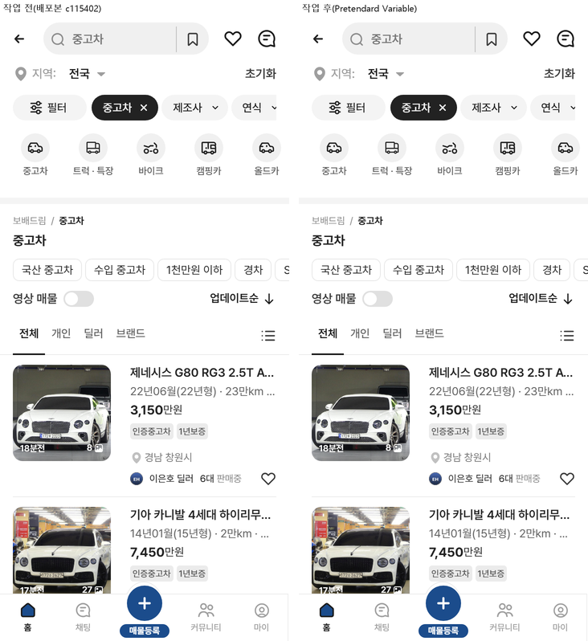

# PR #103 QF-120 과쯔 시안 전체에 Pretendard 글꼴 넣기

## 1. 한 줄 요약
과쯔 모드 전체에 저장소 안의 Pretendard Variable(가변 굵기 45~920)을 적용했습니다. 이제 650·750 같은 중간 굵기가 그대로 보입니다. 글자 폭이 바뀌어 줄바꿈이 달라지거나 새로 잘린 곳은 없고, 초톳·동처띠는 그대로(0%)입니다.

## 2. 기본 정보
| 항목 | 내용 |
|---|---|
| 과제 ID | QF-120 |
| 브랜치 | `feat/qf-120-pretendard`(main `c115402`에서 시작) |
| 커밋 | `15d050d` · 보고서 커밋(이 파일) |
| PR | https://github.com/bobaekimboae/bobaedream/pull/103 |
| 상태 | 병합·배포(배포 v 값은 채팅 보고·노션에 적음) |
| 이번 병합으로 main에 함께 들어간 과제 | QF-120 |

## 3. 한 일
- **작업 전 상태 확인**: 저장소에는 글꼴 파일이 없었습니다. 공용 `src/prototype/base.css`가 외부 CDN(jsdelivr)의 **고정 굵기** Pretendard(100~900, 100 단위)를 모든 모드에 불러오고 있었습니다. 그래서 650은 700, 750은 800으로 반올림돼 보였습니다(아래 폭 측정). QF-117 보고의 "시스템 글꼴로 보임"은 이 CDN 글꼴을 못 본 설명이었고, 정확히는 "고정 굵기라 중간 굵기가 안 보임"입니다.
- **글꼴 넣기**: `public/fonts/pretendard/`에 Pretendard Variable 한국어 dynamic subset(92조각 woff2, 모두 3.1MB, 첫 화면에는 14~17조각 364~436KB만 받음)과 라이선스 `OFL.txt`를 넣었습니다. 전체 파일(2.06MB 한 덩어리)보다 첫 화면이 가벼워 subset을 골랐습니다. 외부 주소에서 글꼴 파일을 받지 않습니다.
- **과쯔만 적용**: `src/prototype/fonts/pretendard.ts`가 `?qf=guazi`일 때만 글꼴 CSS와 `<html class="qf-font-pretendard">`를 붙입니다. 모드를 바꾸면 떼어 냅니다. 모듈을 읽는 순간(첫 렌더 전)에 붙여 요청을 앞당기고, 첫 화면 공통 14조각은 미리 불러옵니다(preload). `font-display: swap`(글꼴이 오기 전에도 글자가 먼저 보임)입니다.
- **글꼴 순서**: `"Pretendard Variable", Pretendard, -apple-system, BlinkMacSystemFont, system-ui, "Apple SD Gothic Neo", "Noto Sans KR", sans-serif`. 공용 CSS가 여러 곳에 `Pretendard`(CDN 고정 굵기)를 직접 적어 두었습니다. 그래서 과쯔에서는 화면 안 모든 글자에 이 순서를 `!important`로 씌웁니다(디버그 배지·겹침 표시 제외).
- **초톳·동처띠**: 글꼴 CSS가 붙지 않아 지금과 똑같습니다(base.css의 CDN import는 두 모드를 위해 남김).

### 변경 파일
| 파일 | 내용 |
|---|---|
| `public/fonts/pretendard/woff2-dynamic-subset/*.woff2`(새, 92개) · `OFL.txt`(새) | pretendard@1.3.9 `dist/web/variable` 원본 파일 그대로 |
| `public/fonts/pretendard/pretendard-guazi.css`(새) | @font-face 92개(swap) + 과쯔 글꼴 순서 |
| `src/prototype/fonts/pretendard.ts`(새) | 과쯔일 때만 CSS·preload·html 클래스 붙이기/떼기 |
| `src/prototype/listing/index.tsx` | 모듈 로드 시 + 모드 바뀔 때 `setPretendard` 호출 |
| `scripts/font-impact-check.mjs`(새) | 전후 같은 상태에서 글자 요소별 줄 수·잘림 비교 + 캡처 |
| `scripts/font-load-measure.mjs`(새) | 첫 화면 로딩 시간 전후(느린 4G 흉내, 3회 중앙값) |
| `reports/baseline/…` | 글꼴 굵기 표현 차이로 원본 대조 기준 다시 저장 |
| `docs/quick-filter-spec.md` · `reports/change-log.csv` | 규칙 · CH-0132 |

## 4. 작업 전과 비교
### 굵기(글자 "주행거리 10만km 이상 3~6만km" 20px 폭, PC 1440)
| 굵기 | 500 | 600 | 650 | 700 | 750 | 800 |
|---|---|---|---|---|---|---|
| 작업 전(CDN 고정 굵기) | 267.06 | 268.98 | **270.84(=700)** | 270.84 | **272.81(=800)** | 272.81 |
| 작업 후(가변) | 267.09 | 269.05 | **269.98** | 270.94 | **271.89** | 272.88 |

→ 바텀시트 제목 750, 칩 650, 버튼 700이 각각 제 굵기로 보입니다. 실제로 그린 글꼴(CDP 확인)은 제목·칩·버튼·눈금 모두 `Pretendard Variable(웹 글꼴)`입니다.

### 글자 폭 영향(4개 폭 × 6개 화면, 화면 안 글자 요소 짝 56~131개씩)
| 폭 | 첫 화면 | 제조사 줄 | 벤츠(모델 줄) | 전체 브랜드 창 | 주행거리(PC 사이드바·모바일 시트) | 매물 카드 |
|---|---|---|---|---|---|---|
| PC 1440 | 줄 수 바뀜 0 · 새로 잘림 0 | 0 · 0 | 0 · 0 | 0 · 0 | 0 · 0 | 0 · 0 |
| PC 1280 | 0 · 0 | 0 · 0 | 0 · 0 | 0 · 0 | 0 · 0 | 0 · 0 |
| 모바일 393 | 0 · 0 | 0 · 0 | 0 · 0 | 0 · 0 | 0 · 0 | 0 · 0 |
| 모바일 360 | 0 · 0 | 0 · 0 | 0 · 0 | 0 · 0 | 0 · 0 | 0 · 0 |

평균 글자 폭 비율은 100%(같은 글꼴의 굵기 차이만 있음)입니다. 상단 카드(제목·칩 줄·지역 줄·퀵필터 이름 2줄 말줄임), 좌측 필터(항목 폭 290), 주행거리 시트, 전체 브랜드 창, 매물 카드 모두 바뀐 곳이 없습니다. 같은 위치 전후 캡처의 픽셀 차이는 화면당 0.01~0.70%(굵기 표현)입니다.

### 첫 화면 로딩(같은 빌드, 느린 4G 10Mbps · 지연 40ms, 캐시 없음, 3회 중앙값)
| 화면 | DOMContentLoaded 전 → 후 | load 전 → 후 | 글꼴 준비 전 → 후 | 받은 글꼴 |
|---|---|---|---|---|
| PC 1440 | 415 → 410ms | 2,854 → 3,059ms(+205) | 2,862 → 3,065ms | 0 → 17조각 436KB |
| 모바일 393 | 425 → 418ms | 1,829 → 1,974ms(+145) | 1,835 → 1,978ms | 0 → 14조각 364KB |

"전"은 같은 빌드에서 과쯔 글꼴 파일만 막은 상태입니다(작업 전 동작). 이 측정 PC에는 Pretendard가 설치돼 있어 CDN 글꼴 파일을 받지 않았습니다. 설치 안 된 사용자는 작업 전에도 CDN 고정 굵기 파일을 받았습니다. swap이라 글자는 DOMContentLoaded 시점에 이미 보입니다.

### 원본 대조(diff)
| 점검 | 결과 |
|---|---|
| `diff:bbm` | 최대 1.1%(모바일 칩 줄) — 모두 글꼴 굵기 표현 차이, 3% 한도 안 → 기준 다시 저장 후 0% |
| `diff:bbm:flow` | 최대 1.3%(모바일 칩 줄) — 글꼴 → 기준 다시 저장 후 0% |
| `regress:modes` | 초톳·동처띠 PC·모바일 10개 0% · 과쯔 모바일 0.26~0.27%(글꼴, 의도한 변경) |

### 캡처(같은 위치, 작업 전 · 후)

## 5. 검증
| 점검 | 결과 |
|---|---|
| `npm run verify:qf` | 통과 |
| `npm run check:stability` | 모두 통과(높이 두 값·간격) |
| `npm run check:sidebar` · `sidebar-stable-check` | 34/34 · 모두 통과 |
| `check:top` · `check:hybrid` · `check:logos` | 21/21 · 20/20 · 23/23 |
| `check:models` · `check:model-images` | 65/65 · 15/15 |
| `mileage-check` | 모두 통과 |
| `regress:modes` | 초톳·동처띠 0% |
| 콘솔 오류 | PC 1024·1280·1440 · 모바일 393 0 |
| 퀵필터 규격(레일·카드·이미지·트림 칩) | 크기 변화 없음(check:stability 통과, 글자 폭 변화 0) |

## 6. 원본과 다르게 남긴 것과 이유
- **공용 base.css의 CDN import 유지**: 초톳·동처띠 글꼴을 그대로 두기 위해서입니다. 과쯔에서도 이 CSS 파일 1개는 받습니다. 하지만 과쯔 글자는 모두 `Pretendard Variable`이 먼저라 CDN 글꼴 파일은 받지 않습니다.
- **`!important`로 글꼴 순서 씌움(과쯔만)**: 공용 CSS 수십 곳이 `Pretendard`를 직접 적고 있어서, 하나씩 바꾸는 대신 과쯔 범위에서 한 번에 덮었습니다.

## 7. 못 한 것 · 다음에 할 것
- 초톳·동처띠도 같은 가변 글꼴로 바꾸려면 base.css의 CDN import를 지우는 별도 과제가 필요합니다(이번엔 동결).
- preload 조각은 지금 첫 화면 글자 기준입니다. 첫 화면 문구가 크게 바뀌면 `font-impact-check`로 다시 뽑아야 합니다.

## 8. 확인 링크
- 모바일: https://bobaekimboae.github.io/bobaedream/?qf=guazi&v=<배포 v>
- PC: https://bobaekimboae.github.io/bobaedream/?qf=guazi&v=<배포 v>&pc=1
- 로컬: `?qf=guazi` · `?qf=guazi&pc=1`
