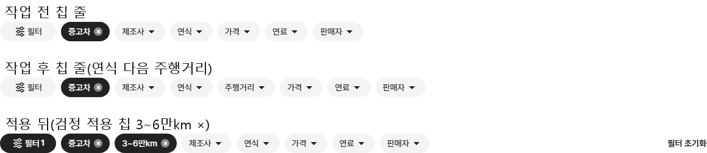
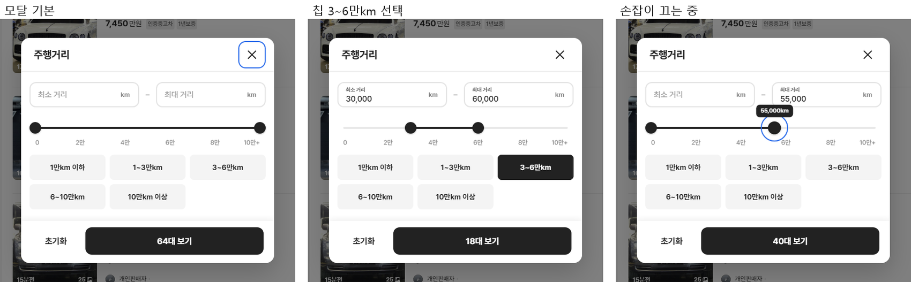
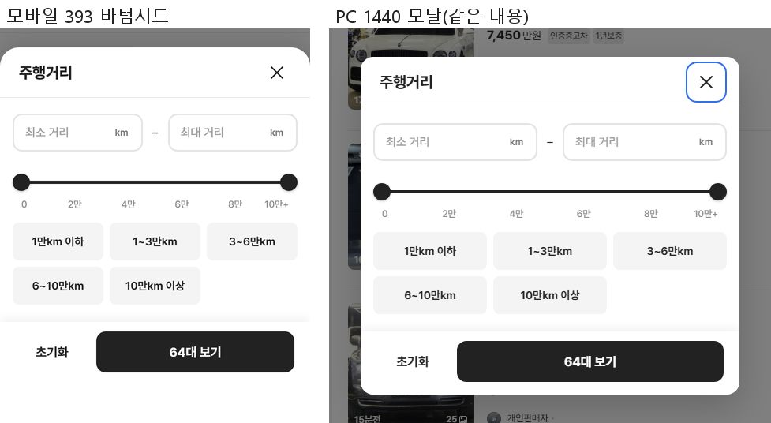

# PR #105 QF-118 PC 상단 필터 칩 줄에 "주행거리" 칩 + 가운데 모달

## 1. 한 줄 요약
과쯔 PC(1024 이상) 상단 칩 줄의 연식 다음에 "주행거리 ▾" 칩을 넣었습니다. 누르면 모바일 바텀시트와 같은 내용의 가운데 모달(폭 480)이 열립니다. 새 부품을 만들지 않고 QF-117 주행거리 부품과 QF-119 규칙을 그대로 썼습니다. 모바일은 바뀌지 않았습니다.

## 2. 기본 정보
| 항목 | 내용 |
|---|---|
| 과제 ID | QF-118 |
| 브랜치 | `feat/qf-118-pc-mileage-modal`(QF-120 병합 main `f0656be`에서 시작) |
| 커밋 | `43cffe9` · 보고서 커밋(이 파일) |
| PR | https://github.com/bobaekimboae/bobaedream/pull/105 |
| 상태 | 병합·배포(배포 v 값은 채팅 보고·노션) |
| 이번 병합으로 main에 함께 들어간 과제 | QF-118 |

## 3. 한 일
- **칩 줄(PC)**: 칩 순서를 `필터 · 중고차 · 제조사 · 연식 · 주행거리 · 가격 · 연료 · 판매자`(좌측 필터 순서)로 했습니다. 주행거리 칩은 다른 칩과 같은 부품이라 규격이 같습니다. 값을 적용하면 칩 줄에서 빠지고, 검정 적용 칩(`3~6만km ×` 등)이 생기며 "필터 N"에 셉니다. × 는 주행거리만 풉니다.
- **모달**: 기존 `MileageFinalSheet`에 `variant="modal"`을 더했습니다. 모바일 바텀시트는 그대로이고, `BbmSheet`·`ActionBar`는 건드리지 않았습니다. 화면 가운데에 폭 `min(480, 화면 − 48)`, 모서리 16, 최대 높이 화면 − 96(넘치면 본문만 스크롤), 검정 50% 덮개로 뜹니다. 열고 닫을 때 0.15초 투명도 + 8px 위로 움직입니다(움직임 줄이기 설정이면 없음).
- **내용**: 모바일 시트와 같은 구성·수치입니다. 입력 208 · 칩 144는 그리드가 본문 폭(448)으로 계산하며, 숫자를 고정하지 않았습니다.
- **동작**: 모달은 적용 값을 복사한 임시 값으로 시작합니다. "N대 보기"를 눌러야 주행거리만 적용되고(목록·칩·좌측 사이드바) 닫힙니다. 닫기·배경·Esc는 임시 값을 버립니다. 초기화는 모달 안 주행거리만 비우고 닫히지 않습니다. 버튼 대수는 임시 값 기준으로 실시간이고, 목록은 적용 때만 다시 그립니다.
- **스크롤**: 열린 동안 페이지 스크롤을 잠급니다. 스크롤바가 사라진 폭만큼 오른쪽 여백을 더해 화면이 옆으로 밀리지 않습니다. 열고 닫을 때 페이지·사이드바 scrollTop은 그대로입니다.
- **접근성**: `role="dialog"`, `aria-modal`, `aria-labelledby`(제목)를 달았습니다. 열리면 닫기 버튼에 포커스(preventScroll)하고, Tab은 모달 안에서만 돕니다. 닫히면 주행거리 칩(적용 뒤에는 적용 칩)으로 포커스가 돌아갑니다. 손잡이는 aria-label·방향키 1,000km·End = 제한 없음, 칩은 aria-pressed입니다.

### 변경 파일
| 파일 | 내용 |
|---|---|
| `src/prototype/filters/bbm-mileage.tsx` | `MileageFinalSheet`에 `variant="modal"` · `returnFocus` — 스크롤 잠금 훅, 포커스 가두기·복귀, 닫는 움직임, 주행거리만 적용 |
| `src/prototype/filters/bbm-mileage.css` | 모달 크기·모서리·그림자·움직임(reduced-motion 제외) |
| `src/prototype/listing/index.tsx` | 과쯔 PC 칩 줄에 주행거리 칩, 적용 칩 표시용 클래스, PC 칩 창 → 모달, 포커스 복귀 대상 |
| `scripts/mileage-modal-check.mjs`(새) | 수치·동작·접근성 점검(PC 1024 · 1280 · 1440 + 모바일 393) |
| `docs/quick-filter-spec.md` · `reports/change-log.csv` | 규칙 · CH-0134~0135 |

## 4. PC 결과(수치)
| 항목 | 1024×768 | 1280×800 | 1440×900 |
|---|---|---|---|
| 칩 줄 순서 | 중고차 · 제조사 · 연식 · **주행거리** · 가격 · 연료 · 판매자 | 같음 | 같음 |
| 주행거리 칩 | 32 · 좌우 12 · 14/20 500 · #F4F4F4 · 연식과 사이 8 | 같음 | 같음 |
| 상단 카드 높이 전 → 후 | 같음 | 282 → 282 | 282 → 282 |
| 모달 폭 · 가운데(좌우/위아래) · 모서리 | 480 · 같음 · 16 | 480 · 400/400 · 186/186 · 16 | 480 · 480/480 · 236/236 · 16 |
| 헤더 · 액션 바 | 64 · 80 | 64 · 80 | 64 · 80 |
| 본문 → 입력 · 칩 | 448 → 208 · 144(3열) | 같음 | 같음 |
| 첫 눈금 왼쪽 끝 − 첫 손잡이 중심 · 끝 눈금 오른쪽 끝 − 끝 손잡이 중심 · 가운데 눈금 오차 | 0 · 0 · 0 | 0 · 0 · 0 | 0 · 0 · 0 |
| 눈금 슬라이더 안 · 잘림·가로 스크롤 | 안 · 0 | 안 · 0 | 안 · 0 |
| 조작 중(끌기·칩 6번) 모달 높이 | 428 고정 | 428 고정 | 428 고정 |
| 열 때 scrollTop(페이지 600 · 사이드바 200) · 목록 x | 그대로 | 그대로 · 364 | 그대로 · 444 |

눈금은 지시문 2번(첫 글자 왼쪽 · 끝 글자 오른쪽 정렬, QF-119 규칙)대로 쟀습니다. 첫 눈금은 왼쪽 끝, 끝 눈금은 오른쪽 끝이 손잡이 중심과 같습니다(차이 0). 5번의 "중심 차이 0"은 QF-119 이전 기준이라 이렇게 바꿔 적었습니다.

## 5. 동작 테스트 결과(1024 · 1280 · 1440 모두 통과)
| 테스트 | 결과 |
|---|---|
| 칩 → 모달 열림 | O |
| 3~6만km 적용 → 검정 칩 `3~6만km ×` · 목록 64 → 18(버튼 대수와 같음) · 사이드바 3~6만km 선택 · `필터 1` · 주행거리 ▾ 칩 빠짐 | O |
| 끄는 동안 목록 64 그대로 · 버튼만 40대 보기 | O |
| 적용 값(3~6만km)으로 열림 · 닫기 / 배경 / Esc → 임시 값 버림 | O · O · O |
| 서울 선택 뒤 모달 초기화 → 주행거리만 풀림(닫히지 않음) · 서울 유지 | O |
| 사이드바에서 1~3만km → 칩 줄 표시 · 칩 × → 주행거리만 해제 | O(1280·1440, 1024는 사이드바가 펼침판) |
| 열고 닫을 때 페이지·사이드바 scrollTop 변화 0 | O |
| 접근성: dialog · aria-modal · 제목 연결 · 열 때 닫기 포커스 · Tab 17번 모두 모달 안 · 닫히면 칩으로 포커스 | O |
| 키보드만: ← 99,000km · End 제한 없음 · 칩 Space(aria-pressed) · Enter 적용 | O |
| 모바일 393 칩 줄 변화 없음(주행거리 칩 없음) | O |
| 콘솔 오류 | 0 |

### 캡처

## 6. 검증
| 점검 | 결과 |
|---|---|
| `node scripts/mileage-modal-check.mjs` | 모두 통과 |
| `npm run verify:qf` | 통과 |
| `check:stability` · `check:sidebar` · `sidebar-stable-check` | 통과 · 34/34 · 통과 |
| `check:top` · `check:hybrid` · `mileage-check` | 21/21 · 20/20 · 통과 |
| `regress:modes` | 초톳·동처띠·과쯔 모바일 모두 0% |
| `diff:bbm` · `diff:bbm:flow` | 0% |
| 검수한 폭 | PC 1024 · 1280 · 1440, 모바일 393 |

## 7. 원본과 다르게 남긴 것 · 미완료
- 열 때 포커스는 닫기 버튼에 둡니다(지시문의 "첫 입력 또는 닫기" 중 하나). 입력칸에 두면 떠 있는 이름표가 작아지는 모양으로 바뀌어 기본 모습이 달라지기 때문입니다.
- 1024~1279는 좌측 필터가 펼침판이라, 사이드바 값 공유는 1280 이상에서 확인했습니다(값은 같은 상태를 씁니다).
- 미완료 항목: 없음.

## 8. 확인 주소(PC)
- PC: https://bobaekimboae.github.io/bobaedream/?qf=guazi&v=<배포 v>&pc=1
- 로컬: `?qf=guazi&pc=1`
