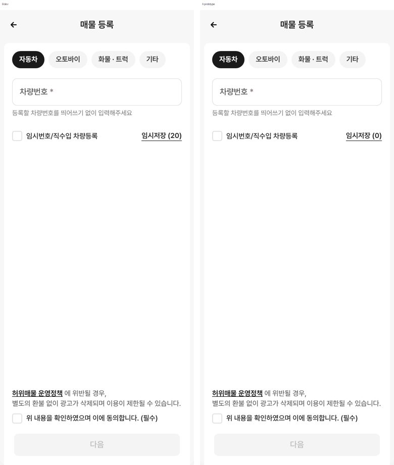
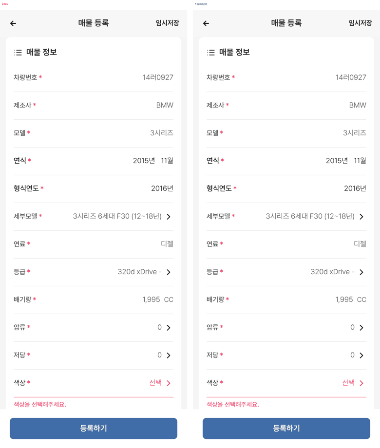
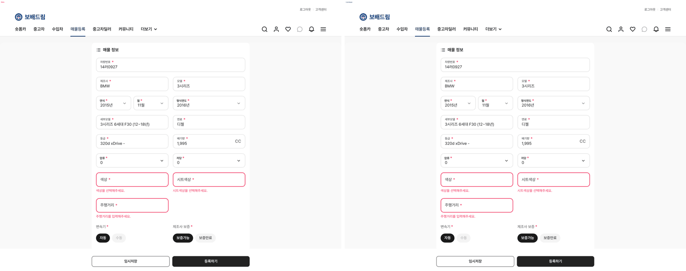
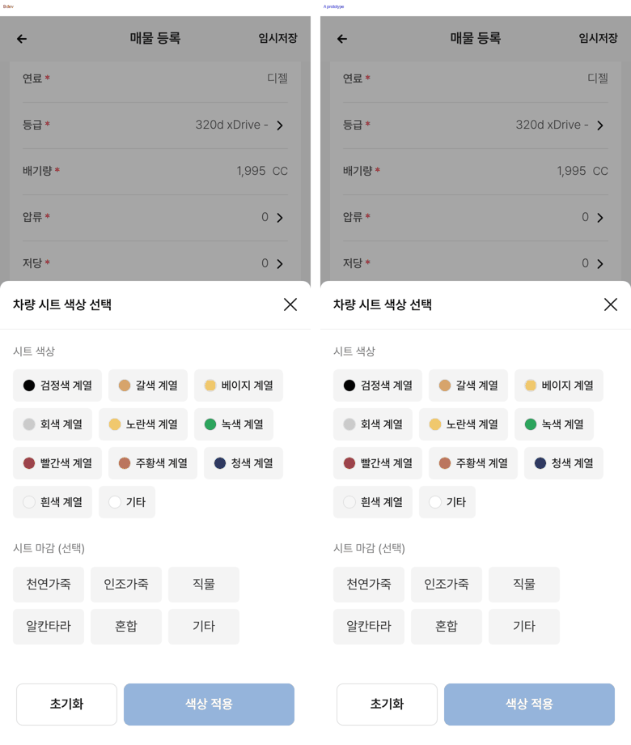
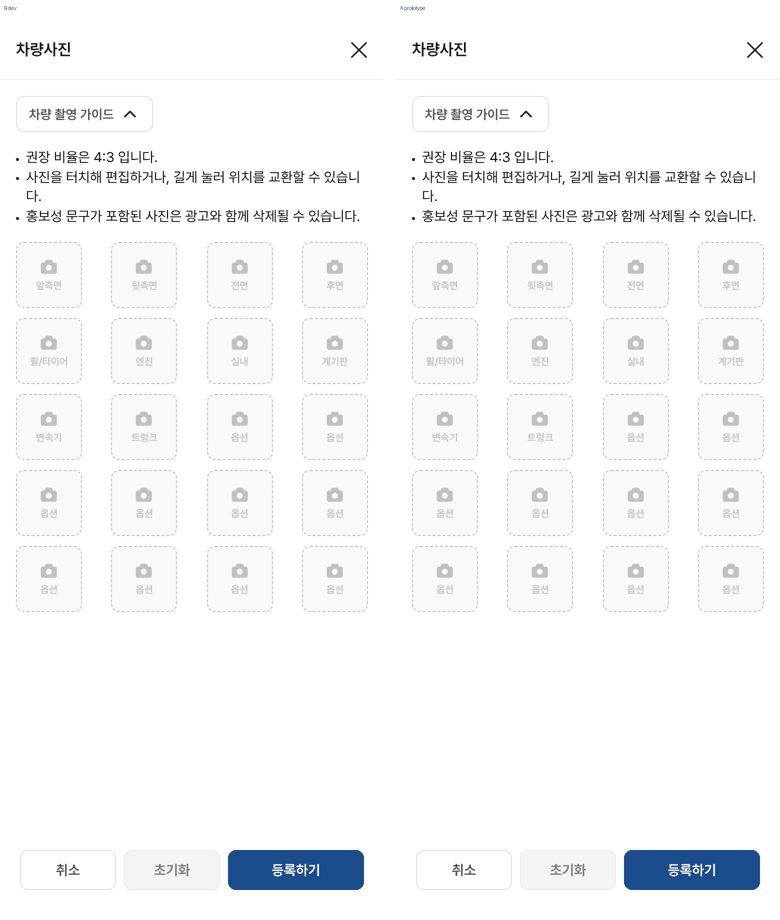
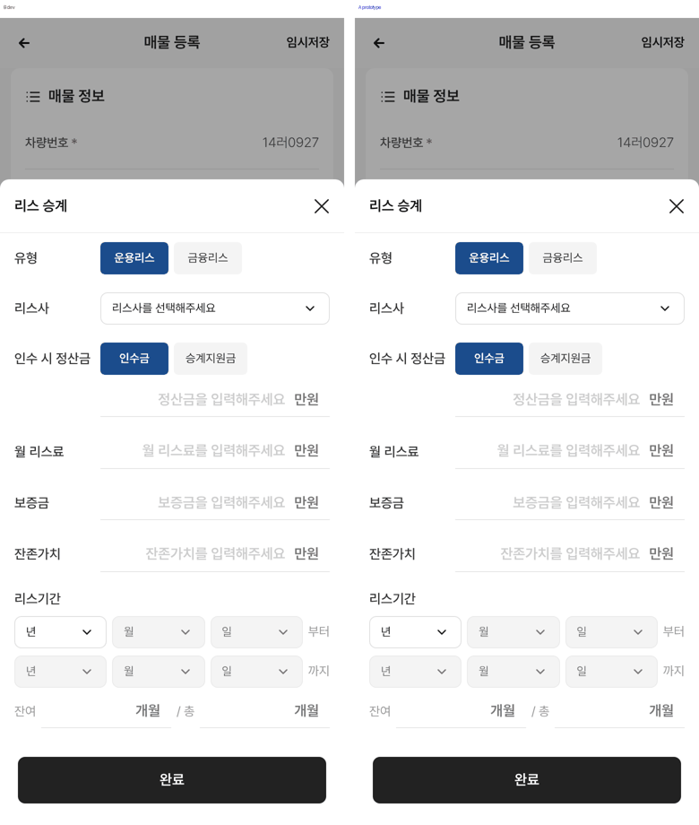
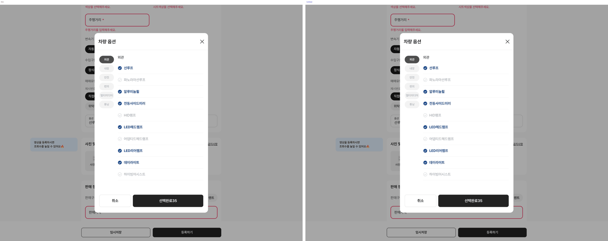
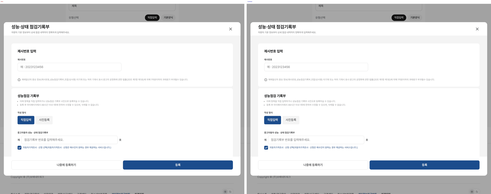

# PR #210 보고 — JOB-7 매물 등록 화면

## ① 한 줄 요약
dev 매물 등록 화면(`/car/register` → `/car/register/form`)을 시안 `?register`에 옮겼습니다. 384·1280 두 폭 모두 전체 폼 픽셀 차이 0.0%이고, 실측 48개 항목 중 47개가 일치합니다. 나머지 1개는 일부러 가린 연락처입니다.

## ② 과제 · 브랜치 · 커밋 · PR · 상태
| 항목 | 값 |
|---|---|
| 과제 ID | JOB-7 |
| 브랜치 | `claude/register-form-dev-parity` (base `main` fd41d91) |
| 커밋 | `7de3789`(구현) · `74ac4b3`(점검기록부 보정·보고서) · `62ab94a`(촬영 가이드) · 이 보고서 갱신 커밋 |
| PR | https://github.com/bobaekimboae/bobaedream/pull/210 |
| 상태 | 푸시 완료 · 병합 안 함 · 배포 안 함 |
| 함께 main에 들어간 과제 | 없음(병합 전) |

## ③ 한 일
- 1단계(유형 · 차량번호 · 임시번호 · 약관 동의 → 다음)와 등록 폼을 dev와 같은 구조 · 문구 · 클래스 이름으로 만들었습니다. 등록 폼은 매물 정보 · 사진 및 영상 · 판매 정보 · 상세설명 · 성능·상태 점검기록부 · 부가서비스로 이루어집니다.
- 차량번호 조회는 실제 API를 부르지 않습니다. `14러0927`만 목업(BMW 3시리즈 F30 320d xDrive 2015년 11월)으로 채웁니다. 다른 번호를 넣으면 안내 문구를 띄웁니다.
- 팝업 14종을 만들었습니다: 세부모델, 등급, 압류/저당, 외장색, 시트색, 옵션, 차량사진, 사진 촬영 가이드, 금지사항, 거래지역, 내 설명글, 리스 승계, 렌트, 점검기록부.
- 점검기록부는 모바일에서 바텀시트(아래에서 올라오는 창), PC에서 dev 직접입력 모달 원문으로 엽니다.
- 모양은 dev CSS에서 이 화면이 쓰는 규칙만 뽑아 `.bbm-register` 범위로 묶은 `register.css`가 그립니다. 다른 화면에 영향이 가지 않게 별도 파일로 나눠 필요할 때만 불러옵니다.
- 팝업은 dev처럼 화면 맨 바깥(루트) 바로 아래에 붙였습니다. 그래야 폼 전용 규칙이 팝업에 섞이지 않습니다.
- 등록 화면에서만 문서 스크롤을 켰습니다. 전역 `body { overflow: hidden }`(스크롤 막힘)과 모바일 감싸개의 높이 고정을 이 화면에서만 풀었습니다. 보호 파일은 손대지 않았습니다.

## ④ 원본과 비교
### 영역별 화면 차이(픽셀 차이 비율, 작업 전에는 A에 화면 자체가 없었음)
| 화면 | 384 | 1280 | 라벨 |
|---|---|---|---|
| 등록 폼 전체(문서 전체) | 0.0% | 0.0% | 일치 |
| 1단계 | 0.14% | 0.04% | 🔵 임시저장 개수 (0) vs (20) |
| 세부모델 · 등급 · 외장색 · 시트색 · 옵션 | 0.0% | 0.0% | 일치 |
| 점검기록부 | 0.0% | 0.0% | 일치 |
| 리스 승계 · 렌트 | 0.01% | 0.0% | 🟡 / 일치 |
| 거래 지역 | 0.0% | 0.48% | 🟡 뒤쪽 입력칸 포커스 테두리 |
| 금지사항 | 6.58% | 0.0% | 🟡 어둡게 덮인 뒤쪽 페이지 스크롤 위치만 다름 |
| 차량사진(빈 상태) | 0.0% | 0.07% | 일치 / 🟡 |
| 허위매물 운영정책 | 0.0% | 0.01% | 일치 / 🟡 |
| 사진 촬영 가이드 | 0.0% | 1.48% | 일치 / 🟡 뒤쪽 페이지 스크롤 위치만 다름 |
| 내 설명글 불러오기 | 52.47% | 23.01% | 🔵 목록이 예시 3건 |

### 요소 실측(getBoundingClientRect, 화면에 그려진 위치·크기)
48개 항목 × 2폭 = 96건 중 일치 94건, 🔵 2건(연락처 번호를 0으로 가려 글자 폭만 다름).

### 동작 점검(시안)
26항목 × 2폭 모두 통과했습니다.
- 다음 버튼 활성 조건, 다른 번호 안내, 조회 자동입력
- 검증 문구 5개 표시와 입력 후 사라짐
- 색상 · 시트색 · 세부모델 · 등급 · 옵션(35 → 36개) 적용
- 사진 목업 업로드(시안에서만)와 개수 표시
- 리스 시트, 거래지역, 기본양식, 내 설명글
- 점검기록부 열기·닫기(모바일·PC)
- 등록하기를 누르면 요청 없이 안내만 표시

| 1단계 384 | 폼 384 | 폼 1280 |
|---|---|---|
|  |  |  |

| 시트색 384 | 차량사진 384 | 리스 384 | 옵션 1280 | 점검기록부 1280 |
|---|---|---|---|---|
|  |  |  |  |  |

## ⑤ 검증
- `npm run verify:qf` 통과(런타임 점검 · TypeScript · Vite 빌드)
- 콘솔 오류: PC · 모바일 모두 앱 오류 0건. 미리보기 서버 루트의 `favicon.ico` 404 1건은 기존 서버 설정이고 이 화면과 무관합니다.
- 외부 요청 0건(조회 · 업로드 · 등록 API를 부르지 않음)
- 퀵필터 규격 측정(`measure:qf`)은 해당 없음: 퀵필터 · 목록 화면을 바꾸지 않았습니다.
- dev에서는 등록하기 · 임시저장 · 결제를 누르지 않았고, 사진도 올리지 않았습니다.

## ⑥ 원본과 다르게 남긴 것과 이유
- 연락처는 `01000000000`, PC 점검기록부 차대번호는 `WBA00000000000000`로 가렸습니다(개인 · 차량 식별 정보).
- 임시저장 개수는 (0)입니다. dev 값 (20)은 테스트 계정의 실제 저장 수입니다.
- 내 설명글은 예시 3건, 주소 검색은 목업 4건입니다(dev는 실제 계정 글과 우편번호 서비스).
- 시트 마감을 고르면 값이 `검정색 계열 / 천연가죽`처럼 표시됩니다. dev에서 적용 후 표기를 확인하지 않은 추정값입니다.

## ⑦ 못 한 것 · 다음에 할 것
- **아이콘 교체(JOB-7 아이콘 최종)는 대기 중입니다.**
  - `register_icons_1007.zip`이 작업 환경과 구글 드라이브에 없습니다. 노션 JOB-7에 확정 요청을 올렸습니다.
  - 교체할 23자리는 384·1280에서 미리 재서 시트 `3_아이콘` 탭에 넣었습니다. 글자 옆 아이콘은 모두 세로 중심 차이 1px 이하입니다.
  - 15번 AI 아이콘은 dev 등록 화면에 넣을 자리가 없어 확정이 필요합니다.
- 리스·렌트 시트, 차량사진처럼 dev에서 값을 넣은 뒤의 화면은 입력 전 상태만 비교했습니다. dev 규칙상 등록 직전 단계까지만 확인했기 때문입니다.
- 「부가서비스」는 dev에서도 눌렀을 때 반응이 없어 그대로 두었습니다.
- 모바일 하단 탭 「매물등록」과 메인 「내 차 팔기」를 이 화면에 연결하는 작업은 하지 않았습니다(목록 · 메인 화면 변경이라 범위 밖). 필요하면 지시 바랍니다.

## ⑧ 확인 링크
- 로컬 미리보기: `?register`(1단계부터), `?register=form`(폼부터). 빌드: `claude/register-form-dev-parity` @ 이 보고서 커밋
- 배포 전이라 배포본 링크는 없습니다(병합 · 배포 지시 후 `https://bobaekimboae.github.io/bobaedream/?register&v=<커밋>`).
