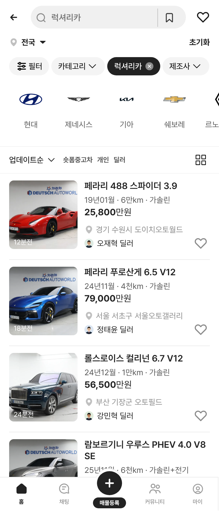
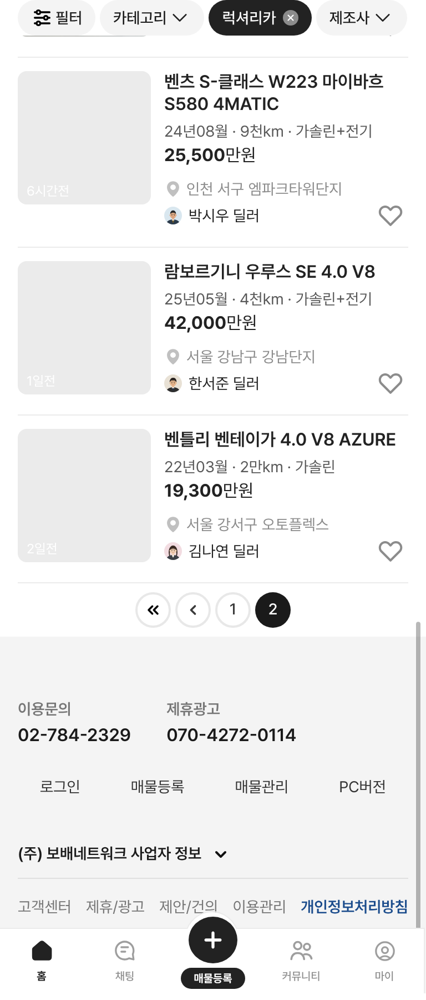
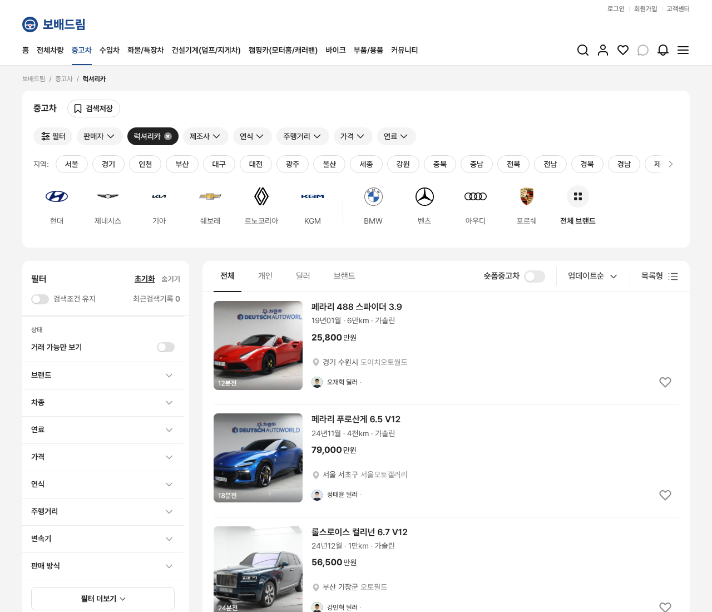

# PR #272 럭셔리카 카테고리 가상 매물 v01

① **한 줄 요약:** 차량 › 중고차 › 럭셔리카 목록에 구글 시트·드라이브 기반 가상 매물 32대를 넣었습니다. 각 매물에는 전국 실제 매매단지 16곳과 가상 딜러 16명을 배정했습니다.

② **과제 정보**
- 과제 ID: 미지정
- 브랜치: `claude/usedcar-list-detail-category-otcx1u`
- 커밋: `03738eb` 외 보고서 커밋
- PR: https://github.com/bobaekimboae/bobaedream/pull/272
- 상태: 병합·배포 (배포 v값은 채팅 보고 참조)

③ **한 일**
- 시트 「가상 매물 시나리오 › 럭셔리카」 33행을 대조했습니다. 고유 차량번호가 32대(368서5810 중복 1행 제외)이고, 드라이브 사진은 29장입니다.
- `src/prototype/data/luxury-category-v01.ts`를 만들었습니다. 매물 32대는 제조사 · 모델 · 세대 · 트림 · 등록연월 · 주행 · 연료 · 가격 · 딜러로 이루어집니다.
- 사진은 차량번호 대신 순번 파일명(`public/assets/cars/luxury-category-v01/lux-NN.webp`)으로 저장했습니다.
- 딜러 16명을 실제 단지 16곳(KB차차차 마스터, 매물 1대 이상)에 2대씩 배정했습니다. 사용자 지시 「서울오토갤러리 등 전국으로 여러 개」에 따른 것입니다.
- 프로필은 실존 인물 사진이 아닌 일러스트형 16장(`public/assets/cars/sellers/luxury-v01/`)입니다.
- `?category=럭셔리카`(과쯔)일 때만 이 매물을 보여줍니다. 위치 줄은 데이터에 정한 단지를 그대로 씁니다.

④ **원본과 비교**
- 비교할 원본 화면이 없는 새 카테고리라 시트 원문과 대조했습니다.
- 시트 CSV ↔ 데이터: 문제 0건 (등록연월 · 주행 · 연료 · 차명 · 가격 · 사진 연결)
- 데이터 ↔ 화면 384 카드 32대(1쪽 20 + 2쪽 12): 문제 0건 (스펙 · 가격 · 위치 · 판매자 · 프로필)

⑤ **검증**
- `npm run verify` 통과: admin 29/29 · 빌드 · sites 4/4 · 런타임 무결성 28개
- 콘솔 오류: 모바일 384 · PC 1280 모두 0건

⑥ **원본과 다르게 남긴 것과 이유**
- **가상 값:** 가격 · 딜러 · 단지 · 프로필 · 등록시각은 가상입니다. 09더1188은 기존 3004 매물과 같은 18,990만원입니다.
- **시트에 정보가 없던 3대:** 351거1113 · 178다6624 · 181마3337은 등록연월·주행·연료를 그럴듯한 값으로 채웠습니다(`filled: true`).
- **모델명 통일:** 시트의 「우르스」는 「우루스」로 통일했습니다.
- **지역:** 단지를 전국에 나눠서 시트의 지역(경기·부산)과 화면 지역이 다를 수 있습니다. 시트 값은 `sheetRegion`에 남겨 두었습니다.
- **사진 속 정보:** 사진 대부분에 「차란차 · DEUTSCH AUTOWORLD」 배경과 번호판이 보입니다. 사용자가 제공한 사진 그대로입니다.

⑦ **못 한 것 · 다음에 할 것**
- **사진 없는 3대:** 121가3330 · 351거1113 · 181마3337은 빈 사진 칸입니다. 드라이브에 올라오면 `image`만 채우면 됩니다.
- **퀵필터:** 럭셔리 브랜드 로고 → 모델 → 세부모델 퀵필터가 다음 단계입니다. 지금은 기존 승용 제조사 레일을 그대로 씁니다.
- **상세 화면:** 매물마다 다른 상세 화면은 이번 범위가 아닙니다(승용 공통 상세 시안을 그대로 씀).

⑧ **확인 링크**
- 모바일 `?qf=guazi&category=럭셔리카`
- PC `?qf=guazi&pc=1&category=럭셔리카`

| 모바일 384 첫 화면 | 모바일 384 2쪽 끝(사진 없는 3대) | PC 1280 |
|---|---|---|
|  |  |  |
