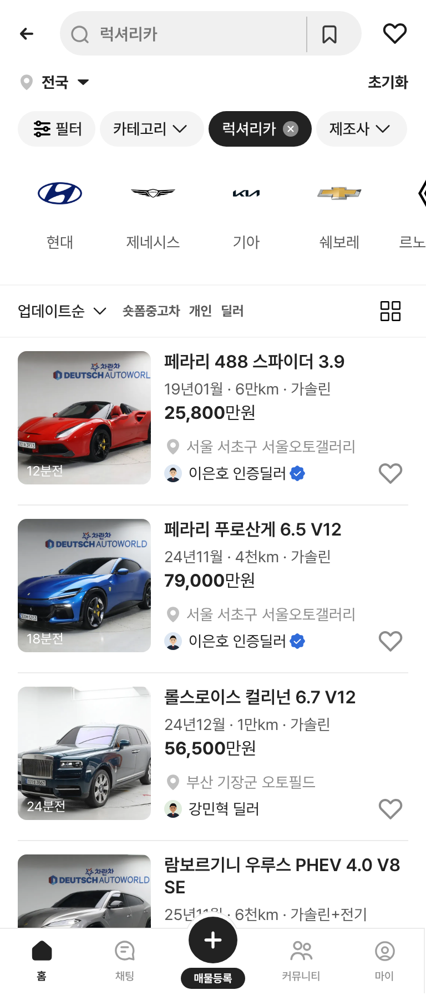
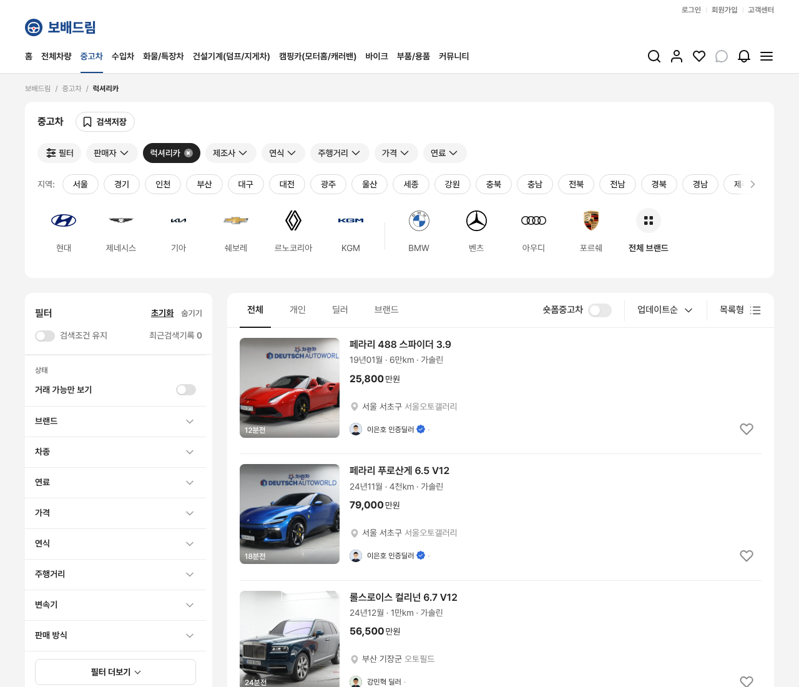

# PR #273 럭셔리카 후속: 사진 없는 3대 제외 · 딜러 전문 차종 배치 · 인증딜러 배지

① **한 줄 요약:** 럭셔리카 목록을 사진 있는 29대로 줄였습니다. 딜러는 전문 차종별로 다시 배치했고, 5명에게 인증딜러 배지를 붙였습니다.

② **과제 정보**
- 과제 ID: 미지정
- 브랜치: `claude/usedcar-list-detail-category-otcx1u`
- 커밋: `607587d` · `a6877a1` · 보고서 커밋
- PR: https://github.com/bobaekimboae/bobaedream/pull/273
- 상태: 병합·배포 (v값은 채팅 보고 참조)

③ **한 일**
- **사진 없는 3대 제외:** 121가3330 · 351거1113 · 181마3337을 빼서 29대가 남았습니다(사용자 선택 「사진 없는 3대」).
- **딜러 전문 차종:** 16개 단지의 딜러마다 전문 차종을 정했습니다. 시트 지역이 부산인 3대는 부산 단지에 둡니다.
  - 서울: 서울오토갤러리 페라리 · 강남 롤스로이스/벤틀리 · 오토플렉스 맥라렌
  - 경기: 도이치오토월드 G-클래스 · SKV1 우루스 · 오토허브 포르쉐/아우디
  - 그 밖: 엠파크 마이바흐 · 디오토몰·제주 테슬라 · 대구 벤츠 S/벤틀리 · 광주 마세라티/애스턴마틴 · 울산 미국 대형 SUV/픽업 · 경남 BMW M · 청주 페라리 GTC4
- **인증딜러 5명:** 이은호 · 한서준 · 오재혁 · 이도현 · 박시우는 「이름 인증딜러」로 표시합니다. 이름 바로 뒤에 초톳 「인증 딜러 물결 배지」 원본 SVG를 16px로 붙였습니다(`public/assets/bbm/verified-dealer-wavy-chotot-v01.svg`).

④ **원본과 비교**
- 시트 ↔ 데이터 ↔ 화면 29대: 판매자 이름 · 인증 배지 · 단지 · 스펙 · 가격 불일치 0
- 차이는 예상한 것뿐입니다(뺀 3대, 가상 값으로 채운 178다6624).

⑤ **검증**
- `npm run verify` 통과: admin 29/29 · 빌드 · sites 4/4 · 런타임 28개
- 콘솔 오류: 모바일 384 · PC 1280 모두 0건

⑥ **원본과 다르게 남긴 것**
- 딜러 이름 · 단지 배정 · 인증 여부는 가상 시나리오입니다.

⑦ **다음에 할 것**
- 럭셔리 브랜드 로고 → 모델 → 세부모델 퀵필터
- 사진이 들어오면 빠진 3대를 다시 넣기

⑧ **확인 링크**
- 모바일 `?qf=guazi&category=럭셔리카`
- PC `?qf=guazi&pc=1&category=럭셔리카`

| 모바일 384 | PC 1280 |
|---|---|
|  |  |
