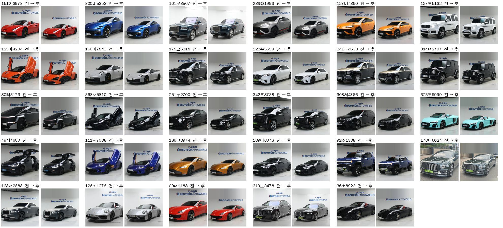
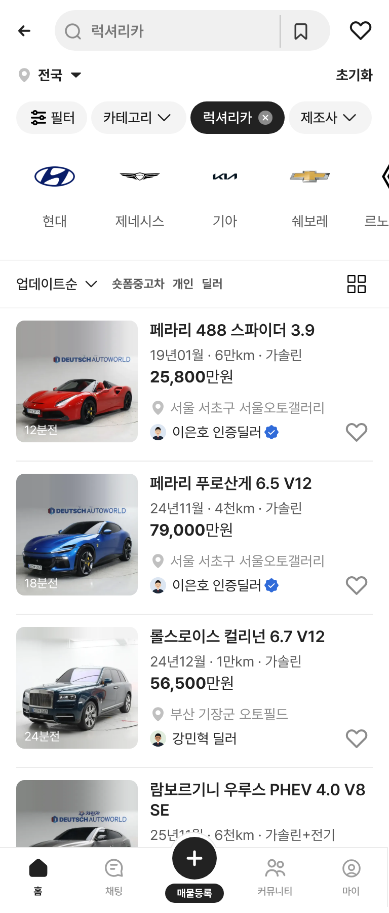

# PR #274 럭셔리카 목록 썸네일 정규화

① **한 줄 요약:** 럭셔리카 목록 썸네일 29장의 차 크기(칸 폭의 90%)와 바닥 높이(위에서 85%)를 똑같이 맞췄습니다.

② **과제 정보**
- 과제 ID: 미지정
- 브랜치: `claude/usedcar-list-detail-category-otcx1u`
- 커밋: `c1860fc` · 보고서 커밋
- PR: https://github.com/bobaekimboae/bobaedream/pull/274
- 상태: 병합·배포 (v값은 채팅 보고 참조)

③ **한 일**
- **차 영역 찾기:** 분할 모델(u2netp)로 사진마다 차 영역을 찾았습니다. 처음 시도한 윤곽선 방식과 배경 빼기 방식은 영역을 잘못 잡아서 쓰지 않았습니다.
- **정사각형 사본 만들기:** 차 영역 기준으로 600×600 사본을 만들었습니다(`public/assets/cars/luxury-category-v01/thumb/`).
- **여백 채우기:** 위·아래 여백은 원본 맨 위·아래 줄 색을 가로로 넓게 평균 내 채웠습니다. 처음엔 맨 윗줄 픽셀을 그대로 늘려서 세로 줄무늬가 생겼고, 이 방식으로 고쳤습니다. 어두운 천장 띠는 뺐습니다.
- **목록 카드에만 적용:** 목록 카드는 `Car.listThumb` 사본을 씁니다. 원본 사진과 피드 보기의 큰 대표 사진은 바꾸지 않았습니다.

④ **원본과 비교:** 아래 전·후 비교 캡처 참조

⑤ **검증**
- `npm run verify` 통과
- 화면 29대 모두 사본 썸네일 사용
- 다른 값(스펙·가격·위치·판매자) 불일치 0, 콘솔 오류 0

⑥ **원본과 다르게 남긴 것**
- 긴 차(마이바흐 GLS · 에스컬레이드 ESV 등)는 차 전체가 들어오는 대신 칸 안에서 작아 보입니다.
- 위쪽 천장 띠는 썸네일에서만 지웠습니다.

⑦ **다음에 할 것**
- 새 사진이 들어오면 같은 기준(차 폭 90% · 바닥선 85%)으로 사본을 만듭니다.
- 다른 카테고리 실사 사진에도 같은 방식을 적용할지 검토합니다.

⑧ **확인 링크**
- 모바일 `?qf=guazi&category=럭셔리카`
- PC `?qf=guazi&pc=1&category=럭셔리카`

**전 → 후 (29장)**

**모바일 384**

