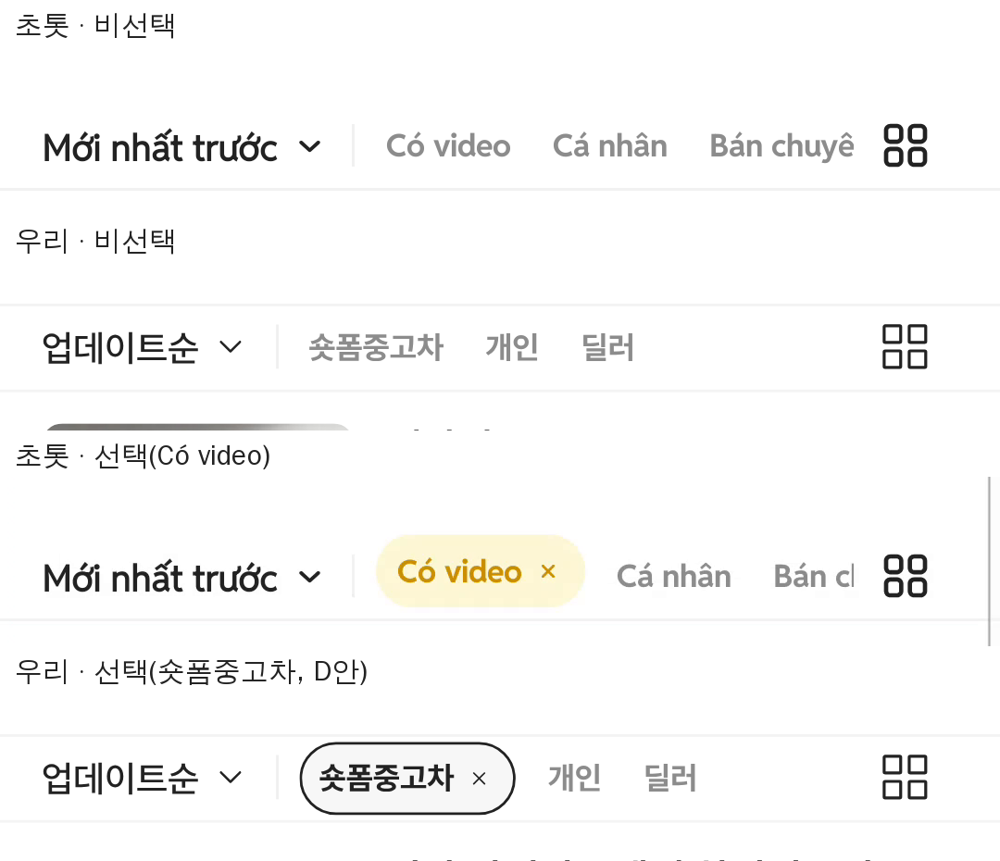

# PR #277 보고서 — 모바일 목록 제어행 초톳 녹화 실측 맞춤

## ① 한 줄 요약
모바일 목록 제어행(`정렬 │ 숏폼중고차 · 개인 · 딜러 … 보기 방식`)의 크기·간격·선택 동작을 초톳 앱 캡처·녹화와 같게 맞추고, 선택 색은 D안(`#F7F7F7` 바탕 · `#222` 1px 테두리)으로 했다.

## ② 과제 정보
- 과제 ID: 미지정
- 브랜치: `claude/usedcar-list-detail-category-otcx1u`
- 커밋: 9619bd6 (+ 이 보고서 커밋)
- PR: https://github.com/bobaekimboae/bobaedream/pull/277
- 상태: 병합·배포(배포 v값은 채팅 보고에 기록)
- 함께 들어간 과제: 없음

## ③ 한 일
- 제어행 높이 34px, 정렬 뒤 세로 구분선(1×17 `#F0F0F0`)을 넣었다.
- 탭은 12px · 700 · `#8C8C8C`, 좌우 4px · 탭 사이 8px(글자 사이 16)로 맞췄다.
- 탭을 누르면 그 자리에서 알약으로 바뀌고 글자가 4px 오른쪽으로 밀리며 ×가 붙는다(초톳 녹화와 같은 동작). 다시 누르면 해제.
- `숏폼중고차`와 판매자 탭은 함께 선택되고, `개인`·`딜러`는 하나만 선택된다.
- 보기 방식 아이콘을 19px `#222`(`view-grid-chotot-v02.svg`)로 바꿨다.

## ④ 원본과 비교

| 항목 | 초톳 | 우리 |
|---|---|---|
| 글자 중심 → 아래 구분선 | 16.7 | 16.3 |
| 탭 글자 사이 | 16.7 | 16.0 |
| 선택 알약 높이 | 27.7 | 27.7 |
| 글자 → × | 7.9 | 7.5 |
| × 잉크 | 5.0 | 4.6 |
| × → 알약 끝 | 11.4 | 11.4 |
| 알약 → 다음 탭 글자 | 12.5 | 13.2 |
| 보기 아이콘 | 17.1 | 17.4 |
| 보기 아이콘 오른쪽 끝 x | 356.3 | 356.3 |

## ⑤ 검증
- `npm run verify` 통과(check:runtime 28 · test:admin 29 · build · test:sites 4)
- 콘솔 오류: 모바일 0
- `scripts/stability-check.mjs`의 C200 트림 칩 시간초과는 main에서도 나는 기존 실패

## ⑥ 원본과 다르게 남긴 것
- 선택 색: 초톳 연노랑·금색 대신 사용자 선택 D안(`#F7F7F7` · `#222` 테두리).
- 제어행 높이 34px은 JOB-3 실개발 값(48px)과 다르다(초톳 기준을 우선).

## ⑦ 못 한 것·다음에 할 것
- JOB-3 실개발 대조는 dev.bbmuseum 접속 차단(403)으로 보류.

## ⑧ 확인 링크
- 모바일: https://bobaekimboae.github.io/bobaedream/?qf=guazi
- PC: https://bobaekimboae.github.io/bobaedream/?qf=guazi&pc=1
