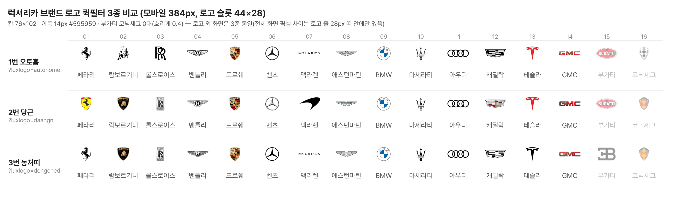

# PR #278 보고서 — 럭셔리카 브랜드 로고 퀵필터 3종 시안

## ① 한 줄 요약
럭셔리카 제조사 줄을 확정 16개 브랜드 로고 퀵필터로 바꿨다. 로고 소스만 다른 3종 시안(1번 오토홈 · 2번 당근 · 3번 동처띠)을 `?luxlogo=`로 나눴다.

## ② 과제 정보
- 과제 ID: 미지정
- 브랜치: `claude/usedcar-list-detail-category-otcx1u`
- 커밋: 845c554 (+ 이 보고서 커밋)
- PR: https://github.com/bobaekimboae/bobaedream/pull/278
- 상태: 병합·배포. 배포 v값은 채팅 보고에 적는다.
- 함께 들어간 과제: 없음

## ③ 한 일
- 드라이브 폴더 3개를 확인했다. 각 폴더에 16개, 번호 01~16이 빠짐없이 있었다.
- 원본 48장을 내려받아 `public/assets/brand/luxury-qf-v01/{소스}/`에 이름을 바꾸지 않고 복사했다. 모두 132×84 투명 PNG다.
- 럭셔리카에서만 제조사 줄을 확정 16개 순서로 그린다.
- 로고 슬롯은 44×28이다. `contain` · 가운데로 그리고, 로고마다 크기를 따로 고치지 않았다.
- 칸 크기(모바일 76×102 · PC 84×102), 간격, 이름, 가로 스크롤은 기존 초톳 제조사 줄 그대로다. 슬롯의 세로 중심을 기존 40×40 상자와 같게 둬서 칸 높이와 이름 위치는 그대로다.
- 0대인 부가티 · 코닉세그는 기존 규칙(QF-114)대로 흐리게(0.4) 두고 누를 수 있게 했다.
- 브랜드를 누르면 기존 제조사 필터와 같다. 모델 자료가 있으면 모델 줄로 넘어가고, 없으면 이 줄에 선택 표시가 남는다.

## ④ 3종 비교

| 크로스체크 | 1번 오토홈 | 2번 당근 | 3번 동처띠 |
|---|---|---|---|
| 1. 로고 16개 로드(깨짐·404 없음) | 통과 | 통과 | 통과 |
| 2. 순서 = 확정 16개 | 통과 | 통과 | 통과 |
| 3. 슬롯 44×28 실측(모바일·PC) | 44×28 | 44×28 | 44×28 |
| 4. 선택 → 제조사 필터·목록 | 페라리 4대 · 테슬라 2대 · 부가티 0대 | 같음 | 같음 |
| 5. 로고 외 화면 동일 | 기준 | 차이는 로고 줄 28px 띠 안에만 | 같음 |

## ⑤ 검증
- `npm run verify`: 통과. 런타임 보호 파일은 바꾸지 않았다.
- `npm run measure:qf`: 기존 규격 그대로(벤츠 모델 레일 PC 84×102 · 이미지칸 76×40). 콘솔 오류는 모바일 0건 · PC 0건.
- 럭셔리카 화면 콘솔 오류: 3종 × 모바일·PC 모두 0건.

## ⑥ 원본과 다르게 남긴 것
- 「전체 브랜드」 11번째 칸은 두지 않았다. 지시의 16개 순서만 쓰기 위해서다. 전체 목록은 `제조사 ▾` 칩으로 열 수 있다.

## ⑦ 발견한 문제(로고는 고치지 않음)
보이는 크기는 132×84 원본의 투명하지 않은 영역을 ÷3으로 잰 값이다.
- 맥라렌: 오토홈·동처띠는 글자 로고라 보이는 높이가 4px뿐이다. 작은 화면에서 거의 읽히지 않는다. 당근은 엠블럼(44×26)이다. (엠블럼과 글자 중 무엇을 쓸지는 아직 정해지지 않았다.)
- 애스턴마틴: 세 소스 모두 44×10~11로 가늘다. 당근은 밝은 회색이라 대비가 약하다.
- 롤스로이스: 당근·동처띠는 16×28 회색 배지라 흐리다. 오토홈은 검정 RR(25×28)이다.
- 벤틀리 44×12~14, GMC 44×9~10: 가로로 납작해서 다른 로고보다 작아 보인다.
- 색 처리가 소스마다 다르다. 이 항목들은 미정 사항이라 보고만 한다.
  - GMC: 세 소스 모두 빨강
  - 부가티: 오토홈·당근은 빨강 타원, 동처띠는 회색 EB
  - 테슬라: 동처띠만 검정
- 아우디: 세 소스 모두 네 개의 고리 선화(44×15)다.
- 당근 벤츠: 밝은 회색 선이라 흰 바탕에서 약하다. 오토홈 코닉세그도 밝은 회색(밝기 169)이라 약하다.
- 무채색(검정) 로고와 브랜드 원색 로고가 섞여 있어, 소스마다 줄 전체의 톤이 다르다.

## ⑧ 확인 링크
배포본에는 `&v=<커밋>`을 붙인다.
- 1번 오토홈: `?qf=guazi&category=럭셔리카&luxlogo=autohome`
- 2번 당근: `?qf=guazi&category=럭셔리카&luxlogo=daangn`
- 3번 동처띠: `?qf=guazi&category=럭셔리카&luxlogo=dongchedi`
- PC는 각 링크에 `&pc=1`을 붙인다.
