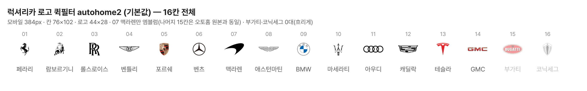

# PR #279 보고서 — 럭셔리카 로고 기본값 autohome2

## ① 한 줄 요약
럭셔리카 브랜드 로고 퀵필터의 기본값을 `autohome2`로 바꿨다. `autohome2`는 오토홈 세트에서 07 맥라렌만 검은 엠블럼으로 바꾼 것이다. 기존 3종 비교 링크는 그대로 둔다.

## ② 과제 정보
- 과제 ID: 미지정
- 브랜치: `claude/usedcar-list-detail-category-otcx1u`
- 커밋: 859437c (+ 이 보고서 커밋)
- PR: https://github.com/bobaekimboae/bobaedream/pull/279
- 상태: 병합·배포(배포 v값은 채팅 보고에 적는다)
- 함께 들어간 과제: 없음

## ③ 한 일
- 드라이브 `luxury_qf_autohome2_1008`에서 16장을 받았다. 모두 132×84 투명 PNG다.
  - 처음에는 공유가 막혀 있어서 받으면 로그인 화면이 내려왔다. 사용자가 공유를 연 뒤 다시 받았다.
- 07 맥라렌을 뺀 15장은 기존 `autohome/` 파일과 바이트까지 같았다. 07은 당근 세트의 07과 바이트까지 같은 파일이다.
- 16장을 `public/assets/brand/luxury-qf-v01/autohome2/`에 원본 파일명 그대로 복사했다. 기존 `autohome/` 폴더는 건드리지 않았다.
- `luxlogo=autohome2` 값을 추가하고, `luxlogo`가 없을 때 이 세트가 나오도록 기본값을 바꿨다.
- 로고 칸 규격과 화면의 나머지는 바꾸지 않았다.

## ④ autohome2 16칸

## ⑤ 검증 (모바일 384 · PC 1440)
| 크로스체크 | 결과 |
|---|---|
| 1. 로고 16개 표시, 깨진 이미지·404·콘솔 오류 0건 | 통과(4개 소스 + 기본 모두) |
| 2. 로고 칸 44×28 실측 | 통과 |
| 3. 기본 = autohome2, 기존 3개 링크는 이전과 같은 화면 | 통과. 기본 화면과 autohome2 화면은 픽셀까지 같다. 기존 3개 링크 비교는 아래 설명 참고 |
| 4. autohome2와 autohome의 차이 | 통과. 16칸을 하나씩 비교했을 때 다른 칸은 07 맥라렌뿐이다. PC 전체 화면의 차이도 맥라렌 로고 칸(44×27) 안에만 있다 |
| 5. 선택 동작 | 통과. 페라리 4대 · 테슬라 2대 · 부가티 0대 |

- 3번 기존 링크 비교: 모바일은 배포 전 화면과 픽셀까지 같았다. PC는 로컬 개발 서버와 배포본을 비교한 것이라 글자·그림 가장자리 몇 픽셀이 달랐다. 그래서 배포 뒤 이전 배포본과 다시 비교했다(결과는 채팅 보고).
- `npm run verify` 통과.

## ⑥ 원본과 다르게 남긴 것
- 없음. 로고는 고치지 않았다.

## ⑦ 문제 보고 (고치지 않음)
- 07 맥라렌 엠블럼은 칸 안에서 보이는 크기가 44×26이다. 다른 엠블럼과 크기 균형은 맞다.
- 이전에 보고한 대로 애스턴마틴(높이 10px)과 GMC(높이 9px)는 가늘고 작아 보이고, 코닉세그는 밝은 회색이라 약하다. 지시대로 그대로 두었다.

## ⑧ 확인 링크
- 기본: `?qf=guazi&category=럭셔리카` (배포본은 `&v=<커밋>`, PC는 `&pc=1`)
- 비교: `&luxlogo=autohome` · `&luxlogo=daangn` · `&luxlogo=dongchedi`
