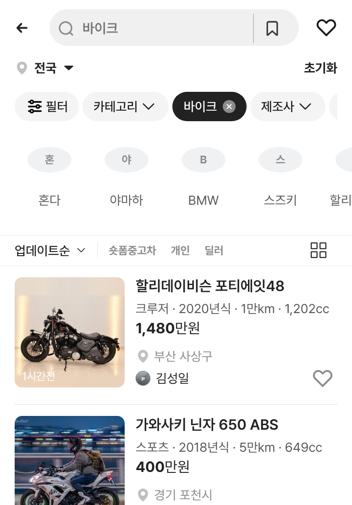
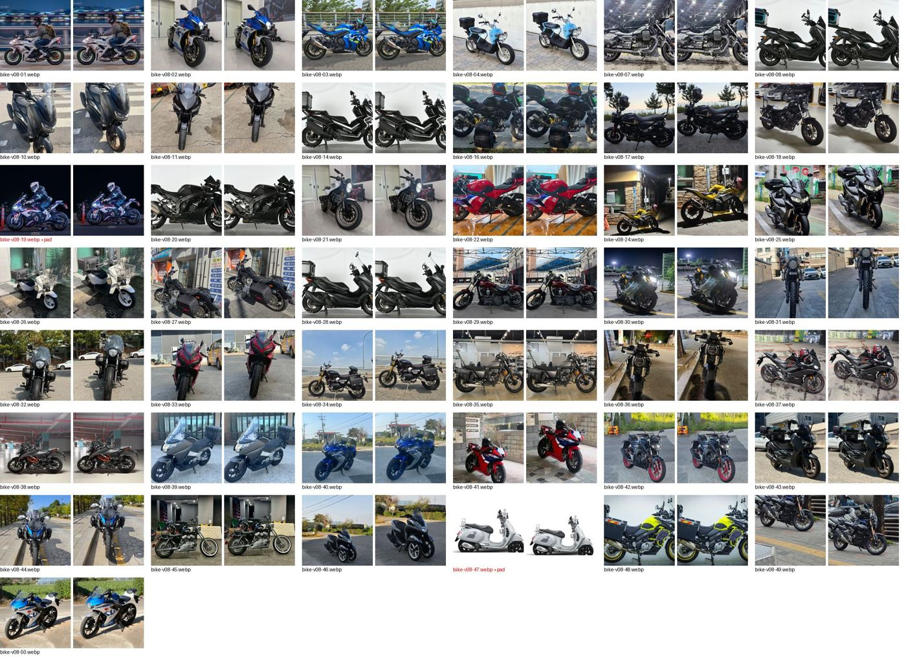

# PR #289 보고서 — 바이크 카테고리 매물 v08

## ① 한 줄 요약
바이크 카테고리 목록을 사용자 구글 시트의 실제 매물 50대로 바꿨다. 럭셔리카처럼 실제 같은 정보와 정리된 썸네일로 바이크 페이지의 뼈대를 세웠다.

## ② 과제 정보
- 과제 ID: 미지정
- 브랜치: `claude/usedcar-list-detail-category-otcx1u`
- 커밋: d3b8f9c (+ 이 보고서 커밋)
- PR: https://github.com/bobaekimboae/bobaedream/pull/289
- 상태: PR 열림. 병합·배포는 하지 않음.

## ③ 한 일
- 시트 「바이크」 탭 50행을 `src/prototype/bike/scenario-v08.ts`로 옮겼다.
  - 시트 값 그대로 옮긴 항목: 제조사 · 모델 · 연식 · 주행 · 지역 · 가격 · 배기량 · 서류 · 상태 · 튜닝 · 정비
  - 모델을 보고 정한 항목: 장르(스포츠 · 스쿠터 · 네이키드 · 크루저 · 멀티퍼포즈 · 클래식 · 언더본 · 삼륜), 면허, 변속기
- 판매자 이름은 가상 값이다. 개인은 가상 인물 이름, 업체(라이트바겐 · 굿초이스 등)는 `가상 이름 딜러`로 표시한다. 원본 상세 URL과 매물 ID는 저장하지 않았다.
- 배지는 실제 매물 유형만 표시한다. 라이트바겐 인증중고 매물만 「인증중고차」를 단다.
- 정렬: 게시일이 최신인 매물이 위로 온다. 오늘 올라온 매물은 「N시간 전」, 그 외는 「N일 전」으로 표시한다.
- 앞서 지시받은 할리 포티에잇48은 맨 위에 그대로 두었고, v07의 나머지 가상 29대는 뺐다.
- 사진 50장을 내려받았다. 47번 광고 포스터는 전화번호가 보이지 않도록 바이크 부분만 잘라 냈다.
- 목록 썸네일 43장은 럭셔리카와 같은 규칙으로 맞췄다.

## ④ 화면
- 모바일 바이크 목록: 
- 썸네일 전후(각 쌍 왼쪽 = 원본, 오른쪽 = 정규화): 

## ⑤ 검증
- `npm run verify:qf` 통과. 모바일·PC 콘솔 오류와 404는 0건이다.
- 필터 결과가 시트와 같다.
  - 제조사: 야마하 10, 할리데이비슨 4
  - 모델: NMAX 2, YZF R3 4, XMAX 3, PCX 2
- 전체차량 섞인 목록에도 새 바이크가 업데이트순으로 섞여 나온다.

## ⑥ 원본과 다르게 남긴 것
- 판매자 이름은 가상 값이다(실제 판매자명은 쓰지 않음).
- 장르 · 면허 · 변속기는 시트에 없어서 모델을 보고 정했다.

## ⑦ 못 한 것 · 다음에 할 것
- 시트의 첫 사진이 근접 사진인 매물이 5대 있다(05 줌머 계기판 · 06 Z900 헤드라이트 · 12 XMAX 앞부분 · 13 XMAX 타이어 · 15 PCX 앞부분). 차 전체가 나온 사진으로 바꾸면 좋다.
- 바이크 브랜드 줄의 로고가 원래부터 비어 있다(첫 글자 동그라미). 배포본도 같아서 이번 작업에서는 손대지 않았다.
- 상세 화면에서 서류 · 튜닝 · 정비 정보를 보여 주는 일은 다음 단계다(값은 데이터에 넣어 둠).
- 바이크 테마 헤더(럭셔리카 A·B안처럼)도 다음 단계다.

## ⑧ 확인 링크(배포 후)
- 모바일: `?qf=guazi&category=바이크`
- PC: `?qf=guazi&category=바이크&pc=1`
