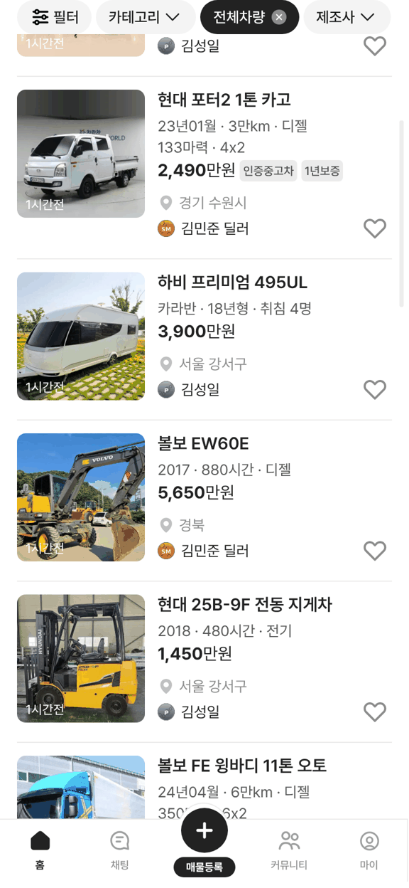
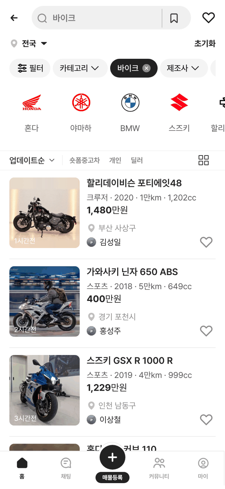

# PR #291 바이크 카드 스펙 줄 연식 글자 제거

① 한 줄 요약: 목록 카드 스펙 줄의 연식을 「년식」 글자 없이 숫자만 표기한다(`2020년식` → `2020`, 바이크 + 전체차량·모든 카테고리).

② 과제 ID 미지정 · 브랜치 `claude/usedcar-list-detail-category-otcx1u` · 커밋 c62f18a · PR https://github.com/bobaekimboae/bobaedream/pull/291 · 상태: 푸시(병합·배포 전)

③ 한 일
- 바이크 카드 스펙 줄을 만드는 코드(`bbm-card-samples.ts`)에서 연식 항목을 뺐다.
- 할리 포티에잇48(`bike-001`) 지시값도 `크루저 · 1만km · 1,202cc`로 맞췄다.
- 규칙 문서(`docs/quick-filter-spec.md`) 바이크 카드 항목을 고쳤다.
- 추가 지시 「전체차량 리스트에서도 빼라」: 카드 스펙 줄을 만드는 `bbmCardSpec`이 `N년식` 항목을 걸러내게 해서 전체차량·모든 카테고리 목록에서 빠지게 했다(볼보 EW60E `880시간 · 디젤`, 현대 25B-9F `480시간 · 전기`).
- 등록연월(`16년10월`)·연형(`18년형`)은 연식 글자가 아니라서 그대로 두었다.

④ 비교: 작업 전 `크루저 · 2020년식 · 1만km · 1,202cc` → 작업 후 `크루저 · 1만km · 1,202cc`. 전체차량 323장 · 바이크 51 · 건설기계 30 · 자재운반장비 30 · 트럭 63 · 캠핑카 53 · 중고차 68 · 럭셔리카 29 모든 페이지에서 「년식」 0건(작업 전 전체차량 첫 페이지 2건).

⑤ 검증: verify:qf 통과 · 콘솔 오류 모바일 0 · 퀵필터 규격은 바꾸지 않음(카드 텍스트만 변경)

⑥ 원본과 다르게 남긴 것: 없음

⑦ 못 한 것: 상세 화면의 연식 정보는 그대로 둠(목록 카드만 요청으로 해석)

⑧ 확인 링크(배포 후 `&v=<커밋>`): 모바일 `?qf=guazi&category=바이크`, PC `?qf=guazi&category=바이크&pc=1`

## 수정(「2002 숫자만 표기하자」)
- 연식을 통째로 빼던 것을 되돌려, `년식` 글자만 빼고 네 자리 숫자를 남겼다: 바이크 `크루저 · 2020 · 1만km · 1,202cc`, 볼보 EW60E `2017 · 880시간 · 디젤`, 현대 25B-9F `2018 · 480시간 · 전기`.
- 두 자리(`24년식`)는 `2024`로 맞춘다. 등록연월(`16년10월`)·연형(`18년형`)은 그대로.
- 전 카테고리 모든 페이지 「년식」 0건, 콘솔 오류 0, verify:qf 통과.
