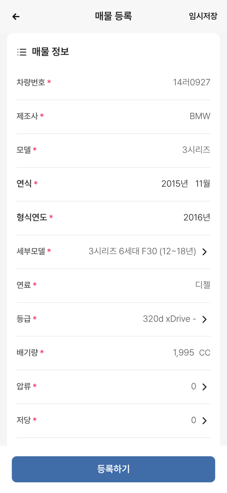

# PR #292 매물 등록 차량번호 입력 수정

① 한 줄 요약: 매물 등록(`?register`) 첫 화면에서 차량번호 칸을 눌러도 글자가 안 들어가던 문제를 고쳤다.

② 과제 ID 미지정(JOB-7 화면) · 브랜치 `claude/usedcar-list-detail-category-otcx1u` · 커밋 5bbe4e4 · PR https://github.com/bobaekimboae/bobaedream/pull/292 · 상태: 푸시(병합·배포 전). PR #291 보고서 배포 기록 커밋도 함께 들어감.

③ 한 일
- 원인: 빈 칸일 때 실제 입력창 줄이 높이 0·투명으로 접혀 있어서, 칸을 누르면 입력창이 아니라 바깥 상자가 눌렸다.
- 수정: 입력칸 바깥 상자(`FloatInput`)를 누르면 안의 입력창에 커서를 준다. 선택형 칸(누르면 목록이 열리는 칸)은 기존대로 열리고, 읽기 전용·비활성 칸은 그대로다.
- 같은 부품을 쓰는 등록 폼의 다른 입력칸에도 똑같이 적용된다.

④ 동작 점검표
| 항목 | 작업 전 | 작업 후 |
|---|---|---|
| 차량번호 칸 탭(모바일) | 입력 안 됨 | 입력됨 |
| 차량번호 칸 클릭(PC) | 입력 안 됨 | 입력됨 |
| 14러0927 + 동의 → 다음 | 진행 불가 | 등록 폼 열림 |

⑤ 검증: verify:qf 통과 · 콘솔 오류 모바일·PC 0 · 퀵필터 규격과 무관(등록 화면만 변경)

⑥ 원본과 다르게 남긴 것: 없음(원본 dev 화면도 칸 아무 곳이나 누르면 입력됨)

⑦ 못 한 것: 목록 하단 「매물등록」 버튼은 아직 이 화면과 연결하지 않음(사용자 결정 대기)

⑧ 확인 링크: 배포 후 `https://bobaekimboae.github.io/bobaedream/?register&v=<커밋>` (차량번호 14러0927)
